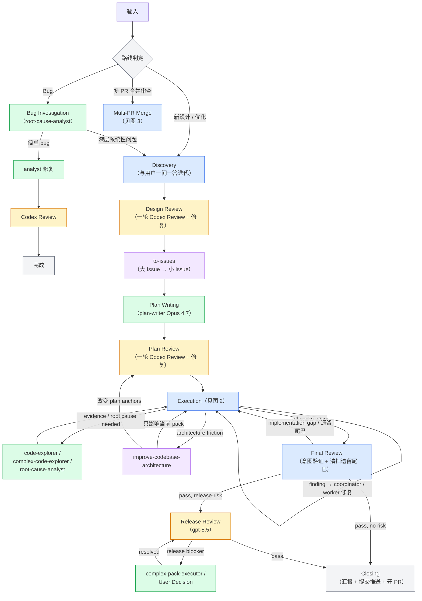
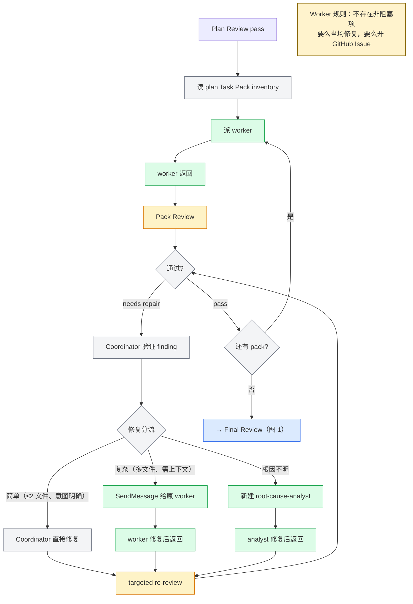
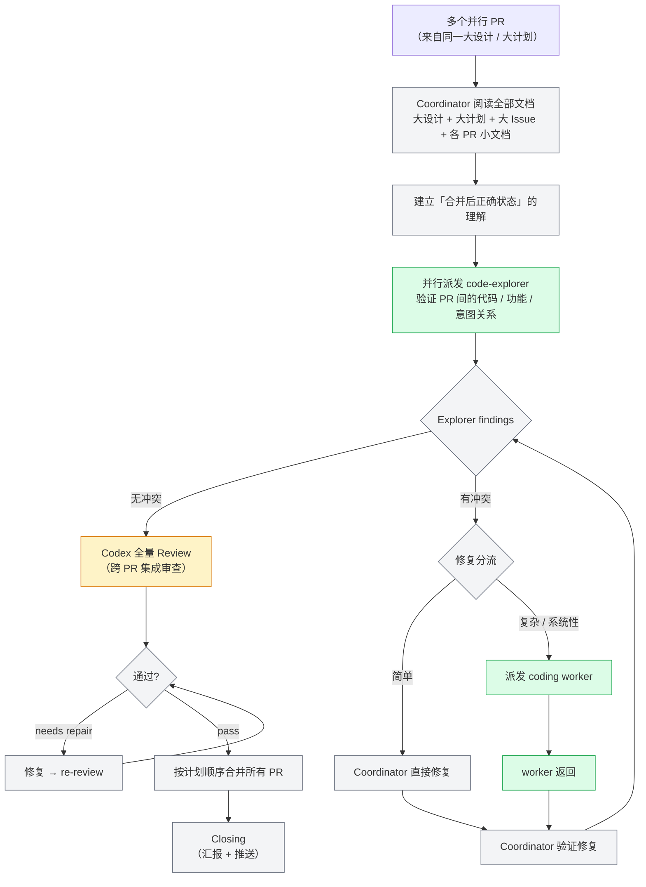

# Orchestrate Workflow Architecture Draft

来源：commit 774f7fe + 对齐讨论

## 图例

```
蓝色 = 内部 Skill（按需加载到主线程）
绿色 = Sub-Agent（独立子进程，不消耗主线程上下文）
橙色 = Codex Reviewer（跨模型独立审查）
紫色 = 外部 Skill（orchestrate 之外的独立技能）
灰色 = Coordinator 自身逻辑（路线判定、修复分流、git 操作等）
```

## 图 1：全局流程（三条路线）



### 图 1 节点分析

| 节点 | 机制 | 做什么 |
|------|------|--------|
| 路线判定 | Coordinator 自身逻辑 | 判断输入属于三条路线中的哪一条 |
| Discovery | 内部 Skill：orchestrate-discovery | 与用户 Q&A 迭代 + grill-with-docs 同步维护 CONTEXT.md + 产出设计文档 + Design Review + to-issues 过渡 |
| Bug Investigation | Sub-Agent：root-cause-analyst | 调查 bug 根因，判定简单/深层 |
| analyst 修复 → Codex Review | Sub-Agent + Codex Reviewer | analyst 修复代码，codex:codex-rescue 验证修复正确性 |
| Design Review | orchestrate-discovery 内部：Coordinator + Codex Reviewer | Coordinator 按 review angles 构建 prompt，派 codex:codex-rescue 审查设计文档，收到 findings 后 Coordinator 修复，只做一轮 |
| to-issues | 外部 Skill | 将设计文档拆分为大 Issue → 小 Issue，形成追踪文档 |
| Plan Writing | orchestrate-plan-writing 内部：前置确认 + Sub-Agent（plan-writer Opus 4.7） | 验证 design + issues 就绪 → 派 plan-writer agent 撰写计划文档 |
| Plan Review | orchestrate-plan-writing 内部：Coordinator + Codex Reviewer | Plan Entry Gate + Task Pack Inventory Gate → 派 codex:codex-rescue，收到 findings 后修复，只做一轮 |
| Execution | 内部 Skill：orchestrate-execution | 执行图 2 的 pack 循环 |
| code-explorer / complex-code-explorer | Sub-Agent | 代码探索，验证证据，挥洒上下文的探索型工作 |
| root-cause-analyst | Sub-Agent | 根因调查，独立子进程 |
| improve-codebase-architecture | 外部 Skill | 架构改进，独立于 orchestrate 的能力 |
| Final Review | 内部 Skill：orchestrate-final-review | 意图验证（代码是否偏离设计/计划）+ 清扫 Coding Worker 遗留的所有尾巴，内部派 Codex Reviewer |
| Release Review | Codex Reviewer（gpt-5.5） | Final Review skill 内部派发，用更强模型审查发布风险 |
| complex-pack-executor / User Decision | Sub-Agent / 用户 | 修复 release blocker |
| Closing | Coordinator 自身逻辑 | 向用户汇报 + 提交 + 推送 + 开 PR |

## 图 2：Execution 循环



### 图 2 节点分析

| 节点 | 机制 | 做什么 |
|------|------|--------|
| 读 plan Task Pack inventory | Coordinator 逻辑 | 读取计划文档中的 Task Pack 列表 |
| 派 worker | Sub-Agent：pack-executor / complex-pack-executor | Agent tool 派发 coding worker，保存 agentId |
| Pack Review | Codex Reviewer：codex:codex-rescue | 跨模型审查 worker 产出的代码 |
| Coordinator 验证 finding | Coordinator 逻辑 | 主线程评估 finding 是否成立、严重程度 |
| 修复分流 | Coordinator 逻辑 | 按复杂度路由修复方式 |
| Coordinator 直接修复 | Coordinator 逻辑 | 读写范围明确的代码，直接修复简单问题 |
| SendMessage 给原 worker | SendMessage 给已有 Sub-Agent | 复杂修复发回原 worker（保持上下文） |
| 新建 root-cause-analyst | 新 Sub-Agent | 根因不明时启动独立调查 |
| targeted re-review | Codex Reviewer：codex:codex-rescue | 只审查修复涉及的变更 |
| 还有 pack? | Coordinator 逻辑 | 循环控制——有则回到派 worker，无则释放到 Final Review |

## 图 3：Multi-PR Merge 流程



### 图 3 节点分析

| 节点 | 机制 | 做什么 |
|------|------|--------|
| Coordinator 阅读全部文档 | Coordinator 逻辑 | 读大设计 + 大计划 + 大 Issue + 各 PR 的小文档，建立全局理解 |
| 建立正确状态理解 | Coordinator 逻辑 | 基于文档理解合并后代码应有的正确状态 |
| 并行派发 code-explorer | Sub-Agent：code-explorer / complex-code-explorer | 并行探索各 PR 代码，发现 PR 间的冲突（代码/功能/意图） |
| 修复分流 | Coordinator 逻辑 | 简单冲突 Coordinator 直接修，复杂/系统性的派 coding worker |
| Coordinator 直接修复 | Coordinator 逻辑 | 读写范围明确的代码，修复简单冲突 |
| 派发 coding worker | Sub-Agent：pack-executor / complex-pack-executor | 复杂冲突交给 coding worker 落地修复 |
| Coordinator 验证修复 | Coordinator 逻辑 | 主线程最了解冲突方向，验证修复是否正确 |
| Codex 全量 Review | Codex Reviewer：codex:codex-rescue | 所有冲突解决后，跨 PR 集成审查 |
| 按计划顺序合并 PR | Coordinator 逻辑 | git 操作，按计划文档中的顺序合并 |
| Closing | Coordinator 逻辑 | 汇报 + 推送 |

## 组件汇总

### 内部 Skill（6 个，按需加载到主线程）

| Skill | 对应节点 | 职责 |
|-------|---------|------|
| orchestrate-workflow | 路线判定 + Bug 路线 + READY_FOR_REPAIR + Closing | 入口路由、Scope Contract、Git Checkpoint、Budget File、Bug 路线调度、Direct Repair mini-route（Step 8a）、Closing（汇报 + 提交 + 推送 + 开 PR） |
| orchestrate-discovery | Discovery + Design Review + to-issues 过渡 | 与用户 Q&A 迭代 + grill-with-docs 同步维护 CONTEXT.md + 产出设计文档 + Design Review（Codex 派发 + 修复）+ 检查/调用 to-issues |
| orchestrate-plan-writing | Plan Writing + Plan Review | 前置确认 + 派发 plan-writer agent + 计划生成 + Plan Review（Codex 派发 + 修复）+ 过渡到 Execution |
| orchestrate-execution | Execution（图 2） | Pack 循环：派 worker → Pack Review → 修复分流 → 循环释放 |
| orchestrate-final-review | Final Review | 意图验证 + 清扫遗留尾巴 + Release Review 派发 |
| orchestrate-multi-pr-merge | Multi-PR Merge（图 3） | 跨 PR 冲突发现与解决 + 合并 |

### Sub-Agent（7 个，已有 agent 文件全部保留）

| Agent | 模型 | 用在哪 |
|-------|------|--------|
| plan-writer | Opus 4.7 (1M) | Plan Writing |
| pack-executor | Sonnet | Execution 普通 pack / Multi-PR 普通修复 |
| complex-pack-executor | Opus 4.7 | Execution 高风险 pack / Release blocker 修复 |
| code-explorer | Sonnet | Execution 证据收集 / Multi-PR 代码探索 |
| complex-code-explorer | Opus 4.7 | 多模块调查 |
| root-cause-analyst | Opus 4.7 (1M) | Bug Investigation / Execution 根因不明 |
| docs-worker | Sonnet | 文档清理（Closing 阶段可选） |

### 外部 Skill

#### Coordinator 按需调用（主线程 Skill tool）

| Skill | 用在哪 | 产出 |
|-------|--------|------|
| grill-with-docs | Discovery：术语对齐，与设计文档同步维护 CONTEXT.md | 更新 CONTEXT.md（术语表 + ADR） |
| prototype | Discovery：状态/UI 方向验证 | throwaway 原型 + verdict |
| to-issues | Design Review 通过后：设计文档 → 大 Issue → 小 Issue | vertical issues |
| improve-codebase-architecture | Execution 中 architecture friction / Discovery 中架构分析 | 架构分析 + deepening 建议 |
| zoom-out | 任何阶段需要代码地图 | 模块地图 + 调用链 + 边界上下文 |
| triage | Issue 管理 | issue 分类 + ready state |
| diagnose | Bug 路线或 Execution 中需要重现/假设 | 反馈循环 + 假设 + 关键接口 |

#### Agent-Bound（agent frontmatter `skills:` 自动加载）

| Skill | 绑定 Agent |
|-------|-----------|
| tdd | pack-executor, complex-pack-executor, root-cause-analyst |
| diagnose | root-cause-analyst, pack-executor, complex-pack-executor |
| improve-codebase-architecture | complex-pack-executor, plan-writer |
| grill-with-docs | docs-worker |
| triage | docs-worker |

#### 外部 Plugin（可选）

| Plugin Skill | 用在哪 |
|-------------|--------|
| frontend-design | Discovery：UI 项目的高品质前端原型 |

### Codex Reviewer（贯穿所有 review 节点）

| 审查点 | 模型 | 触发条件 |
|--------|------|---------|
| Design Review | gpt-5.4 | 设计文档完成后，一轮 |
| Plan Review | gpt-5.4 | 计划文档完成后，一轮 |
| Pack Review | gpt-5.4 | 每个 pack worker 返回后 |
| targeted re-review | gpt-5.4 | 修复后只审查变更部分 |
| Final Review | gpt-5.4 | 所有 pack 完成后，意图验证 |
| Release Review | gpt-5.5 | Final Review 通过但存在发布风险时 |
| Bug fix review | gpt-5.4 | analyst 修复简单 bug 后 |
| Multi-PR 全量 Review | gpt-5.4 | 所有 PR 间冲突解决后 |

## 对齐结论记录

以下是架构讨论中确认的所有设计决策，作为图和表的补充说明。

### 1. 只有三条路线，不是六条

原设计有 6 条 Entry Gate 路线（Answer-only、One-shot Review、Direct Repair、Bug Investigation、Formal Orchestrate、User Decision）。实际上：

- **Answer-only**：用户问问题不会调用 orchestrate 技能，根本不存在这条路线。
- **One-shot Review**：不存在 review 完什么都不干的情况——在 orchestrate 流程中 review 必然会导向行动。
- **User Decision**：不是独立路线，是任何阶段都可能发生的交互。
- **Direct Repair**：不是独立路线，是 Bug Investigation 的子路径（简单 bug → 直接修）。

实际路线：新设计/优化、Bug、多 PR 合并审查。

### 2. Bug 和新设计本质上是同一种任务

区别只在于解决方法。一个 bug 如果牵扯出更深层次的问题，就需要重新设计、认真计划、仔细调查——也就是汇入路线 1 的管线。简单 bug 就直接 analyst 修复 + Codex review 结束。

### 3. Bug 路线不走 Final Review

root-cause-analyst 修完代码，Codex review 一下确认没问题就结束。不需要走 Final Review。

### 4. 不再用 Phase A/B/C 命名

Phase A/B/C 造成理解困难。改用描述性名称：Discovery、Design Review、Plan Review、Execution、Final Review、Closing。

### 5. 文档阶段是线性的，不回流

- **Discovery** = 与用户一问一答的迭代过程，不是一个需要 review loop 的节点。只要正确加载 Discovery skill，自然进入 Q&A 迭代。
- **Design Review** = 设计文档完成后，发给 Codex 听取独立的第二意见。Review 完 Coordinator 修复一次，**不再继续 review**，直接进 to-issues。
- **Plan Review** = 同理，一轮 Codex review + 修复，不循环。

真正的回流/内循环发生在 Execution 阶段。

### 6. to-issues 的拆分逻辑

设计文档 → 大 Issue → 小 Issue。这一步依赖外部 skill。大的设计文档会被拆成很多大 issue，每个大 issue 包含很多小 issue，形成具体的追踪文档。

### 7. Plan Writing 是独立的、与 Discovery 平行的 Skill

- Opus 4.6（主线程）在讨论设计文档时优势更大。
- Opus 4.7 更擅长撰写计划文档。
- 因此 Plan Writing 交给 Opus 4.7 的 sub-agent（plan-writer）执行。

### 8. per issue 开 session，同一 session 内完成 Plan + Execution

to-issues 拆分完成后，用户会开多个 session，每个 session 针对一个 Issue 文档。在同一个 session 内完成：Plan Writing → Plan Review → Execution → Final Review → Closing。

### 9. Final Review 的两个职责

1. **意图验证**：检查落地的代码是否偏离了最初的设计文档、计划文档和 Issue 文档。
2. **清扫遗留尾巴**：Coding Worker 经常因为 Out of Scope 或"非阻塞项"把东西搁置，Final Review 要全部揪出来、全部解决掉。

### 10. Coding Worker 规则：不存在"非阻塞项"

所有东西要么当场修复，要么立刻在 GitHub 上开 issue 记录。项目中不存在"非阻塞项"这种概念。

### 11. Closing 应该积极主动

提交、推送、开 PR 不是危险动作——是兜底动作：
- 不积极提交，发现错误时无法回退。
- 不推送、不开 PR，用户无法知道任务已经完成。

Closing = 汇报 + 提交 + 推送 + 开 PR，应自动执行。

### 12. Release Review 只做一次，在 Final Review 之后

不逐 pack 做 Release Review。原因：
- Release 风险（migration 顺序、deploy order、rollback 策略）只有在所有代码变更到位后才能准确判断。
- 单个 pack 的变更不足以评估发布风险全貌。
- Pack Review 已经覆盖了代码质量，再加 Release Review 是重复消耗。

### 13. 三种 Agent 角色的本质区别

- **Explorer**（code-explorer / complex-code-explorer）：尽情挥洒上下文的探索型 Agent，用于广泛发现问题。
- **Coordinator**（主线程）：任务派发和目标把关的 Agent。读范围明确的代码，写范围明确的代码。不是一点代码都不碰，而是碰的范围必须明确。
- **Coding Worker**（pack-executor / complex-pack-executor）：按照设计和计划进行代码落地和调整的 Agent。

### 14. Multi-PR Merge 的关键细节

- 冲突是 **PR 与 PR 之间**的冲突，不是 PR 与 main 的冲突。因为这些 PR 都是从同一个大设计/大计划拆分出来并行落地的。
- 代码合并冲突好解决，**功能和意图冲突**最难、最需要思考。
- **Coordinator 读文档**建立方向，**Explorer 做代码验证**——符合节省主线程上下文的原则。
- 修复后由 **Coordinator 验证**（不是 Explorer），因为 Coordinator 最了解冲突的方向和正确状态。
- 所有 PR **并行分析**，不是逐个顺序处理。
- 理论上可能打回某个 PR，但实际上因为每个 PR 都经历了路线 1，几乎不存在回炉重造的情况。

### 15. 外部 Skill 体系

**Agent-Bound**（agent frontmatter `skills:` 自动加载）：
- tdd → pack-executor + complex-pack-executor + root-cause-analyst
- diagnose → root-cause-analyst + pack-executor + complex-pack-executor
- improve-codebase-architecture → complex-pack-executor + plan-writer
- prototype → pack-executor + complex-pack-executor
- grill-with-docs → docs-worker
- triage → docs-worker

**Coordinator-Invoked**（主线程按需调用）：grill-with-docs、prototype、to-issues、improve-codebase-architecture、zoom-out、triage、diagnose。

**外部 Plugin**（可选）：frontend-design（UI 项目的前端原型）。

**Discovery 阶段的关键设计**：
- **grill-with-docs** 在 Discovery 过程中同步维护 CONTEXT.md，确保术语和领域模型与设计文档**共同进化**。
- Discovery 阶段是**灵活多变**的——grill-with-docs 做术语对齐、prototype 做状态/UI 验证、frontend-design 做前端原型、improve-codebase-architecture 做架构分析——按需组合，不是固定线性流程。
- CONTEXT.md 是项目的领域词汇表，与设计文档**共同进化**。
