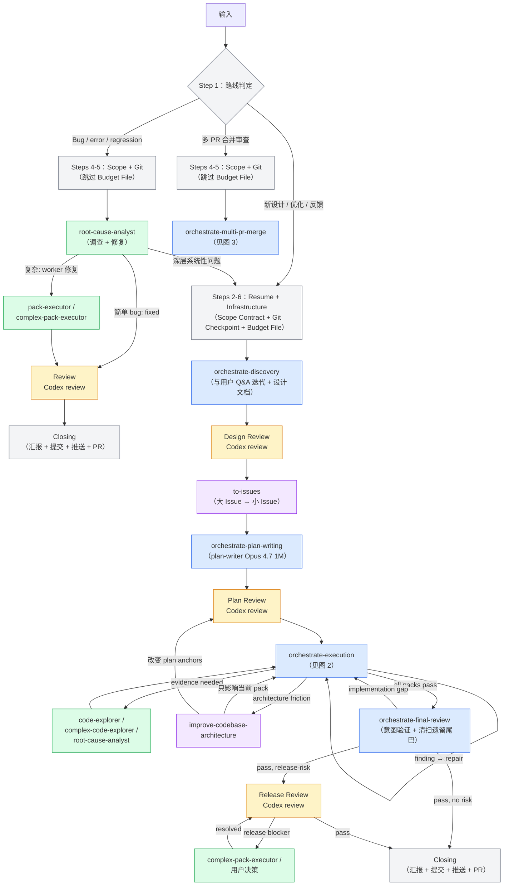
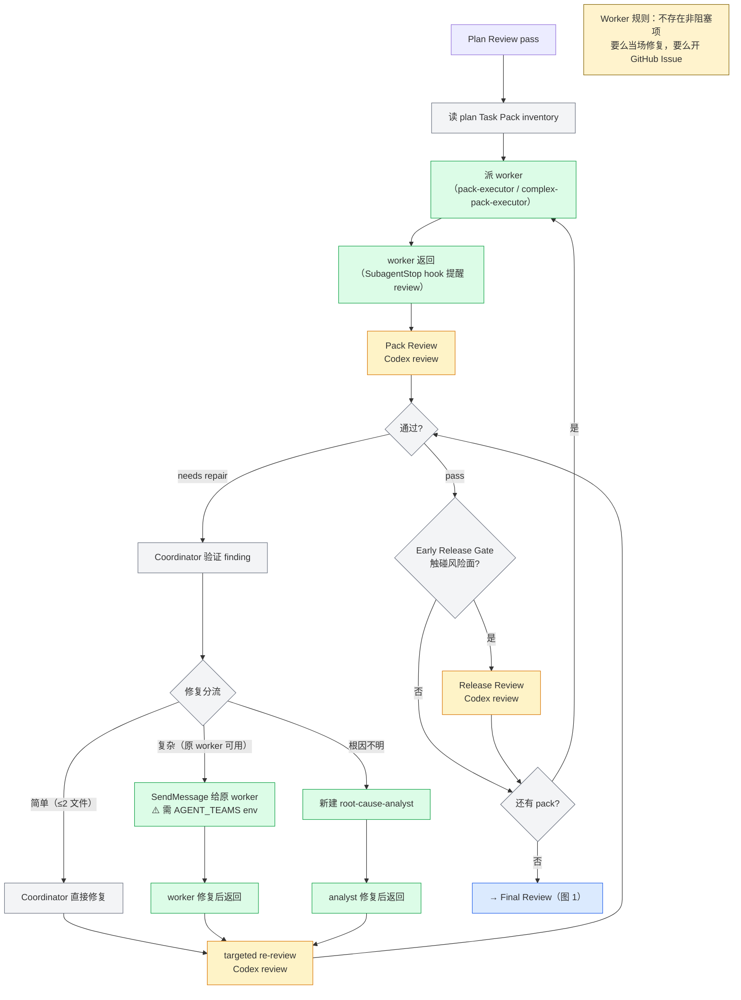
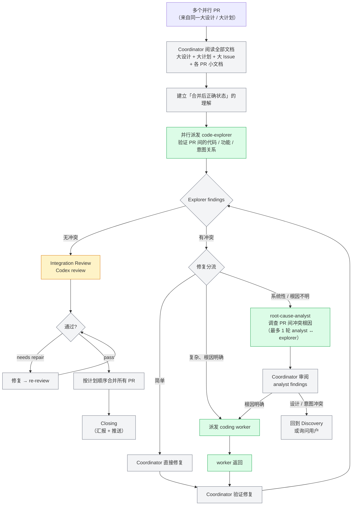
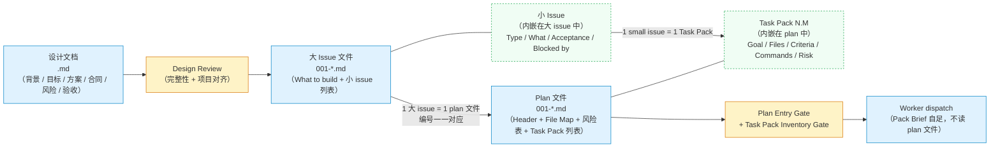

# Plugin V2 架构文档（基于 2026-05-20 审计）

> **审计基准**：`plugin-v2/` 目录下的实际代码（skills/ agents/ hooks/）。
> **审计日期**：2026-05-20。

## 图例

```
🟦 蓝色 = 内部 Skill（按需加载到主线程）
🟩 绿色 = Sub-Agent（独立子进程，不消耗主线程上下文）
🟧 橙色 = 外部 Review（跨模型独立审查）
🟪 紫色 = 外部 Skill（orchestrate 之外的独立技能）
⬜ 灰色 = Coordinator 自身逻辑（路线判定、修复分流、git 操作等）
🟥 红色 = 断点 / 矛盾
⬜ 虚线 = 路径存在但机制缺失
```

---

## 图 1：全局流程（三条路线）



### 图 1 节点分析

| 节点 | 机制 | 做什么 | 产出/消费文档 | 状态 |
|------|------|--------|-------------|------|
| 路线判定 | Coordinator 自身逻辑 | 判断输入属于三条路线中的哪一条 | — | ✅ 正常 |
| Steps 2-6 Infrastructure | Coordinator 逻辑（`workflow-infrastructure.md`） | Cross-Conversation Resume + Scope Contract + Git Checkpoint + Budget File 创建 | **确定** feature slug（贯穿 `docs/orchestrate/` 全链） | ✅ 正常 |
| Discovery | Skill：`orchestrate-discovery` | 与用户 Q&A 迭代 + grill-with-docs 同步维护 CONTEXT.md + 产出设计文档 | **产出** `design/<slug>.md` + CONTEXT.md | ✅ 正常 |
| Design Review | Coordinator + **外部 Review** | 两个 baseline review（Design Content + Project Alignment），按 dispatch 模板内联的 Codex review 步骤派发 | **审查** `design/<slug>.md` | ✅ 正常 |
| to-issues | 外部 Skill | 设计文档拆分为大 Issue → 小 Issue | **消费** `design/<slug>.md` → **产出** `issues/<slug>/00N-*.md` | ✅ 正常 |
| Plan Writing | Skill：`orchestrate-plan-writing` | 前置确认 + 派 plan-writer agent + Budget 赋值（`2N+12`） | **消费** `issues/<slug>/00N-*.md` → **产出** `plans/<slug>/00N-*.md`（编号一一对应） | ✅ 正常 |
| Plan Review | Coordinator + **外部 Review** | Plan Entry Gate + Task Pack Inventory Gate → 派外部 review | **审查** `plans/<slug>/` 全部 plan 文件 | ✅ 正常 |
| Execution | Skill：`orchestrate-execution` | 图 2 的 pack 循环 | **消费** `plans/<slug>/` 提取 Task Pack → 构造 Pack Brief（自足，worker 不读 plan） | ✅ 正常（review 节点除外） |
| Final Review | Skill：`orchestrate-final-review` | 意图验证 + 清扫遗留尾巴 + Release Gate | **消费** `design/<slug>.md` 验证意图覆盖 | ✅ 正常（review 节点除外） |
| Release Review | Coordinator + **外部 Review** | 发布风险审查，仅触碰风险面时进入 | — | ✅ 正常 |
| Bug Investigation | Sub-Agent：root-cause-analyst | 调查 bug 根因，判定简单/深层 | — | ✅ 正常 |
| Bug Fix Review | **外部 Review** | 按 dispatch 模板内联的 Codex review 步骤派发 Codex review | — | ✅ 正常 |
| Closing | Coordinator 自身逻辑 | 汇报 + 提交 + 推送 + 开 PR | — | ✅ 正常 |

---

## 图 2：Execution 循环



### 图 2 节点分析

| 节点 | 机制 | 做什么 | 文档交互 | 状态 |
|------|------|--------|---------|------|
| 读 Task Pack inventory | Coordinator 逻辑 | 读取所有 plan 文档中的 Task Pack 列表 | **读** `plans/<slug>/` 全部文件 → 提取 pack 编号、依赖、风险、并行标记 | ✅ 正常 |
| 派 worker | Sub-Agent：`pack-executor`（普通）/ `complex-pack-executor`（高风险） | Agent tool 派发 coding worker，保存 agentId | **嵌入** Pack Brief（从 plan 提取，worker 不读 plan 文件） | ✅ 正常 |
| SubagentStop 提醒 | Hook：`SubagentStop` on `pack-executor\|complex-pack-executor` | 提醒 Coordinator 派发 review | — | ✅ 正常 |
| Pack Review | **外部 Review** | 按 dispatch 模板内联的 Codex review 步骤派发 | — | ✅ 正常 |
| Coordinator 验证 finding | Coordinator 逻辑 | 主线程评估 finding 是否成立 | — | ✅ 正常 |
| 修复分流 | Coordinator 逻辑 | 简单/复杂/根因不明三路分流 | — | ✅ 正常 |
| SendMessage 给原 worker | SendMessage（需 `CLAUDE_CODE_EXPERIMENTAL_AGENT_TEAMS`） | 复杂修复发回原 worker 保持上下文 | — | ⚠️ env 未设置时静默降级 |
| targeted re-review | **外部 Review** | 只审查修复变更 | — | ✅ 正常 |
| Early Release Gate | Coordinator + **外部 Review** | Pack 触碰风险面时触发 release review | — | ✅ 正常 |

---

## 图 3：Multi-PR Merge 流程



### 图 3 节点分析

| 节点 | 机制 | 做什么 | 状态 |
|------|------|--------|------|
| Coordinator 阅读全部文档 | Coordinator 逻辑 | 读大设计 + 大计划 + 各 PR 小文档，建立全局理解 | ✅ 正常 |
| 并行派发 code-explorer | Sub-Agent：`code-explorer` / `complex-code-explorer` | 并行探索各 PR 代码，发现冲突 | ✅ 正常 |
| 修复分流 | Coordinator 逻辑 | 简单/复杂/系统性三路分流 | ✅ 正常 |
| root-cause-analyst 调查 | Sub-Agent：root-cause-analyst | 系统性冲突根因调查（capped at 1 轮 analyst ↔ explorer） | ✅ 正常 |
| Integration Review | **外部 Review** | 跨 PR 集成审查 | ✅ 正常 |
| 按计划顺序合并 PR | Coordinator 逻辑 | git 操作 | ✅ 正常 |

---

## 状态文件链

```
orchestrate-workflow Step 4
  └─ .claude/multi-model-workflow/scope-<run_id>.md        ← Scope Contract
orchestrate-workflow Step 6
  ├─ .claude/multi-model-workflow/budget-<run_id>.json      ← Budget File（Route 1 only）
  └─ .claude/multi-model-workflow/active-run-id             ← Active Run ID
orchestrate-plan-writing Step 12a
  └─ budget-<run_id>.json: budget_total = 2N + 12           ← Budget 赋值（不可变）
每次 review 完成
  └─ budget-<run_id>.json: budget_used += 1                 ← Budget 消耗
每个 phase verdict 后
  └─ budget-<run_id>.json: last_gate_phase + timestamp      ← Phase 标记
Review 派发时
  ├─ .claude/multi-model-workflow/review-prompts/<gate>.md  ← Review prompt
  └─ .claude/multi-model-workflow/review-results/<gate>.md  ← Review result
Closing 前（cleanup-before-push.sh）
  └─ 清除 active-run-id + scope + budget + review temp files
```

---

## 文档产物链：`docs/orchestrate/`

运行态状态文件（上节）跟踪 Coordinator 内部状态。**文档产物**跟踪功能本身的设计-拆分-计划-执行链路——它们是 phase 之间传递信息的载体，也是 review 的审查对象。

### 目录结构与命名

所有 orchestrate 产出文档统一存放在 `docs/orchestrate/`，按类型分子文件夹。同一功能用相同的 **feature slug**（`YYYY-MM-DD-<feature>`，kebab-case）贯穿四个子文件夹：

```
docs/orchestrate/
├── design/                                  # 设计文档（Discovery 产出）
│   └── <slug>.md
├── issues/                                  # Issue hierarchy（to-issues 产出）
│   └── <slug>/
│       ├── 001-<large-issue-slug>.md       # 大 issue（内含小 issue）
│       ├── 002-<large-issue-slug>.md
│       └── ...
├── plans/                                   # 实施计划（plan-writer 产出）
│   └── <slug>/
│       ├── 001-<issue-slug>.md             # 编号与 issues/ 下同编号文件一一对应
│       ├── 002-<issue-slug>.md
│       └── ...
└── mockups/                                 # 原型产出（prototype / frontend-design）
    └── <slug>/
        ├── *.html / *.png / *.svg
        └── README.md                        # mockup 索引
```

**关键约束**：
- feature slug 在 Infrastructure Setup 确定后全流程不变
- `issues/` 和 `plans/` 的文件**编号必须一一对应**（001 ↔ 001, 002 ↔ 002）——Plan Entry Gate 强制检查
- Plan 文件数量必须与 issue 文件数量一致——缺对应 plan 的 issue 返回 plan-writing 补写

### 图 4：文档产物流



### 四种文档产物

| 产物 | 模板来源 | 产出者 | 消费者 | 审查门禁 |
|------|---------|--------|--------|---------|
| **设计文档** | `discovery-design-document.md` | orchestrate-discovery | to-issues、plan-writer（只读） | Design Review（2 baseline） |
| **大 Issue 文件** | to-issues skill（上游） | to-issues | plan-writer（1 issue = 1 plan） | — |
| **Plan 文件** | `plan-writing-methodology.md` | plan-writer agent | orchestrate-execution | Plan Entry Gate + Task Pack Inventory Gate |
| **Mockup** | prototype / frontend-design | Discovery 阶段 | plan-writer（mockup anchors）、worker（视觉验证） | Design Review 覆盖 |

### 设计文档结构

```
# <功能> 设计文档
├── 背景和问题          — 用户视角问题、触发场景
├── 目标结果            — 完成后能稳定做到什么
├── 用户场景            — actor/action/benefit · happy path + 失败 + 空态 + 权限 + 并发 + 回滚
├── 方案设计
│   ├── 业务对象、角色和状态   — 对象 / owner / writer / reader / verifier / 状态 / 生命周期
│   └── 实现决策               — 讨论中做出的决策（不写 file path / code snippet）
├── 合同边界            — API / Pydantic / DB / JSON / sync / billing / permission / runtime
├── 发布风险和人工门禁
├── 测试和验收
├── UI/UX 状态          — mockup 目录 / viewport / states / interaction
├── 失败场景和异常处理
├── 不在本次范围
└── Open Decisions
```

**硬规则**：使用 CONTEXT.md 正式术语 · 无 TODO/TBD · 不混入 Task Pack 或 worker 指令 · 不写只在聊天中能理解的句子。

### Issue 文档结构

Issue 文档由上游 `to-issues` skill 产出（非 plugin-v2 自有），plugin-v2 只消费它。

```
# <大 Issue 标题>
├── What to build       — 端到端行为描述（vertical slice）
├── Small issues        — 编号子节，每个小 issue 包含：
│   ├── Type: AFK / HITL
│   ├── What to build
│   ├── Acceptance criteria（checkbox 列表）
│   └── Blocked by（其他小 issue 编号或 None）
└── Blocked by          — 其他大 issue 编号或 None（跨 plan 依赖）
```

**层级关系**：大 issue = 一个 vertical slice = 一个文件 · 小 issue = 内嵌子节（不是独立文件）· 小 issue 直接映射 Task Pack。

**编号规则**：文件名 `00N-<slug>.md`，N 按依赖顺序排列（blocker 在前）。to-issues 完成后还会发布 GitHub Issue 并将 issue number 写回本地文件。

### Plan 文档结构

```
# <Issue Title> Implementation Plan
├── Header
│   ├── Goal / Source design / Source issue / Execution owner / Blocked by
│   ├── Architecture / Tech stack / Quality gate
│   ├── File / Responsibility Map（Create / Modify / Test / Docs）
│   └── 发布风险和人工门禁表
└── Task Pack 列表（每个小 issue → 一个 Task Pack）
    └── Task Pack N.M: <small issue title>
        ├── Issue / Goal behavior
        ├── Owned files / responsibilities
        ├── Read first（source docs / ADRs / mockups）
        ├── Contract anchors / Mockup anchors
        ├── Acceptance criteria（从 issue 映射）
        ├── Verification commands（pack-local）
        ├── Implementation tasks（TDD: Red → Green → Refactor per step）
        ├── Commit boundary
        ├── Risk flags / 发布风险
        ├── AFK / HITL
        ├── Dependencies / Parallel safety
        └── Out of scope
```

**Task Pack 编号**：`N.M`，N = plan/issue 文件编号，M = pack 在该 plan 内的序号。Pack 2.3 = plan 002 的第 3 个 Task Pack。

**关键设计决策**：
- 每个 plan-writer agent **只负责一个大 issue**——Coordinator 逐 issue 派发
- Worker **不读 plan 文件**——Pack Brief 在 dispatch prompt 中完整自足
- Task Pack 是最小执行单元：包含 worker 所需的一切（任务、验收、命令、文件、合同锚点）
- 无 Placeholder 规则：TBD/TODO/later 出现在 plan 中 = plan failure
- `Dependencies` + `Parallel safety` 字段决定 pack 能否并行 worktree 执行

### 文档间引用关系

```
设计文档 ←───────────── plan header: Source design
    │
    ├─(Design Review)
    │
    ▼
大 Issue 文件 ←──────── plan header: Source issue
    │                    plan header: Blocked by（从 issue 继承）
    │
    ├─(1 大 issue = 1 plan 文件，编号对应)
    │
    │   小 issue ←────── Task Pack: Issue 字段
    │   acceptance ←──── Task Pack: Acceptance criteria
    │   blocked-by ←──── Task Pack: Dependencies
    │
    ▼
Plan 文件
    │
    ├─(Plan Entry Gate + Task Pack Inventory Gate)
    │
    ▼
Worker dispatch（Pack Brief 自足）
```

**单向引用**：设计文档不引用 issue/plan（上游只产出不消费下游）。Issue 不引用 plan。Plan 引用设计文档和 issue。Worker dispatch 嵌入 pack 内容，不引用 plan 文件路径。

---

## 返回值路由表

### orchestrate-discovery → orchestrate-workflow

| 返回值 | Coordinator 动作 |
|--------|-----------------|
| `DISCOVERY_READY` | 检查 issue hierarchy → 有则进 plan-writing；无则先调 `to-issues` |
| `DISCOVERY_NOT_NEEDED` | 同上 |
| `READY_FOR_REPAIR` | 进入 Direct Repair mini-route → Closing |
| `NEEDS_USER_DECISION` | 询问用户 → 重新进入 discovery |
| `BLOCKED` | 报告用户 |

### orchestrate-plan-writing → orchestrate-workflow

| 返回值 | Coordinator 动作 |
|--------|-----------------|
| `PLAN_CREATED` | 确认 budget file → 进入 execution |
| `NEEDS_DISCOVERY` | 回到 discovery |
| `NEEDS_DESIGN_REVIEW` | 回到 design review |
| `NEEDS_ISSUES` / `NEEDS_TRIAGE` | 调用 to-issues / triage |
| `NEEDS_DIAGNOSIS` / `NEEDS_ARCHITECTURE` / `NEEDS_CONTEXT` | 调用对应外部 skill |
| `NEEDS_DECISION` | 询问用户 |
| `BLOCKED` | 报告用户 |

### orchestrate-execution → orchestrate-workflow

| 返回值 | Coordinator 动作 |
|--------|-----------------|
| `EXECUTION_PASSED` | 进入 final-review |
| `NEEDS_DISCOVERY` | 回到 discovery |
| `NEEDS_PLAN_REVISION` | 回到 plan-writing |
| `NEEDS_ARCHITECTURE` | 调用 improve-codebase-architecture → 回到 execution 或 plan-writing |
| `BLOCKED` | 报告用户 |

### orchestrate-final-review → orchestrate-workflow

| 返回值 | Coordinator 动作 |
|--------|-----------------|
| `FINAL_REVIEW_PASSED` | Closing |
| `FINAL_REVIEW_PASSED_WITH_RELEASE_RISK` | Closing（release review 已在内部处理） |
| `NEEDS_EXECUTION` | 回到 execution（**最多 1 次**；第 2 次 → BLOCKED） |
| `NEEDS_DISCOVERY` | 回到 discovery |
| `NEEDS_PLAN_REVISION` | 回到 plan-writing |
| `BLOCKED` | 报告用户 |

### orchestrate-multi-pr-merge → orchestrate-workflow

| 返回值 | Coordinator 动作 |
|--------|-----------------|
| `MERGE_COMPLETE` | Closing |
| `NEEDS_DISCOVERY` | analyst 发现设计/意图冲突 → 回到 discovery |
| `NEEDS_USER_DECISION` | 询问用户 |
| `BLOCKED` | 报告用户 |

---

## 组件汇总

### 内部 Skill（6 个，按需加载到主线程）

| Skill | 对应节点 | 职责 |
|-------|---------|------|
| `orchestrate-workflow` | 路线判定 + Infrastructure + Bug 路线 + Direct Repair + Closing | 入口路由、Scope Contract、Git Checkpoint、Budget File、Bug 路线调度、Direct Repair mini-route、Closing |
| `orchestrate-discovery` | Discovery + Design Review + to-issues 过渡 | Q&A 迭代 + grill-with-docs + 设计文档 + Design Review + to-issues 检查/调用 |
| `orchestrate-plan-writing` | Plan Writing + Plan Review | 前置确认 + plan-writer dispatch + Budget 赋值 + Plan Review + Git Checkpoint |
| `orchestrate-execution` | Execution（图 2） | Pack 循环：派 worker → Pack Review → 修复分流 → Early Release Gate → 循环释放 |
| `orchestrate-final-review` | Final Review + Release Gate | 意图验证 + 清扫遗留尾巴 + Final Release Gate + 业务汇报 |
| `orchestrate-multi-pr-merge` | Multi-PR Merge（图 3） | 冲突发现 → 根因调查 → 修复 → 集成审查 → 合并 |

Skill 命名空间：`multi-model-workflow:orchestrate-*`（全限定名，通过 `Skill({ skill: "..." })` 调用）。

### Sub-Agent（7 个）

| Agent | 模型 | 用在哪 | `skills:` 自动加载 | 体内 Skill tool 调用 |
|-------|------|--------|-------------------|---------------------|
| `plan-writer` | Opus 4.7 (1M) | Plan Writing | — | `improve-codebase-architecture` |
| `pack-executor` | Sonnet | Execution 普通 pack / Bug worker | `tdd` | `diagnose`, `prototype` |
| `complex-pack-executor` | Opus 4.7 | Execution 高风险 pack / Release blocker | `tdd` | `diagnose`, `improve-codebase-architecture`, `prototype` |
| `code-explorer` | Sonnet | Execution 证据收集 / Multi-PR 代码探索 | — | — |
| `complex-code-explorer` | Opus 4.7 | 多模块调查 | — | — |
| `root-cause-analyst` | Opus 4.7 (1M), maxTurns: 40 | Bug Investigation / Execution RCA / Multi-PR 冲突调查 | `diagnose`, `tdd` | — |
| `docs-worker` | Sonnet, maxTurns: 20 | 文档清理（Closing 阶段可选） | `grill-with-docs` | — |

**注意**：
- Plugin-v2 **没有 `code-reviewer` 和 `release-reviewer` agent**。所有 review 通过 `dispatch 模板内联的 Codex review 步骤` 直接调用 codex 插件的 `codex-companion.mjs` 派发。
- `skills:` 自动加载 = frontmatter 声明，agent 启动时自动预加载。体内 Skill tool 调用 = agent body 中通过 `Skill({ skill: "..." })` 按需调用，不预加载。
- `plan-writer` frontmatter 无 `skills:` 字段，`improve-codebase-architecture` 在 body 中按需调用。
- `docs-worker` frontmatter 只声明 `grill-with-docs`，**`triage` 未在 frontmatter 中声明**（与原 draft 不一致）。

### Hooks（5 个）

| 事件 | Matcher | 做什么 | 状态 |
|------|---------|--------|------|
| `SessionStart` | `startup\|clear\|compact` | `session-start.sh`：注入行为覆盖规则 | ✅ 正常 |
| `PreToolUse` | `Bash` | `guard-premature-push.sh`：阻止未完成时 push/PR | ✅ 正常 |
| `PreToolUse` | `Bash` | `cleanup-before-push.sh`：push 前清理 `.claude/multi-model-workflow/` | ✅ 正常 |
| `PostToolUse` | `Bash` | `track-review-budget.sh`：检测 codex-companion result 命令，自动递增 budget_used，80%/100% 阈值警告 | ✅ 正常 |
| `SubagentStop` | `pack-executor\|complex-pack-executor` | 提醒 Coordinator 派发 Codex review | ✅ 正常 |

### 外部 Skill

#### Coordinator 按需调用（主线程 Skill tool）

| Skill | 用在哪 | 产出 |
|-------|--------|------|
| `grill-with-docs` | Discovery：术语对齐，同步维护 CONTEXT.md | 更新 CONTEXT.md |
| `prototype` | Discovery：状态/UI 方向验证 | throwaway 原型 + verdict |
| `to-issues` | Design Review 通过后 | vertical issues |
| `improve-codebase-architecture` | Execution 中 architecture friction / Discovery 中架构分析 | 架构分析 + 建议 |
| `zoom-out` | 任何阶段需要代码地图 | 模块地图 + 调用链 |
| `triage` | Issue 管理 | issue 分类 |
| `diagnose` | Bug 路线或 Execution 中需要重现/假设 | 反馈循环 + 假设 |

#### Agent-Bound（frontmatter `skills:` 自动加载）

| Skill | 自动加载到 |
|-------|-----------|
| `tdd` | pack-executor, complex-pack-executor, root-cause-analyst |
| `diagnose` | root-cause-analyst |
| `grill-with-docs` | docs-worker |

其他 skill（`improve-codebase-architecture`、`prototype`、`triage`、`zoom-out`）**不在任何 agent frontmatter 的 `skills:` 中**——agent body 中通过 `Skill({ skill: "..." })` 按需调用。

#### 外部 Plugin（可选）

| Plugin Skill | 用在哪 |
|-------------|--------|
| `frontend-design` | Discovery：UI 项目的高品质前端原型 |

---


---

## 架构约束

- **渐进式加载**：SKILL.md 是骨架；reference 到达步骤时才读取
- **Sub-agent 隔离**：dispatch prompt 自足；sub-agent 不读 SKILL.md / references
- **Agent 定义 = 行为权威**：TDD、自检、scope 边界等通用规则写 agent 定义，dispatch template 只写场景信息
- **Reviewer 独立验证**：所有 Calibration 包含"不信任上游报告"
- **合并策略铁律**：只用 `git merge --no-ff`，禁止 squash merge 和 rebase（`guard-premature-push.sh` 强制）
- **Review 预算**：`2N + 12`（N = pack 数）。Budget 自动追踪（PostToolUse hook）
- **`AGENT_TEAMS` 硬依赖**：`session-start.sh` 阻断未设置 `CLAUDE_CODE_EXPERIMENTAL_AGENT_TEAMS` 的会话

---

## 设计决策

- Bug 路线不走 Final Review——`bug-investigation-route.md` Step 17/18 → Closing
- 文档阶段线性不回流——Discovery → Design Review → to-issues → Plan Writing → Plan Review，各一轮 review + 修复
- Release Review 最多两次——Execution Early Release Gate + Final Release Gate，合计 ≤ 2 dispatch
- Coding Worker 无"非阻塞项"——要么当场修，要么开 GitHub Issue
- Closing 积极主动——提交 + 推送 + PR 自动执行，`guard-premature-push.sh` 确保完成后才放行
- Review 无独立 agent——不用 `code-reviewer` / `release-reviewer`，全部通过 `codex-companion.mjs` Bash 调用
- Budget 由 PostToolUse hook 自动追踪——prompt 写入 `review-prompts/<gate>.md`，结果存 `review-results/<gate>.md`

---

## 与 Codex Runtime 的关系

Plugin-v2 和 `.agents/skills/`（Codex runtime）是**两套并行代码**，30+ 文件已不同步。同步方向单向：`.agents/skills/` → 外部 repo（通过 `install-orchestrate-runtime.sh`）。

| 维度 | Plugin V2 | Codex Runtime |
|------|-----------|---------------|
| Skill 调用语法 | `Skill({ skill: "multi-model-workflow:..." })` | 裸名 `orchestrate-*` |
| 状态文件路径 | `.claude/multi-model-workflow/` | `.codex/multi-model-workflow/` |
| Review 派发 | `codex-companion.mjs` Bash 调用 | `claude-subscription-review.sh` |
| Agent 命名 | `plan-writer`（连字符） | `plan_writer`（下划线） |
| Worker 隔离 | `isolation: "worktree"` | disjoint write sets |

---

## 编辑同步清单

- 改 disposition 表 → 同步 4 个 phase 文件（execution-pack-review-cycle / final-review-disposition / plan-review-resolution / merge-integration-review）
- 改 disposition `needs context` 前置检查 → 同步全部 5 个 disposition 文件（含 design-review-angles）
- 改 Forbidden Shortcuts → 同步 execution-review-dispatch.md + final-review-angles.md
- 改 verdict 值 → `rg` 验证所有 producer 和 consumer
- 改 dispatch template → 检查 agent 定义的模式检测表是否对齐
- 改 agent 通用规则 → 检查所有相关 agent 定义
- 改 NEEDS_EXECUTION 上限 → 同步 final-review-repair.md + final-review-completion.md + workflow-formal-orchestrate.md
- dispatch template 不放 agent 定义已有的规则（TDD、自检、Git 纪律等）
