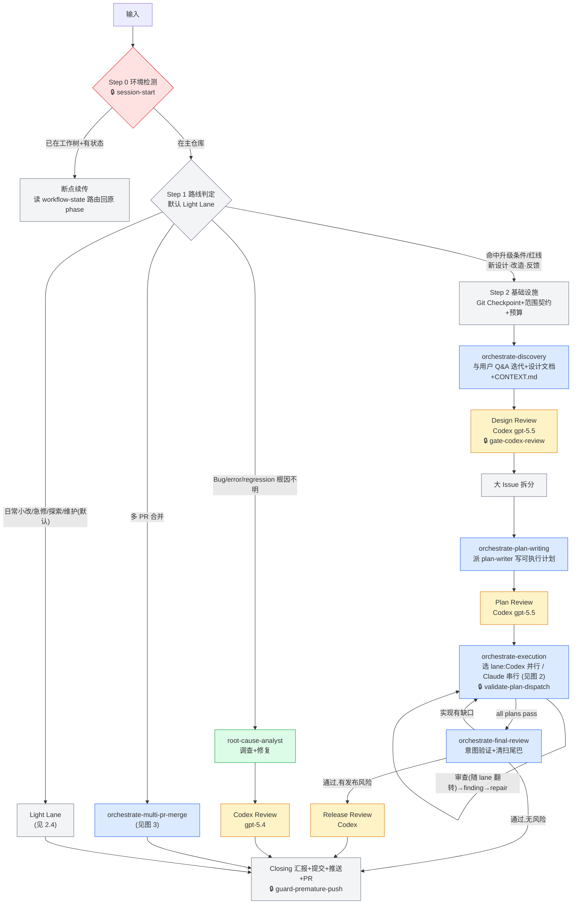
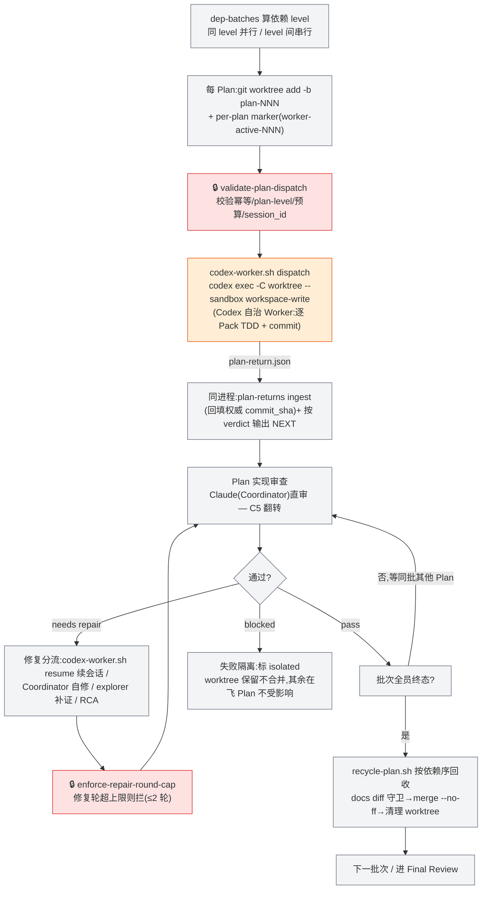
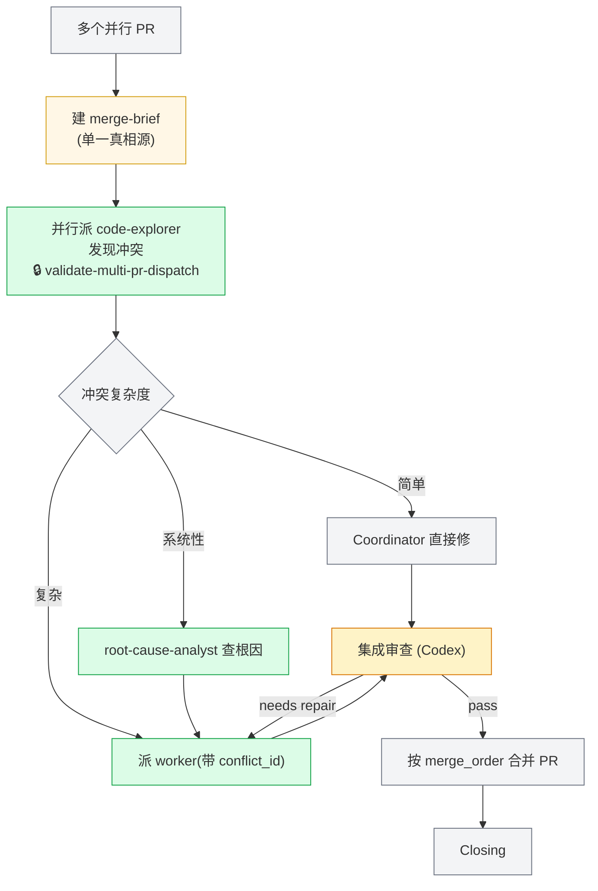

# MultiModel Worktree · 架构总览

> 本文档是给**项目负责人 / 产品视角**读的架构地图：讲清楚这个 plugin 各阶段的流程、每一步做什么、每个组件的功能,以及运行期文档怎么流转。**不写行号、字段 schema、构建脚本内部**这类实现细节——那些属于代码和 commit 历史。
>
> 流程的**真相源**是 `state-schema/routes-v1.json`(哪条路线跑哪些阶段、跳哪些门、预算多少、修几轮、verdict 怎么机械路由)。本文档若与它冲突,以 routes 清单为准。

---

## 这个 Plugin 是什么

在 Claude Code 里编排一套**"设计 → 计划 → 执行 → 审查"**的多模型软件工作流。三种角色各司其职:

- **Claude 当 Coordinator(总协调)**:判路线、派活、验收、收口。execution 阶段可亲自当**执行者**(claude lane,派内置 sub-agent)或当**审查者**(codex lane 下亲审 Codex 写的代码),取决于用户选的载体。
- **Codex 当执行者 / 文档评审**:
  - **执行者(codex lane)**——execution 选 codex lane 时,代码由 Codex 在隔离工作树里落地(`codex-worker.sh` 派发)。
  - **文档评审 + 代码评审(claude lane)**——Design / Plan 两道 gate 恒做独立对抗审查;claude lane 下还反过来审 Claude sub-agent 写的代码。
- **Sub-agent 当劳动力**:写计划(`plan-writer`)、只读补证(`code-explorer`)、查根因(`root-cause-analyst`);claude lane 下 `pack-executor`/`complex-pack-executor` 也是 execution 落地者。都在工作树里干活,把上下文压力从主线程卸下来。

> **execution 双执行载体**:用户在 execution 入口选一次(整个 run 生效)——**codex lane**(Codex 落地 + 并行批次 + Claude 审)或 **claude lane**(内置 sub-agent 落地 + 共享工作树串行 + Codex 审)。详见 §2.2 / §5.4。

四条贯穿全局的核心理念:

| 理念 | 是什么 | 为你解决什么 |
|------|-------|------------|
| **Document-as-Context**(文档即上下文) | 指令不塞进对话,写进磁盘文档与 `state.sh` 状态,agent 启动后自读 | 省 token、抗漂移、可断点续传 |
| **Plan 级 Worker 自治** | 一个 Plan 派一个 worker 从头跑到尾,而不是一个 Pack 派一次 | 派发次数从几十次降到一次/Plan,大幅省 token |
| **并行批次执行**(codex lane) | 互不依赖的 Plan 各占一个隔离工作树,同批次并行落地 | 多 Plan 不串行等待,缩短墙钟时间 |
| **写审异家(写者与审者异家)** | 谁写的不审谁写的:Codex 写代码 → Claude 审;Claude 写代码 → Codex 审;设计/计划恒 Codex 审 | 审查独立性,避免自审自盲 |

> **省 token 的两大支柱**:① **模型分层**——简单/窄范围用便宜模型,高风险/大体量用强模型(sub-agent 与 Codex 两端都分层);② **Document-as-Context + 控制流脚本化**——机械的路由/校验/记账下沉到 `state.sh` 与 hook,主线程只留判断。

---

## 1. 全局流程(路线)

入口先判路线,再走对应流程。**Light Lane 是默认**,只有命中升级条件(大改造/新功能/触碰核心红线)才升 Formal。图中绿色是 sub-agent、橙色是 Codex(执行或评审)、🔒 是机器护栏(hook)。



### Route 对比表

`routes-v1.json` 定义 5 条 route。入口 Step 1 显式判 4 条(**Light 为默认**);**Direct Repair** 不是入口路线,而是从已批准设计下发现实现偏离时,经 verdict 路由(`READY_FOR_REPAIR`)派生出来的修复路径。

| 路线 | 何时走 | Discovery | Plan Writing | Plan Review | Execution | Final Review | 预算 |
|------|-------|:---:|:---:|:---:|:---:|:---:|------|
| **Formal** | 命中升级条件:新设计 / 优化 / 反馈 / 大改造 / 触碰红线 | ✅ | ✅ | ✅ | ✅ | ✅ | `3P+12` |
| **Light Lane**(默认) | 日常小改 / 急修 / 探索 / 维护 | ❌ | ✅ | ❌ | ✅ | ✅ | unlimited |
| **Direct Repair** | 已批准设计下的直接修复(派生) | ❌ | ❌ | ❌ | route-worker | ❌ | unlimited |
| **Bug Investigation** | Bug / error / regression,根因不明 | ❌ | ❌ | ❌ | route-worker | ❌ | unlimited |
| **Multi-PR Merge** | 多 PR 合并审查 | ❌ | ❌ | ❌ | route-worker | ❌ | unlimited |

> Light Lane 跳过 Discovery + Plan Review 门,但保留计划/执行/终审;hotfix(先 push 后审)、quickfix(单 pack 单审)、spike(只产 verdict 即弃)、maintenance(worker+审)是它的**行为子模式**,不另立路线。**核心红线**(计费 / 权限 / 数据权威 / 用户可见合同)会把轻档**建议升级**为 Formal——Light Lane 自带一键升级门(`state.sh budget reinitialize`,单向 light→formal,升级后所有 formal 护栏自动回岗)。

---

## 2. 各阶段流程详解

### 2.1 Formal 完整流程(四阶段,线性不回流)

| 阶段 | Skill | 这一步做什么 | 关键产出 |
|------|-------|------------|---------|
| **Discovery** | `orchestrate-discovery` | 和用户 Q&A 迭代方案,派 explorer 只读补证,写设计文档 + CONTEXT.md/CONTEXT-MAP.md + mockup,拆大 issue | 设计文档、Mockup、Issue |
| **Plan Writing** | `orchestrate-plan-writing` | 把每个 issue 并行派给 `plan-writer`,写成含 Pack Manifest 的可执行计划,首次赋预算 | Plan 文档 |
| **Execution** | `orchestrate-execution` | 入口选 lane → 按 lane 派执行者(codex 并行 / claude 串行)自治执行,逐 Plan 审查(审查方随 lane 翻转)+ 修复(见图 2) | 代码 commit、plan-return |
| **Final Review** | `orchestrate-final-review` | 验证实现是否兑现设计意图(代码审查方随 lane 翻转),清扫遗留尾巴,判断是否需发布审查 | 验收结论 |

每个阶段之间有 **gate**;Design / Plan 两道是 Codex 文档评审,通过才往下走;评审发现问题就地修复,不污染下一阶段。

> **跨计划合同锚点(Cross-Plan Contract Anchors)**:多个 Plan 并行时,每个 Plan 在设计文档里声明自己**产出 / 消费的合同**(接口、schema、状态)。Plan Writing 写进去、Plan Review 检查、Final Review 据此核对跨 Plan 的 producer-consumer 是否对得上——接不上就退回 Execution 修。这是多个 Plan 之间保持一致、不互相打架的机制。

### 2.2 Execution 循环(双执行载体)

这是最核心也是 v5.0.0 改动最大的循环。**进入 execution 先选载体**(Step 3b,AskUserQuestion,整个 run 一次性),两条 lane 形态不同:

| | **codex lane** | **claude lane** |
|---|---|---|
| 落地者 | Codex 执行者(`codex-worker.sh` → `codex exec`) | 内置 `pack-executor` / `complex-pack-executor` sub-agent(`Agent` 派) |
| 隔离/并行 | 每 Plan 一个隔离工作树,`dep-batches` 同 level 并行 | 共享 Coordinator 工作树,按 topo 顺序**串行**(sub-agent 钉不到独立 worktree) |
| 回收 | `recycle-plan.sh` 按依赖序 merge 各 plan 分支 | commit 就在 Coordinator 工作树,无 worktree 回收 |
| 收尾信号 | `codex-worker.sh` 同进程 ingest + NEXT | `SubagentStop` → `agent-return-handler.sh` |
| 审查方(写审异家) | Codex 写 → **Claude 直审**(C5) | Claude 写 → **Codex 审**(gpt-5.4 baseline) |

下图是 **codex lane** 的节奏:`dep-batches` 算依赖 level → 同 level 的 Plan 全部并行 → 返回事件先到先审(Claude 直审)→ 修复(`resume` 续会话)→ 批次全员终态后按依赖序回收合并 → 下一批次。单 Plan 自动退化串行(仍走工作树)。



要点:

- **派发唯一通道 `codex-worker.sh`**:封装 envelope 生成 → `validate-plan-dispatch` 校验 → per-plan marker → `codex exec -C <worktree> --sandbox workspace-write --add-dir <主树状态目录>` → session 记账 → **同进程** plan-return ingest + NEXT 输出。回收不依赖 hook 时序(后台 Bash 完成通知携带最终输出)。禁止手拼 `codex exec`。
- **权威 commit SHA** = Worker 上报 `plan-return.per_pack[].commit_sha` 经 `state.sh plan-returns ingest` 回填;`track-execution-state` 取主树 HEAD 仅作串行 fallback(并行隔离工作树下主树 HEAD 必错)。
- **修复轮**:`codex-worker.sh resume` 续原 Codex session(取代 SendMessage),≤2 轮自修,超限走 RCA 或标 BLOCKED。
- **失败隔离**:blocked Plan → `isolated`,worktree 保留不合并,批次内其余 Plan 不受影响;批次结束后基于最新 HEAD 单独重试或标 BLOCKED。

**claude lane 的节奏**(串行、无 worktree):按 topo 顺序逐 Plan → `Agent` 派内置 executor 在共享工作树就地执行 → `SubagentStop` 触发 `agent-return-handler.sh` 解析 plan-return 路由 → Claude 验收事实后派 **Codex 审**该 Plan 代码 → 修复(SendMessage 续派)→ 处理下一个 Plan。commit 留在 Coordinator 工作树,记账靠 `track-execution-state` hook(共享树主树 HEAD 正确,无需 Worker 回填)。

### 2.3 Multi-PR 合并流程(merge-brief 驱动)

把同一大设计下的多个并行 PR 合并。全程由一份 **merge-brief** 文档当单一真相源,所有 sub-agent 只引用它的路径,不粘贴 PR 内容。冲突修复走 `pack-executor` / `complex-pack-executor`(与 claude lane 同一对 executor agent)。



### 2.4 轻量路线(Light Lane / Direct Repair / Bug / Multi-PR)

| 路线 | 跳过什么 | 怎么走 |
|------|---------|-------|
| **Light Lane**(默认) | Discovery + Plan Review 门 | 直接进计划/执行/终审,执行仍走 Codex Worker(`codex-worker.sh dispatch --model-tier standard`);子模式:hotfix(先 push 后审)、quickfix(单 pack 单审)、spike(只产 verdict)、maintenance(worker+审) |
| **Direct Repair** | 全部 formal 门 + Codex 审 | 根因清楚时,route-worker 直接修 |
| **Bug Investigation** | 全部 formal 门 | `root-cause-analyst` 调查 → worker 修 → Codex 审 → Closing |
| **Multi-PR Merge** | 全部 formal 门 | merge-brief 驱动(见图 3) |

> 机器层面用 routes 清单**强制**这些跳过:轻档误跳到 Discovery 会被 `state.sh` 直接拒(该跳转在 light 路线下根本不存在),不靠"主线程自觉"。

---

## 3. 组件功能概述

### 3.1 Skills(7 个)

Skill 是按需加载到主线程的 Coordinator 逻辑(骨架 + 步骤 + 决策树),sub-agent 不读它。

| Skill | 阶段 / 用途 | 功能概述 |
|-------|-----------|---------|
| `orchestrate-workflow` | 总入口 | 环境检测、路线判定(默认 Light)、断点续传、Closing 收口 |
| `orchestrate-discovery` | Discovery | 与用户迭代方案、写设计文档 + CONTEXT.md + mockup、Design Review(Codex)、拆大 issue |
| `orchestrate-plan-writing` | Plan Writing | 派 plan-writer、Plan 门校验、预算赋值、Plan Review(Codex) |
| `orchestrate-execution` | Execution | 选 lane、按 lane 派执行者、审查(随 lane 翻转)、修复分流、回收合并、发布门 |
| `orchestrate-final-review` | Final Review | 意图验证、清扫尾巴(代码审查随 lane 翻转)、决定是否发布审查 |
| `orchestrate-multi-pr-merge` | Multi-PR | merge-brief 驱动的多 PR 合并 |
| `codex-review` | 任意 | 临时发起一次 Codex 对抗评审(ad-hoc,不写 workflow-state、不耗预算) |

### 3.2 Subagents(6 个 agent + 1 个人设规格)

每个 agent 的 frontmatter 声明 `model`(模型)、`effort`、`skills`(内嵌技能,启动自动加载)、`memory`。**"内嵌 skill"是外部方法论技能,agent 一启动就自动加载进它的上下文**;"启动自读"是它额外要读的操作手册/方法论文件。

| 名称 | 模型 | 内嵌 skill | 被调用流程 | 核心功能 / 边界 |
|------|------|-----------|-----------|---------------|
| `plan-writer` | Opus 4.8 1M (xhigh) | (用 `improve-codebase-architecture`) | Plan Writing(每 issue 一个,并行) | 把 issue 写成含 Pack Manifest 的可执行 plan;不做 Coordinator 判断 |
| `code-explorer` | Sonnet | (无) | 任何阶段只读补证 | 只读调查返回证据;不写文件、不给修复建议 |
| `complex-code-explorer` | Opus 4.8 1M | (无) | 大体量/深层只读调查 | 跨模块/历史/迁移链路的只读调查 |
| `root-cause-analyst` | Opus 4.8 1M (xhigh) | `diagnose` `tdd` | Bug 调查 / 修复截断 / Multi-PR 系统性冲突 | 列可证伪假设 + 排除证据 + 回归验证;可写代码修复 |
| `pack-executor` | Opus 4.6 1M | `tdd` | **claude lane execution**(normal/trivial 档)+ multi-pr 冲突修复 / bug 修复 / direct-repair 路径 B | TDD 逐 Pack 落地整个 Plan;只改代码,禁碰 `docs/` |
| `complex-pack-executor` | Opus 4.8 1M | `tdd` | **claude lane execution**(高风险档)+ 上述残留修复场景 | 承接跨模块/迁移/计费/权限类高风险 Plan |

> **execution 有两条执行载体**(用户在 execution 入口选,见 §2.2 / §5.4):**codex lane** 由 Codex 执行者(`codex-worker.sh` + `references/codex-worker-handbook.md`)落地;**claude lane** 由这两个 `*-pack-executor` sub-agent 落地。两者共享 `worker-loop` 执行骨架,但构建系统注入不同 variant——Codex 拿 `worker-loop.codex`(原生 Codex 语言),executor agent 拿 `worker-loop.claude`(Claude 载体)。审查方向随载体翻转(写审异家)。
>
> **模型分层 = 省 token 的核心手段之一**:只读窄范围用 Sonnet(`code-explorer`),写计划/深调查/高风险用 Opus 1M;两条 lane 同一套 risk→tier 映射。
>
> `agents/persona.md` **不是 agent**,是 7 个角色(含 codex-reviewer)的人设规格(Role/Voice/Forbidden)的人类可读源;实际注入各 agent 的 voice 内容由 `build/templates/voice-directive.md.tmpl` 权威生成,改 persona 须同步模板。

### 3.3 Hooks(13 个机器护栏)

Hook 是自动触发的拦截/记录脚本,违反硬约束直接 `exit 2` 阻断。`hooks.json` 注册以下 13 个(其中 `guard-premature-push` / `cleanup-before-push` 物理位于 `scripts/`,其余在 `hooks/`)。

| Hook | 触发时机 | 触发后效果 |
|------|---------|-----------|
| `session-start` | 会话启动 / clear / compact | 检查环境(env / jq / python3 / 版本≥2.1.147),**缺则只告警不阻断**(SessionStart 无法 exit 2 拦启动);**按需注入**——仅存在 active run 才注入断点恢复(compact 注入完整、clear/startup 只给一行被动备查),普通会话零注入 |
| `guard-premature-push` | `git push` / `gh pr` / `git merge` 前 | ①有未勾选任务时拦 push / 开 PR;②拦 `git merge --squash`(命令边界匹配,不裸扫全文) |
| `enforce-plan-commit` | `git commit` 前 | Pack commit 消息不符 `Pack N.M:` 格式则拦下;非 Pack 前缀放行 |
| `gate-codex-review` | 派 Codex review 前(`codex*task`) | 按当前路线 `review_required`;baseline 审要求该 Plan 所有 Pack 已 committed,否则拦 |
| `enforce-repair-round-cap` | 派 Codex review 前(`codex*task`) | 修复轮超路线 `max_repair_rounds` 则拦,按 `escalate_to_rca` 提示走 RCA 或标 BLOCKED |
| `validate-plan-dispatch` | 派 worker 前(Agent) | 校验幂等 / plan-level(plan_id 非空、pack_id 为 null)/ 预算就绪 / 无待决决策 / plan 未被占用;**扩展 session_id**——in_progress 须用 `resume` 续会话,`resume_from_pack_id` 可绕过续派 |
| `validate-pack-manifest` | 派 worker 前(Agent) | 三方对账 Pack Manifest(表格行 / 标题 / state 键),A==B、C⊆A,不一致则拦 |
| `validate-multi-pr-dispatch` | 派 multi-pr worker 前(Agent) | 校验 merge-brief 存在 / 阶段一致 / conflict_id 有效 / prompt 引用 brief |
| `guard-doc-edit` | 编辑 / 写文件前(Edit/Write) | **四规则**:①`docs/` 一律拦 → ②状态目录放行 → ③登记 worktree 内放行 → ④飞行期间主树只读;无 `worker-active-*` marker 则全放行 |
| `track-review-budget` | Codex review 完成后(`codex*result`) | 递增 `review_used`;attended 80% 写 pending_direction_check;afk 80% 软信号、100% 兜底;credit 归还回流额度 |
| `track-execution-state` | `git commit` 成功后 | 记录该 Pack committed;主树 HEAD 取的 commit_sha 仅作串行 fallback,权威值由 `plan-returns ingest` 覆盖 |
| `cleanup-before-push` | `git push` 成功后 | 清理编排临时状态目录;hotfix-unreviewed 延迟到事后审完由 Closing `--force` 清 |
| `agent-return-handler` | 任何 agent 返回后(PostToolUse) | 读 plan-return,按 6 种 verdict 路由;**信封解析失败 exit 0 放行**(PostToolUse 撤不回已完成 agent) |

### 3.4 外部技能(Mattpocock / gstack 系列)

Plugin 在关键环节直接 `Skill()` 调用外部方法论技能,而不是把方法论抄进自己的文档——避免与上游脱节、悄悄漂移。

| 技能 | 在哪调用 | 作用 |
|------|---------|------|
| `grill-with-docs` | Discovery 开场即调用 | 全程维护 `CONTEXT.md` / `CONTEXT-MAP.md`(仓库级领域模型/术语表),与设计文档**并列为 Discovery 双交付物** |
| `to-issues` | Discovery 大 issue 拆分 | 提供 tracer-bullet / vertical-slice 拆分内核。**混合接法**:调用内核保证权威最新,plugin 保留 issue 文档格式与 AFK/HITL 约定 |
| `improve-codebase-architecture` | `plan-writer` / `complex-code-explorer` 用;拆分时按需 | 理解模块边界、职责分布、合同表面 |
| `tdd` / `diagnose` | `*-pack-executor`(残留)/ `root-cause-analyst` 内嵌 | 红绿重构;根因诊断五步 |
| `frontend-design` / `impeccable` / `prototype` | Discovery 按需(UI) | mockup 生成 / 界面打磨审计 / 原型 |

> **为什么调用而非内嵌**:像 `to-issues` 这种决定拆分质量、进而决定代码落地完整性的核心方法论,内嵌会随上游更新悄悄漂移;直接调用保证单一权威、永远最新。

---

## 4. 文档输入 / 输出流转

运行期产生一连串文档,前一阶段的产出是后一阶段的输入。**指令都在文档里,不在对话里**——这是省 token 和抗漂移的关键。

```mermaid
flowchart LR
    classDef doc fill:#dbeafe,stroke:#2563eb
    classDef state fill:#fef3c7,stroke:#d97706

    SC["范围契约<br/>Scope Contract"]:::doc
    DD["设计文档<br/>design/*.md"]:::doc
    MK["Mockup<br/>mockups/*"]:::doc
    IS["Issue 文档<br/>issues/*.md"]:::doc
    PL["Plan 文档<br/>plans/*.md<br/>(含 Pack Manifest)"]:::doc
    EN["DISPATCH_ENVELOPE<br/>(Coord→Codex Worker)"]:::doc
    RT["plan-return / open-items<br/>(Worker→Coord)"]:::doc
    ST[("workflow-state /<br/>execution-state<br/>磁盘状态")]:::state

    SC --> DD --> IS --> PL --> EN --> RT
    MK --> PL
    RT -.per_pack.commit_sha 回填.-> ST
    ST -.读写贯穿全程.- EN
```

| 文档 | 谁产出 | 谁消费 | 作用 |
|------|-------|-------|------|
| 范围契约 | 基础设施(Step 2) | 全程 | 圈定改动范围 / 可改文件 / 只读上下文 |
| 设计文档 `design/` | Discovery(Coordinator + Explorer) | Plan Writing、Review | 方案权威源,LINEAGE 起点 |
| CONTEXT.md / CONTEXT-MAP.md | Discovery(`grill-with-docs`) | 全程 | 仓库级领域模型/术语表,Discovery 双交付物之一 |
| Mockup | Discovery | Plan Writing、UI 实现 | UI 视觉规格,与文字设计平级的源头工件 |
| Issue 文档 | issue 拆分 | Plan Writing、**Execution worker(核对意图)** | 把设计拆成 thin vertical slice;worker 顺 plan 头 `Source issue` 读它核对实现没偏离原始意图 |
| Plan 文档(+Pack Manifest) | `plan-writer` | Execution worker、Review | 可执行计划,worker 自读的**主**指令源(并顺读源 issue 核对意图) |
| DISPATCH_ENVELOPE | Coordinator(`state.sh envelope build`) | Codex Worker + 校验 hook | 窄接口,只传 `plan_id`+`plan_path`+`worktree_path`+运行时变量,**不粘贴 Pack 内容** |
| plan-return / open-items | Codex Worker | `plan-returns ingest`、Coordinator | 回报 verdict + per-pack 状态 + **权威 commit_sha** + 遗留项 |
| merge-brief | Multi-PR 流程 | state.sh 校验 + worker | 合并冲突的单一真相源 |
| 磁盘状态 | state.sh / hooks | 全程 + compaction 恢复 | 进度记忆(cursor / committed / budget / active_plan_ids),**断点续传的唯一可信源** |

---

## 5. 关键设置与护栏

### 5.1 预算(单一 Review 维度)

- **公式 `3P+12`**:P = Plan 总数。`3P` = 每个 Plan 1 次实现审查 + 最多 2 次修复复审;`+12` = Design / Plan / Final / Release 评审 + 修复余量。常量 `REVIEW_PER_PLAN=3` / `REVIEW_FIXED_RESERVE=12` 在 `state.sh` 里,Plan Writing 阶段**首次且唯一**赋值,执行期不可变。
- **计量单位 = review 派发次数**(不是 token),且**两类 review 都计入**:Codex 文档评审(经 hook 自动记账)与 **Claude 直审 execution 代码**(C5 翻转,Coordinator 手动 `state.sh budget increment-review`)。
- **双模式(在场 / 无人值守)**:无人值守(默认)用到 80% 只软提醒、继续跑,100% 才硬停;在场用到 80% 立即停下请你决策。
- **轻量路线预算 unlimited**(Light / Direct Repair / Bug / Multi-PR 不限)。

### 5.2 质量门最小集 + 红线

- **质量门最小集(所有路线都保留,轻档也不豁免)**:①子代理返回必验;②Worker 禁改 `docs/`;③有未勾选任务时阻断 push。
- **核心红线**:改动触碰计费 / 权限 / 数据权威 / 用户可见合同 → **建议升级 Formal**。当前为 advisory(`redline-check.sh` 探测四类:billing / auth / data-authority / user-contract,Coordinator 判定),非机器强制——这是设计的刻意选择。

### 5.3 硬规则汇总

| 规则 | 强制方式 |
|------|---------|
| 只用 `git merge --no-ff`,禁 `--squash` | `guard-premature-push` 进程级拦截 |
| 有未勾选任务不许 push / 开 PR | `guard-premature-push` 拦截 |
| Worker 不能改 `docs/`(并行下主树源码区也只读) | `guard-doc-edit` 四规则;Codex worker 另加沙箱围栏 + 回收前 docs diff 兜底 |
| 派发幂等(防 compaction 后重复派/重复计费) | `validate-plan-dispatch` 校验 idempotency_key |
| 修复循环 ≤2 轮(超限走 RCA 或 BLOCKED) | `enforce-repair-round-cap` + repair_policy |
| Final Review 回流 Execution 最多 1 次 | `execution_reflux_count`(`verdict-route` reflux-counter 内部计) |
| 未设 `CLAUDE_CODE_EXPERIMENTAL_AGENT_TEAMS` 启动告警 | `session-start`(告警不阻断) |
| Coordinator 是事实唯一权威,sub-agent 返回必亲验 | 主流程文本强制(非 hook) |

### 5.4 Codex 的两条通道 + 写审异家 + 模型分层

Codex 在本 plugin 有**两条互不相同**的调用通道,别混:

| 通道 | 脚本 | 干什么 | 沙箱 |
|------|------|-------|------|
| **执行通道**(仅 codex lane) | `codex-worker.sh` → `codex exec` | execution **写代码**,在隔离工作树里逐 Pack 落地 | `--sandbox workspace-write` 物理围栏 |
| **评审通道** | `codex-companion.mjs task` ←由 `dispatch-review.sh validate/record` 校验记账 | **审文档**(设计 / 计划恒走此),及 **claude lane 代码**的外审 | 只读,送审 diff 包在 `--- BEGIN/END UNTRUSTED CODE DIFF ---`(防注入) |

**写审异家——谁写的不审谁写的**(execution 代码的审查方随 lane 翻转):

| 审什么 | 阶段 | 谁审 | reviewer / 记账 |
|---------|------|------|------|
| **设计 / 计划**(Claude 写) | discovery / plan-writing | **Codex** | `gpt-5.5 --effort xhigh`(更强);经 hook 记账 |
| **execution / 终审代码 · codex lane**(Codex 写) | execution / final-review | **Claude 直审**(Coordinator) | 维度/命令/finding 格式照用,手动 `budget increment-review` |
| **execution / 终审代码 · claude lane**(sub-agent 写) | execution / final-review | **Codex** | `gpt-5.4 --effort xhigh`,经 hook 自动记账 |
| **代码**(其余 Claude worker 写的场景) | bug / direct-repair / multi-pr / light 手动外审 | **Codex** | `gpt-5.4 --effort xhigh` |

> **执行者也分层**:codex lane 的 Codex 模型档由 `codex-worker.sh` 顶部常量定(risk flags 命中 → complex `gpt-5.5 xhigh`;普通 → standard `gpt-5.4 xhigh`);claude lane 的 executor agent 档由 risk 选 `pack-executor`(Opus 4.6)或 `complex-pack-executor`(Opus 4.8)。同一套 risk→tier 映射,落到不同载体。
>
> 配合 sub-agent 的模型分层(3.2),**"什么阶段、什么角色用什么 model"是整套省 token 设计的支柱**:贵而强的模型只用在最需要判断力的环节,其余用够用的便宜模型。

---

## 6. 状态与断点恢复

**为什么 compaction(上下文压缩)不会丢进度**:所有关键状态都写在磁盘 `workflow-state` / `execution-state`(Ruling 2 双文件模型),不只留在对话里。

- `cursor`:当前在哪个 phase / reference / step —— 压缩后从这里续。
- `last_gate_phase` / `last_gate_timestamp`:上次 gate 通过的位置和时间 —— 用来检测"评审后 source 又被改了没",改了就强制重审(`state.sh transition` 自动写,无需手动)。
- `active_plan_ids[]`:**并行模型下同时在飞的 Plan 集合**(取代单值 `current_plan_id`);每个 plan-level 条目带 `worktree_path` / `branch` / `isolation_status`(active|isolated|merged)/ `session_id`。
- per-pack `committed` + `commit_sha`:每个 Pack 是否已提交(权威 SHA 由 `plan-returns ingest` 回填)。
- `idempotency_keys`:已派发过的 key(统一 `<run>/<plan_id|pack_id>/r<n>`),防重复派。

会话启动时 `session-start` hook 读这些状态,按需把"你在哪、下一步做什么"重新注入,流程接着跑。状态写入用目录级自旋锁(`scripts/lib/state-lock.sh`)保证并发安全——这在并行批次下尤其关键。

### 6.1 控制流脚本化:`state.sh` 是机械路由的真相源

机械的(无判断的)路由、校验、记账已从 SKILL.md 散文和 hook 硬编码下沉到 `state.sh` + `routes-v1.json`,主线程只留判断:

- `routes-v1.json` 的 `verdict_routing` 段:6 张 workflow-level verdict → 下一步的机械映射(`judgment:false` 直接跳;`judgment:true` 只给候选,判断留 SKILL 散文)。`state.sh verdict-route` 查询。
- 新机械命令:`checkbox toggle`(committed pack 勾选)/ `envelope build`(DISPATCH_ENVELOPE 生成器,与 `hooks/lib/parse-envelope.sh` 对称自检)/ `dep-batches`(Blocked-by DAG → 并行批次)/ `execution-plan`(start/complete/finish/session 管理 Plan 终态与 active 摘除)/ `plan-returns ingest`(回填权威 SHA)。

### 6.2 三条关键架构裁决(为什么这么设计)

这三条是当前活跃的设计约束,不是历史。改动状态层 / hook 前必读,交叉引用见 `docs/orchestrate/design/2025-05-22-plugin-maturity.md`。

| 裁决 | 决定了什么 | 为什么 |
| --- | --- | --- |
| **Ruling 1** —— commit-message 解析保留 sed | `track-execution-state.sh` 提取 Pack ID 用 sed,不走渐进迁移 | 输入源是 commit message(已被 `enforce-plan-commit.sh` 格式保证),不是 prompt/控制平面。"无渐进迁移"只约束 Agent dispatch 信封,不约束已有格式保证的 commit 解析。 |
| **Ruling 2** —— 状态双文件模型 | `workflow-state`(budget/phase/dispositions,plan-level)+ `execution-state`(pack-level data,keyed by plan_id),两文件靠 plan_id/pack_id 关联 | pack-level 数据被多个 hook 并发写入,分离两文件降低竞态风险——并行批次下并发写更密集。 |
| **Ruling 3** —— PostToolUse fail-open | `agent-return-handler`(PostToolUse)信封解析失败时 exit 0 跳过,而非 exit 2 硬停 | PostToolUse 无法撤回已完成的 agent,硬停只会中断正常流程。"无 fallback / 硬失败"只适用于 PreToolUse dispatch gate,不适用于 PostToolUse 后处理。 |

---

## 7. 设计权威文档

本文档是架构地图;改动前的设计推演与权威细节在以下文档,与本图文冲突时以它们 + `routes-v1.json` 为准。

| 文档 | 覆盖 |
|------|------|
| `state-schema/routes-v1.json` | 流程形态真相源:phase 序列、合法跳转、预算档、verdict 机械路由、repair_policy |
| `docs/orchestrate/design/2026-06-08-orchestrate-scripting.md` | v5.0.0 三块改造的设计权威:控制流脚本化(A)、execution 并行(B)、执行者换轨 Codex(C) |
| `docs/orchestrate/design/2025-05-22-plugin-maturity.md` | 成熟度阶段的三条架构裁决(§6.2)出处 |
| `skills/orchestrate-execution/references/codex-worker-handbook.md` | Codex 执行者(codex lane)行为规范:注入 `worker-loop` 的 **codex variant**(原生 Codex 语言,无适配层)+ `failure-protocol`。claude lane 的 `pack-executor` 拿 `worker-loop` 的 claude variant |

> **C 块的运行时门**:执行者换轨 Codex 落地后,首份真实 Plan 须**单 Plan 串行试跑、人工盯质量**,通过才开放并行。

---

## 附录 A:版本号管理

改版本号必须同时更新两处保持一致:

- `plugin/.claude-plugin/plugin.json` → `version`
- `.claude-plugin/marketplace.json`(仓库根目录) → `plugins[0].version`

CI 验证:两处 `diff` 必须无输出。

## 附录 B:硬性禁区

- `docs/orchestrate/plans/` 下有未勾选任务(`- [ ]`)时,`git push` 和 `gh pr create` 被阻断。
- `git merge --squash` 永久禁止,必须 `--no-ff`。
- Worker agent 不能修改 `docs/` 下任何文件;并行飞行期间主工作树源码区也只读,源码改动只能发生在分配的隔离 worktree 内。
- 未设置 `CLAUDE_CODE_EXPERIMENTAL_AGENT_TEAMS` 时启动告警(SessionStart 无法阻断,缺条件只 stderr 提示)。
- 改了 build 模板未跑 `build.sh --apply` 时,`build.sh --check` 在 CI 失败。
