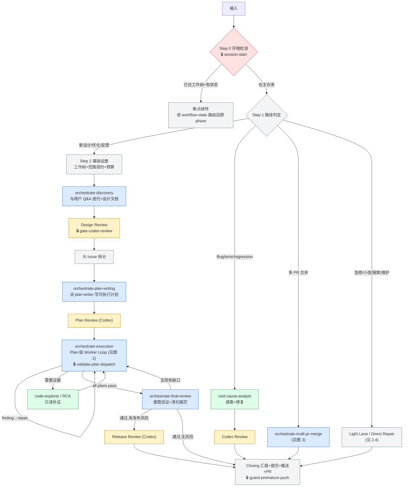
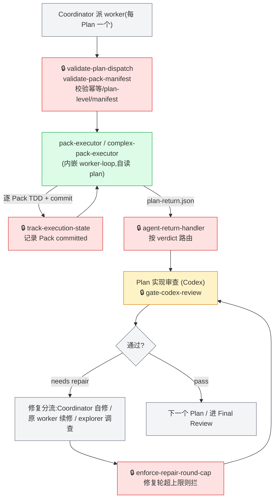
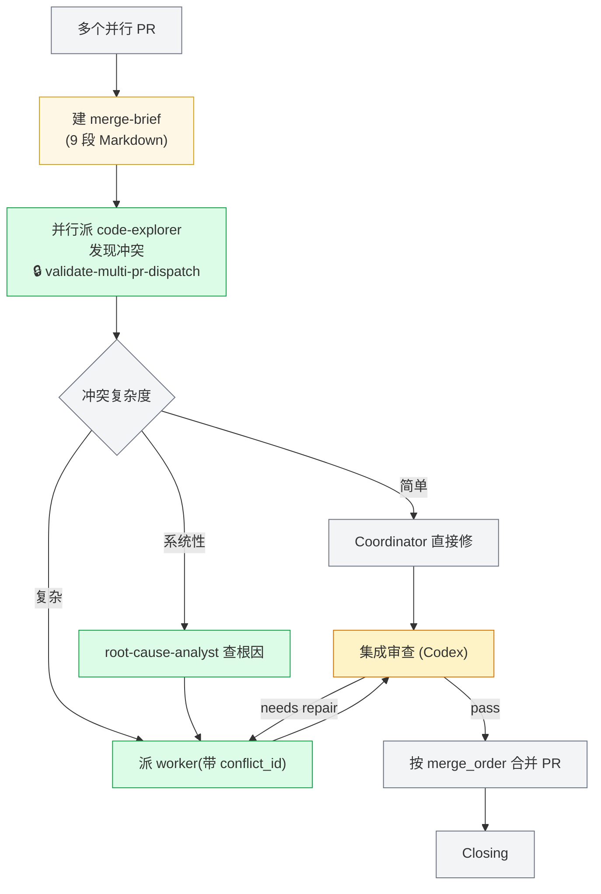
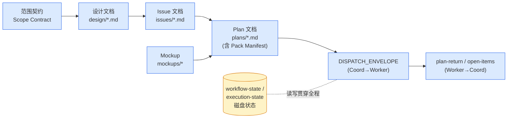

# MultiModel Worktree · 架构总览

> 本文档是给**项目负责人 / 产品视角**读的架构地图：讲清楚这个 plugin 各阶段的流程、每一步做什么、每个组件的功能,以及运行期文档怎么流转。**不写行号、字段 schema、构建脚本内部**这类实现细节——那些属于代码和 commit 历史。
>
> 流程的**真相源**是 `state-schema/routes-v1.json`(哪条路线跑哪些阶段、跳哪些门、预算多少、修几轮)。本文档若与它冲突,以 routes 清单为准。

---

## 这个 Plugin 是什么

在 Claude Code 里编排一套**"设计 → 计划 → 执行 → 审查"**的多模型软件工作流:

- **Claude 当 Coordinator(总协调)**:判路线、派活、验收、收口。
- **Codex 当外部对抗评审**:在关键 gate 做独立审查,抓 Coordinator 自己看不到的问题。
- **Sub-agent 当劳动力**:写设计、写计划、写代码、查根因,在工作树里干活,把上下文压力从主线程卸下来。

两条贯穿全局的核心理念:

| 理念 | 是什么 | 为你解决什么 |
|------|-------|------------|
| **Document-as-Context**(文档即上下文) | 指令不塞进对话,写进磁盘文档,agent 启动后自读 | 省 token、抗漂移、可断点续传 |
| **Plan 级 Worker 自治** | 一个 Plan 派一个 worker 从头跑到尾,而不是一个 Pack 派一次 | 派发次数从几十次降到一次/Plan,大幅省 token |

---

## 1. 全局流程(5 条路线)

入口先判路线,再走对应流程。图中绿色是 sub-agent、黄色是 Codex 评审、🔒 是机器护栏(hook)。

### Route 对比表

| 路线 | 何时走 | Discovery | Plan Writing | Plan Review | Execution | Final Review | 预算 |
|------|-------|:---:|:---:|:---:|:---:|:---:|------|
| **Formal** | 新设计 / 优化 / 反馈 / 大改造 | ✅ | ✅ | ✅ | ✅ | ✅ | `3P+12` |
| **Light Lane** | 小改动 / 急修 / 探索 / 维护 | ❌ | ✅ | ❌ | ✅ | ✅ | unlimited |
| **Direct Repair** | 根因清楚的直接修复 | ❌ | ❌ | ❌ | 单阶段 | ❌ | unlimited |
| **Bug Investigation** | Bug / error / regression | ❌ | ❌ | ❌ | 单阶段 | ❌ | unlimited |
| **Multi-PR Merge** | 多 PR 合并审查 | ❌ | ❌ | ❌ | 单阶段 | ❌ | unlimited |

> Light Lane 跳过 Discovery + Plan Review 门,但保留计划/执行/终审;hotfix、quickfix、spike、maintenance 是它的**行为子模式**(单 pack / 事后审 / 只产 verdict),不另立路线。**核心红线**(计费 / 权限 / 数据权威 / 用户可见合同)会把轻档**建议升级**为 Formal。

---

## 2. 各阶段流程详解

### 2.1 Formal 完整流程(四阶段,线性不回流)

| 阶段 | Skill | 这一步做什么 | 关键产出 |
|------|-------|------------|---------|
| **Discovery** | `orchestrate-discovery` | 和用户 Q&A 迭代方案,派 explorer 只读补证,写设计文档 + mockup,拆大 issue | 设计文档、Mockup、Issue |
| **Plan Writing** | `orchestrate-plan-writing` | 把每个 issue 并行派给 `plan-writer`,写成含 Pack Manifest 的可执行计划 | Plan 文档 |
| **Execution** | `orchestrate-execution` | 每个 Plan 派一个 worker 自治执行,逐 Plan 做实现审查 + 修复(见图 2) | 代码 commit、plan-return |
| **Final Review** | `orchestrate-final-review` | 验证实现是否兑现设计意图,清扫遗留尾巴,判断是否需发布审查 | 验收结论 |

每个阶段之间有 **gate**(Codex 评审),通过才往下走;评审发现问题就地修复,不污染下一阶段。

> **跨计划合同锚点(Cross-Plan Contract Anchors)**:多个 Plan 并行时,每个 Plan 在设计文档里声明自己**产出 / 消费的合同**(接口、schema、状态)。Plan Writing 写进去、Plan Review 检查、Final Review 据此核对跨 Plan 的 producer-consumer 是否对得上——接不上就退回 Execution 修。这是多个 Plan 之间保持一致、不互相打架的机制。

### 2.2 Execution 循环(Plan 级 Worker 自治)

这是最核心的循环:Coordinator 把整个 Plan 交给一个 worker,worker 自己读懂、逐 Pack 实现、逐 Pack 提交,跑完回报。

### 2.3 Multi-PR 合并流程(merge-brief 驱动)

把同一大设计下的多个并行 PR 合并。全程由一份 **merge-brief** 文档当单一真相源,所有 sub-agent 只引用它的路径,不粘贴 PR 内容。

### 2.4 轻量路线(Light Lane / Direct Repair / Bug / Multi-PR)

| 路线 | 跳过什么 | 怎么走 |
|------|---------|-------|
| **Light Lane** | Discovery + Plan Review 门 | 直接进计划/执行/终审;子模式:hotfix(先 push 后审)、quickfix(单 pack 单审)、spike(只产 verdict)、maintenance(worker+审) |
| **Direct Repair** | 全部 formal 门 + Codex 审 | 根因清楚时,route-worker 直接修 |
| **Bug Investigation** | 全部 formal 门 | `root-cause-analyst` 调查 → worker 修 → Codex 审 → Closing |
| **Multi-PR Merge** | 全部 formal 门 | merge-brief 驱动(见图 3) |

> 机器层面用 routes 清单**强制**这些跳过:轻档误跳到 Discovery 会被 `state.sh` 直接拒(该跳转在 light 路线下根本不存在),不靠"主线程自觉"。

---

## 3. 组件功能概述

### 3.1 Skills(7 个)

Skill 是按需加载到主线程的 Coordinator 逻辑(骨架 + 步骤 + 决策树),sub-agent 不读它。

| Skill | 阶段 / 用途 | 功能概述 |
|-------|-----------|---------|
| `orchestrate-workflow` | 总入口 | 环境检测、路线判定、断点续传、Closing 收口 |
| `orchestrate-discovery` | Discovery | 与用户迭代方案、写设计文档 + mockup、拆大 issue |
| `orchestrate-plan-writing` | Plan Writing | 派 plan-writer、Plan 门校验、预算赋值、Plan Review |
| `orchestrate-execution` | Execution | 派 worker、Plan 实现审查、修复分流、发布门 |
| `orchestrate-final-review` | Final Review | 意图验证、清扫尾巴、决定是否发布审查 |
| `orchestrate-multi-pr-merge` | Multi-PR | merge-brief 驱动的多 PR 合并 |
| `codex-review` | 任意 | 临时发起一次 Codex 对抗评审(ad-hoc) |

### 3.2 Subagents(6 个)

每个 agent 的 frontmatter 声明 `model`(模型)、`skills`(内嵌技能,启动自动加载)、`memory`。**"内嵌 skill"是外部方法论技能,agent 一启动就自动加载进它的上下文**;"启动自读"是它额外要读的操作手册/方法论文件。

| 名称 | 模型 | 内嵌 skill | 启动自读 | 被调用流程 | 核心功能 / 边界 |
|------|------|-----------|---------|-----------|---------------|
| `pack-executor` | Sonnet | `tdd` | `worker-loop`(内置) + `execution-worker-dispatch.md` | Execution(每 Plan 一个) | TDD 逐 Pack 实现 + 提交;只改代码,禁碰 `docs/` |
| `complex-pack-executor` | Opus 1M | `tdd` | 同 `pack-executor` | Execution(高风险/大体量) | 承接跨模块/迁移/计费/权限类高风险 Pack |
| `plan-writer` | Opus 1M | `improve-codebase-architecture` | dispatch 的 `## Methodology` 方法论文件 | Plan Writing(每 issue 一个,并行) | 把 issue 写成含 Pack Manifest 的可执行 plan;不做 Coordinator 判断 |
| `code-explorer` | Sonnet | (无) | dispatch 指定范围 | 任何阶段只读补证 | 只读调查返回证据;80% turn 强制返回 |
| `complex-code-explorer` | Opus 1M | `improve-codebase-architecture` | dispatch 指定范围 | 大体量/深层只读调查 | 同上,处理大上下文 |
| `root-cause-analyst` | Opus 1M | `diagnose` `tdd` | `## Methodology` 方法论文件(5 步) | Bug 调查 / 修复截断 / Multi-PR 冲突 | 列可证伪假设 + 排除证据 + 回归验证 |

> **模型分层 = 省 token 的核心手段之一**:简单/窄范围用 Sonnet(`pack-executor` / `code-explorer`),高风险/大体量/写计划用 Opus 1M。Execution 选型规则:改动碰跨模块/迁移/计费/权限或体量大,从 `pack-executor` 升 `complex-pack-executor`。**用对模型而不是一律用最贵的,是整套省 token 设计的一环**(另一环是 Codex 评审的模型分层,见 5.4)。

### 3.3 Hooks(13 个机器护栏)

Hook 是自动触发的拦截/记录脚本,违反硬约束直接 `exit 2` 阻断。

| Hook | 触发时机 | 触发后效果 |
|------|---------|-----------|
| `session-start` | 会话启动 / clear / compact | 检查环境(env / jq / python3 / 版本≥2.1.147),缺则阻断;通过则注入路由规则 + 断点恢复摘要 |
| `guard-premature-push` | 任何 Bash 命令前 | ①有未勾选任务时拦 `git push` / `gh pr create`;②拦 `git merge --squash` |
| `enforce-plan-commit` | `git commit` 前 | Pack commit 消息不符 `Pack N.M:` 格式则拦下 |
| `gate-codex-review` | 派 Codex review 前 | 按当前路线的 `review_required`;baseline 审要求该 Plan 所有 Pack 已 committed,否则拦 |
| `enforce-repair-round-cap` | 派 Codex review 前 | 修复轮数超路线上限则拦,提示走 RCA 或标 BLOCKED |
| `validate-plan-dispatch` | 派 worker 前 | 校验幂等 / plan-level / 预算就绪 / 无待决决策 / plan 未被占用,任一不过则拦 |
| `validate-pack-manifest` | 派 worker 前 | 三方对账 Pack Manifest(表格行 / 标题 / state 键),不一致则拦 |
| `validate-multi-pr-dispatch` | 派 multi-pr worker 前 | 校验 merge-brief 存在 / 阶段一致 / conflict_id 有效 / prompt 引用 brief |
| `guard-doc-edit` | 编辑 / 写文件前 | Worker 在干活且要改 `docs/` → 拦下(保护数据权威) |
| `track-review-budget` | Codex review 完成后 | 递增 review 预算;80% 软信号 / 停顿,100% 兜底 |
| `track-execution-state` | `git commit` 成功后 | 记录该 Pack committed + commit_sha;Plan 全部 committed 则推进 |
| `cleanup-before-push` | `git push` 成功后 | 清理编排临时文件 |
| `agent-return-handler` | 任何 agent 返回后 | 读 plan-return,按 5 种 verdict 路由下一步 |

---

### 3.4 外部技能(Mattpocock / gstack 系列)

Plugin 在关键环节直接 `Skill()` 调用外部方法论技能,而不是把方法论抄进自己的文档——避免与上游脱节、悄悄漂移。

| 技能 | 在哪调用 | 作用 |
|------|---------|------|
| `grill-with-docs` | Discovery Step 0(开场即调用) | 全程维护 `CONTEXT.md` / `CONTEXT-MAP.md`(仓库级领域模型/术语表),与设计文档**并列为 Discovery 双交付物** |
| `to-issues` | Discovery 大 issue 拆分(Step 12c) | 提供 tracer-bullet / vertical-slice 拆分内核。**混合接法**:调用内核保证权威最新,plugin 保留 issue 文档格式与 AFK/HITL 约定 |
| `improve-codebase-architecture` | `plan-writer` / `complex-code-explorer` 内嵌;拆分时按需 | 理解模块边界、职责分布、合同表面 |
| `frontend-design` / `impeccable` / `prototype` | Discovery 按需(UI) | mockup 生成 / 界面打磨审计 / 原型 |

> **为什么调用而非内嵌**:像 `to-issues` 这种决定拆分质量、进而决定代码落地完整性的核心方法论,内嵌会随上游更新悄悄漂移;直接调用保证单一权威、永远最新。

---

## 4. 文档输入 / 输出流转

运行期产生一连串文档,前一阶段的产出是后一阶段的输入。**指令都在文档里,不在对话里**——这是省 token 和抗漂移的关键。

| 文档 | 谁产出 | 谁消费 | 作用 |
|------|-------|-------|------|
| 范围契约 | 基础设施(Step 2) | 全程 | 圈定改动范围 / 可改文件 / 只读上下文 |
| 设计文档 `design/` | Discovery(Coordinator + Explorer) | Plan Writing、Review | 方案权威源,LINEAGE 起点 |
| Mockup | Discovery | Plan Writing、UI 实现 | UI 视觉规格,与文字设计平级的源头工件 |
| Issue 文档 | issue 拆分 | Plan Writing | 把设计拆成 thin vertical slice(端到端可独立验证) |
| Plan 文档(+Pack Manifest) | `plan-writer` | Execution worker、Review | 可执行计划,**worker 自读的唯一指令源** |
| DISPATCH_ENVELOPE | Coordinator | Worker + 校验 hook | 窄接口,只传 `plan_id`+`plan_path`+运行时变量,**不粘贴 Pack 内容** |
| plan-return / open-items | Worker | agent-return-handler、Coordinator | 回报 verdict + per-pack 状态 + 遗留项 |
| merge-brief | Multi-PR 流程 | state.sh 校验 + worker | 合并冲突的单一真相源 |
| 磁盘状态 | state.sh / hooks | 全程 + compaction 恢复 | 进度记忆(cursor / committed / budget),**断点续传的唯一可信源** |

---

## 5. 关键设置与护栏

### 5.1 预算(单一 Review 维度)

- **公式 `3P+12`**:P = Plan 总数。`3P` = 每个 Plan 1 次实现审查 + 最多 2 次修复复审;`+12` = Design / Plan / Final / Release 评审 + 修复余量。在 Plan Writing 阶段**首次且唯一**赋值,执行期不可变。
- **双模式(在场 / 无人值守)**:
  - **无人值守(默认)**:用到 80% 只软提醒、继续跑;到 100% 才硬停。
  - **在场**:用到 80% 立即停下请你决策。
- **轻量路线预算 unlimited**(Light / Direct Repair / Bug / Multi-PR 不限)。
- 计量单位是 **Codex review 派发次数**,不是 token。

### 5.2 质量门最小集 + 红线

- **质量门最小集(所有路线都保留,轻档也不豁免)**:①子代理返回必验;②Worker 禁改 `docs/`;③有未勾选任务时阻断 push。
- **核心红线**:改动触碰计费 / 权限 / 数据权威 / 用户可见合同 → **建议升级 Formal**(走完整 reviewed design)。当前为 advisory(`redline-check.sh` 探测,Coordinator 判定),非机器强制——这是设计的刻意选择。

### 5.3 硬规则汇总

| 规则 | 强制方式 |
|------|---------|
| 只用 `git merge --no-ff`,禁 `--squash` | `guard-premature-push` 进程级拦截 |
| 有未勾选任务不许 push / 开 PR | `guard-premature-push` 拦截 |
| Worker 不能改 `docs/` | `guard-doc-edit` 拦截 |
| 派发幂等(防 compaction 后重复派/重复计费) | `validate-plan-dispatch` 校验 idempotency_key |
| 修复循环 3 轮封顶(2 轮自修 + 1 轮 RCA) | `enforce-repair-round-cap` + SKILL |
| Final Review 回流 Execution 最多 1 次 | `execution_reflux_count` |
| 未设 `CLAUDE_CODE_EXPERIMENTAL_AGENT_TEAMS` 阻断启动 | `session-start` |
| Coordinator 是事实唯一权威,sub-agent 返回必亲验 | 主流程文本强制(非 hook) |

### 5.4 Codex 评审:派发方式 + 模型分层

- **派发方式(必须用对)**:Codex review 通过 `codex-companion.mjs` 脚本派发(由 `dispatch-review.sh validate/record` 校验信封 + Coordinator 用 Bash 调用),**不是** Claude Code 里装的 codex-rescue skill——用错会出上下文问题。送审的代码 diff 必须包在 `--- BEGIN/END UNTRUSTED CODE DIFF ---` 之间(防 prompt 注入)。
- **模型分层(省 token 的另一支柱)**:按当前阶段选不同价位 / 能力的 Codex 模型——

  | 评审什么 | 阶段 | 模型 |
  |---------|------|------|
  | **设计 / 计划**(方案对错) | discovery / plan-writing | `gpt-5.5 --effort xhigh`(更强) |
  | **代码** | execution / final-review / bug / direct-repair / multi-pr / 各轻档子模式 | `gpt-5.4 --effort xhigh` |

  > 配合 sub-agent 的模型分层(3.2 用 Sonnet vs Opus),**"什么阶段用什么 model"是整套省 token 设计的两大支柱**:贵而强的模型只用在最需要判断力的环节,其余用够用的便宜模型。

---

## 6. 状态与断点恢复

**为什么 compaction(上下文压缩)不会丢进度**:所有关键状态都写在磁盘 `workflow-state` / `execution-state`,不只留在对话里。

- `cursor`:当前在哪个 phase / reference / step —— 压缩后从这里续。
- `last_gate_timestamp`:上次 gate 通过的时间 —— 用来检测"评审后 source 又被改了没",改了就强制重审。
- per-pack `committed` + `commit_sha`:每个 Pack 是否已提交。
- `idempotency_keys`:已派发过的 key,防重复派。

会话启动时 `session-start` hook 读这些状态,把"你在哪、下一步做什么"重新注入,流程接着跑。状态写入用目录级自旋锁保证并发安全。

---

## 附录 A:版本号管理

改版本号必须同时更新两处保持一致:

- `plugin/.claude-plugin/plugin.json` → `version`
- `.claude-plugin/marketplace.json`(仓库根目录) → `plugins[0].version`

CI 验证:两处 `diff` 必须无输出。

## 附录 B:硬性禁区

- `docs/orchestrate/plans/` 下有未勾选任务(`- [ ]`)时,`git push` 和 `gh pr create` 被阻断。
- `git merge --squash` 永久禁止,必须 `--no-ff`。
- Worker agent 不能修改 `docs/` 下任何文件,只有 Coordinator 可写。
- 未设置 `CLAUDE_CODE_EXPERIMENTAL_AGENT_TEAMS` 时启动被阻断。
- 改了 build 模板未跑 `build.sh --apply` 时,`build.sh --check` 在 CI 失败。
