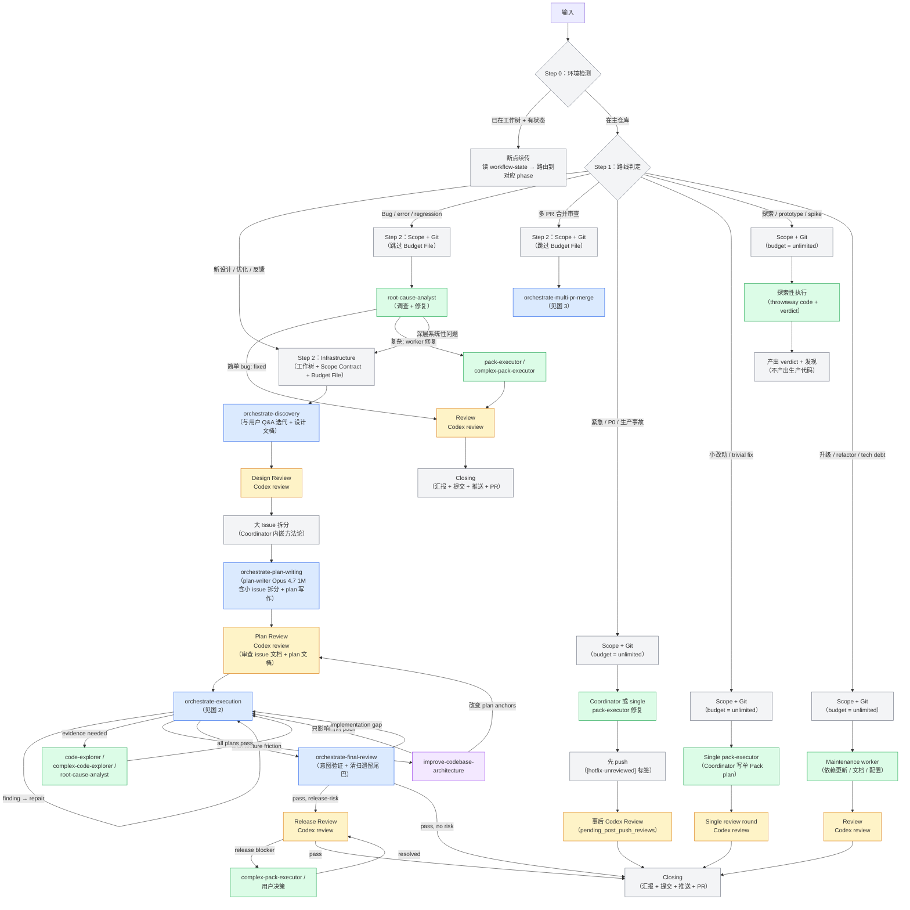
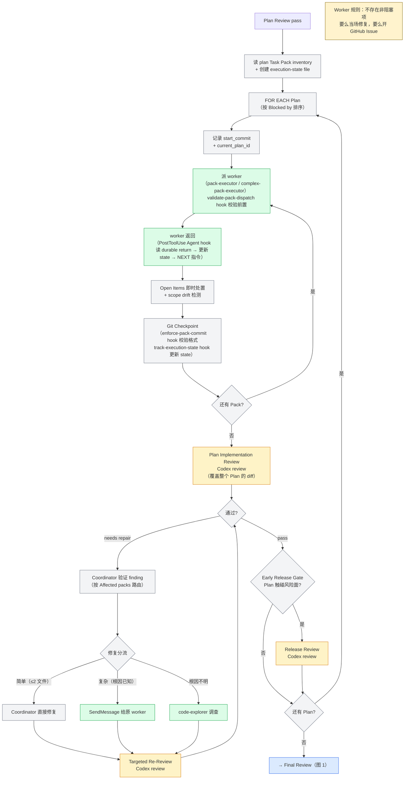
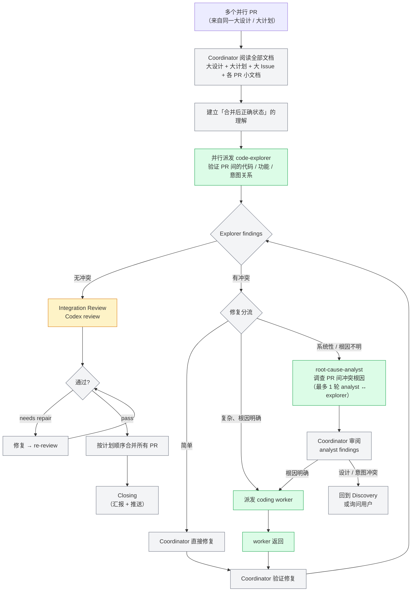
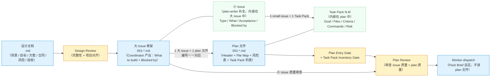

# Plugin 架构文档（基于 2026-05-23 审计）

> **审计基准**：`plugin/` 目录下的实际代码（skills/ agents/ hooks/）。
> **审计日期**：2026-05-23。
> **Plugin 版本**：3.6.3。

## 图例

```
🟦 蓝色 = 内部 Skill（按需加载到主线程）
🟩 绿色 = Sub-Agent（独立子进程，不消耗主线程上下文）
🟧 橙色 = 外部 Review（跨模型独立审查）
🟪 紫色 = 外部 Skill（orchestrate 之外的独立技能）
⬜ 灰色 = Coordinator 自身逻辑（路线判定、修复分流、git 操作等）
🟥 红色 = 断点 / 矛盾
⬜ 虚线 = 路径存在但机制缺失
```

---

## 图 1：全局流程（七条路线）



### 图 1 节点分析

| 节点 | 机制 | 做什么 | 产出/消费文档 | 状态 |
|------|------|--------|-------------|------|
| 路线判定 | Coordinator 自身逻辑 | 判断输入属于七条路线中的哪一条 | — | ✅ 正常 |
| Steps 0-2 Environment Detection + Infrastructure | Coordinator 逻辑（`workflow-infrastructure.md`） | 环境检测（工作树/主仓库）+ 断点续传 + Scope Contract + Git Checkpoint + Budget File 创建 | **确定** feature slug（贯穿 `docs/orchestrate/` 全链） | ✅ 正常 |
| Discovery | Skill：`orchestrate-discovery` | 与用户 Q&A 迭代 + grill-with-docs 同步维护 CONTEXT.md + 产出设计文档 | **产出** `design/<slug>.md` + CONTEXT.md | ✅ 正常 |
| Design Review | Coordinator + **外部 Review** | 两个 baseline review（Design Content + Project Alignment），按 dispatch 模板内联的 Codex review 步骤派发 | **审查** `design/<slug>.md` | ✅ 正常 |
| 大 Issue 拆分 | Coordinator 内嵌方法论（`issue-splitting.md`） | 设计文档拆分为大 Issue 骨架 | **消费** `design/<slug>.md` → **产出** `issues/<slug>/00N-*.md`（小 issue 由 plan-writer 补全） | ✅ 正常 |
| Plan Writing | Skill：`orchestrate-plan-writing` | 前置确认 + 派 plan-writer agent（先拆小 issue 再写 plan）+ Budget 赋值（`3P+12`） | **消费** `issues/<slug>/00N-*.md`（补全小 issue）→ **产出** `plans/<slug>/00N-*.md`（编号一一对应） | ✅ 正常 |
| Plan Review | Coordinator + **外部 Review** | Plan Entry Gate + Task Pack Inventory Gate → 派外部 review | **审查** `issues/<slug>/`（小 issue 质量）+ `plans/<slug>/`（plan 质量）全部文件 | ✅ 正常 |
| Execution | Skill：`orchestrate-execution` | 图 2 的两级循环（Plan → Pack → Plan Implementation Review） | **消费** `plans/<slug>/` 提取 Task Pack → 构造 Pack Brief（自足，worker 不读 plan） | ✅ 正常 |
| Final Review | Skill：`orchestrate-final-review` | 意图验证 + 清扫遗留尾巴 + Release Gate | **消费** `design/<slug>.md` 验证意图覆盖 | ✅ 正常（review 节点除外） |
| Release Review | Coordinator + **外部 Review** | 发布风险审查，仅触碰风险面时进入 | — | ✅ 正常 |
| Bug Investigation | Sub-Agent：root-cause-analyst | 调查 bug 根因，判定简单/深层 | — | ✅ 正常 |
| Bug Fix Review | **外部 Review** | 按 dispatch 模板内联的 Codex review 步骤派发 Codex review | — | ✅ 正常 |
| Closing | Coordinator 自身逻辑 | 汇报 + 提交 + 推送 + 开 PR | — | ✅ 正常 |
| Hotfix（Route 4） | Coordinator + single worker | 跳过 Discovery + Plan Writing，先 push 再事后 review | `pending_post_push_reviews` 记录待审 | ✅ 正常 |
| Quick Fix（Route 5） | Coordinator + single worker | 消费现有 design，single Pack + single review round | Coordinator 自写单 Pack plan | ✅ 正常 |
| Spike（Route 6） | Coordinator + worker | 探索性执行，产出 throwaway code + verdict，不产出生产代码 | — | ✅ 正常 |
| Maintenance（Route 7） | Coordinator + worker | 依赖更新、文档更新、配置调整、chore | — | ✅ 正常 |

### Route 对比

| Route | 名称 | Discovery | Plan Writing | Plan Review | Execution | Final Review | Budget | 特殊行为 |
|-------|------|-----------|-------------|-------------|-----------|-------------|--------|---------|
| 1 | Formal | ✅ | ✅ | ✅ | ✅ | ✅ | `3P+12` | 完整流程 |
| 2 | Bug Investigation | ❌ | ❌ | ❌ | ❌ | ❌ | 无 Budget File | RCA → worker → review → Closing |
| 3 | Multi-PR Merge | ❌ | ❌ | ❌ | ❌ | ❌ | 无 Budget File | 冲突发现 → 修复 → 集成审查 → 合并 |
| 4 | Hotfix | ❌ | ❌ | ❌ | 单 Pack | ❌ | unlimited | 先 push 再事后 review |
| 5 | Quick Fix | ❌ | 简化（Coordinator 自写） | ❌ | 单 Pack + 单 review | ❌ | unlimited | 不允许 3 轮截断 |
| 6 | Spike | ❌ | ❌ | ❌ | 探索性 | ❌ | unlimited | 不产出生产代码 |
| 7 | Maintenance | ❌ | ❌ | ❌ | ✅ | ❌ | unlimited | chore 类任务 |

Routes 4-7 的行为定义分布在两处 `route-extensions/` 目录中（内容不同，不是拷贝）：
- `orchestrate-workflow/references/route-extensions/` — 入口路由判定、phase 跳过规则、budget 策略
- `orchestrate-execution/references/route-extensions/` — Pack 循环内的行为差异（commit 格式、review scope、执行约束）

---

## 图 2：Execution 循环（两级：Plan → Pack）



### 图 2 节点分析

| 节点 | 机制 | 做什么 | 文档交互 | 状态 |
|------|------|--------|---------|------|
| 读 Task Pack inventory + 创建 state | Coordinator 逻辑 | 读取所有 plan → 构建执行队列 → 创建 `execution-state-<run_id>.json` | **读** `plans/<slug>/` 全部文件 → 提取 pack 编号、依赖、风险 | ✅ 正常 |
| 记录 start_commit | Coordinator 逻辑 | Plan 首个 Pack dispatch 前记录 `git rev-parse HEAD` | **写** execution state | ✅ 正常 |
| 派 worker | Sub-Agent：`pack-executor`（普通）/ `complex-pack-executor`（高风险） | Agent tool 派发 coding worker | **嵌入** Pack Brief（含 Durable Return 指令 + Context hint） | ✅ 正常 |
| Agent return handler | Hook：`agent-return-handler.sh`（PostToolUse Agent） | 读 `pack-returns/<run_id>/<pack-id>.json` → 更新 state → 输出 `NEXT` 指令（additionalContext） | **读** pack-returns、**写** execution state | ✅ 正常 |
| validate-pack-dispatch | Hook：`validate-pack-dispatch.sh` | 拦截缺少 start_commit 或 Pack 状态非 pending 的 dispatch | **读** execution state | ✅ 正常 |
| enforce-pack-commit | Hook：`enforce-pack-commit.sh` | 校验 Pack commit message 格式 | — | ✅ 正常 |
| track-execution-state | Hook：`track-execution-state.sh` | commit 后更新 pack status + commit_sha | **写** execution state | ✅ 正常 |
| Plan Implementation Review | **外部 Review** | 按 dispatch 模板内联的 Codex review 步骤派发（覆盖该 Plan 全部 diff） | — | ✅ 正常 |
| Coordinator 验证 finding | Coordinator 逻辑 | 按 `Affected packs` 路由后主线程评估 finding | — | ✅ 正常 |
| 修复分流 | Coordinator 逻辑 | 简单/复杂/根因不明三路分流 | — | ✅ 正常 |
| Early Release Gate | Coordinator + **外部 Review** | Plan 触碰风险面时触发 release review | — | ✅ 正常 |

---

## 图 3：Multi-PR Merge 流程



### 图 3 节点分析

| 节点 | 机制 | 做什么 | 状态 |
|------|------|--------|------|
| Coordinator 阅读全部文档 | Coordinator 逻辑 | 读大设计 + 大计划 + 各 PR 小文档，建立全局理解 | ✅ 正常 |
| 并行派发 code-explorer | Sub-Agent：`code-explorer` / `complex-code-explorer` | 并行探索各 PR 代码，发现冲突 | ✅ 正常 |
| 修复分流 | Coordinator 逻辑 | 简单/复杂/系统性三路分流 | ✅ 正常 |
| root-cause-analyst 调查 | Sub-Agent：root-cause-analyst | 系统性冲突根因调查（capped at 1 轮 analyst ↔ explorer） | ✅ 正常 |
| Integration Review | **外部 Review** | 跨 PR 集成审查 | ✅ 正常 |
| 按计划顺序合并 PR | Coordinator 逻辑 | git 操作 | ✅ 正常 |

---

## 状态文件链

```
orchestrate-workflow Step 2b
  └─ .claude/multi-model-workflow/scope-<run_id>.md        ← Scope Contract
orchestrate-workflow Step 2c
  ├─ .claude/multi-model-workflow/workflow-state-<run_id>.json ← Workflow State（budget/cursor/dispositions/plans）（Route 1 only）
  └─ .claude/multi-model-workflow/active-run-id             ← Active Run ID
orchestrate-plan-writing Step 12a
  └─ workflow-state-<run_id>.json: budget.review_total = 3P + 12, effort_total = 2 × review_total  ← Budget 赋值（P = plan 数，不可变）
orchestrate-execution Step 2a
  └─ .claude/multi-model-workflow/execution-state-<run_id>.json ← Execution State（pack-level status/agent_id/commit_sha）
每个 Worker 完成时
  └─ .claude/multi-model-workflow/pack-returns/<pack-id>.json  ← Worker Durable Return
每次 review 完成
  └─ workflow-state-<run_id>.json: budget.review_used += 1     ← Budget 消耗
每个 phase verdict 后
  └─ workflow-state-<run_id>.json: cursor.phase + timestamp    ← Phase 标记
Review 派发时
  ├─ .claude/multi-model-workflow/review-prompts/<gate>.md  ← Review prompt
  └─ .claude/multi-model-workflow/review-results/<gate>.md  ← Review result
Closing 前（cleanup-before-push.sh）
  └─ 清除 active-run-id + scope + workflow-state + execution-state + review temp files
```

### 状态文件双文件模型

**[Ruling 2]** 设计 §2b 原文描述将原 budget 文件和 execution-state 文件合并为单一 `workflow-state`。实现采用双文件模型：

- **workflow-state-<run_id>.json**：run_id、slug、route（8 值 enum）、cursor（phase/reference/step）+ 冗余顶层 current_phase/current_reference/current_step、budget（budget_status/review_total/review_used/effort_total/effort_used/direction_check_count）、plans 元信息、plan_count、plan_writer_agent_id、idempotency_keys、review_dispositions（per-finding：severity/confidence/disposition/evidence）、review_effectiveness（reject/suppress/path-a/path-b counts + health_warnings）、path_a_escalation、self_verifications、pending_direction_check、pending_post_push_reviews、execution_reflux_count、last_gate_phase/last_gate_timestamp、mutations（append-only 审计日志）
- **execution-state-<run_id>.json**：pack-level data（status/agent_id/commit_sha/worker_verdict/repair_round per pack）

分离原因：pack-level 数据被 3 个 hook 并发写入（agent-return-handler、track-execution-state、track-review-budget），合并到单文件会加剧竞态。双文件模型保持 workflow-state 由 Coordinator + state.sh 独占写入的简洁性，execution-state 由 hooks 写入。两文件通过 plan_id 和 pack_id 关联。

**[Ruling 3]** PostToolUse hook（agent-return-handler）在信封解析失败时 exit 0 跳过，而非 exit 2 硬停。原因：PostToolUse 在 Agent 已完成后触发，无法撤回已完成的 agent，硬停只会中断正常流程。信封解析失败的 agent return 仍可从 tool_response fallback 提取 verdict。

**[Ruling 1]** track-execution-state.sh 的 Pack ID 提取保留 sed 模式（`sed -n 's/.*Pack \([0-9][0-9]*\.[0-9][0-9]*\).*/\1/p'`），因为此 hook 的输入源是 commit message（受 enforce-pack-commit.sh 格式保证），不是 prompt/控制平面。设计 §3.5 的"无 fallback 无渐进迁移"适用于 Agent dispatch 信封，不适用于已有格式保证的 commit message 解析。

---

## 文档产物链：`docs/orchestrate/`

运行态状态文件（上节）跟踪 Coordinator 内部状态。**文档产物**跟踪功能本身的设计-拆分-计划-执行链路——它们是 phase 之间传递信息的载体，也是 review 的审查对象。

### 目录结构与命名

所有 orchestrate 产出文档统一存放在 `docs/orchestrate/`，按类型分子文件夹。同一功能用相同的 **feature slug**（`YYYY-MM-DD-<feature>`，kebab-case）贯穿四个子文件夹：

```
docs/orchestrate/
├── design/                                  # 设计文档（Discovery 产出）
│   └── <slug>.md
├── issues/                                  # Issue hierarchy（大 issue: Coordinator 产出；小 issue: plan-writer 补全）
│   └── <slug>/
│       ├── 001-<large-issue-slug>.md       # 大 issue（内含小 issue）
│       ├── 002-<large-issue-slug>.md
│       └── ...
├── plans/                                   # 实施计划（plan-writer 产出）
│   └── <slug>/
│       ├── 001-<issue-slug>.md             # 编号与 issues/ 下同编号文件一一对应
│       ├── 002-<issue-slug>.md
│       └── ...
└── mockups/                                 # 原型产出（prototype / frontend-design）
    └── <slug>/
        ├── *.html / *.png / *.svg
        └── README.md                        # mockup 索引
```

**关键约束**：
- feature slug 在 Infrastructure Setup 确定后全流程不变
- `issues/` 和 `plans/` 的文件**编号必须一一对应**（001 ↔ 001, 002 ↔ 002）——Plan Entry Gate 强制检查
- Plan 文件数量必须与 issue 文件数量一致——缺对应 plan 的 issue 返回 plan-writing 补写

### 图 4：文档产物流



### 四种文档产物

| 产物 | 模板来源 | 产出者 | 消费者 | 审查门禁 |
|------|---------|--------|--------|---------|
| **设计文档** | `discovery-design-document.md` | orchestrate-discovery | Coordinator（大 issue 拆分）、plan-writer（只读） | Design Review（2 baseline） |
| **大 Issue 文件** | `issue-splitting.md`（Coordinator 方法论）+ `plan-writing-methodology.md` Step 3c（plan-writer 补全小 issue） | Coordinator（大 issue 骨架）+ plan-writer（小 issue 补全） | plan-writer（1 issue = 1 plan） | Plan Review（Issue Quality 角度） |
| **Plan 文件** | `plan-writing-methodology.md` | plan-writer agent | orchestrate-execution | Plan Entry Gate + Task Pack Inventory Gate |
| **Mockup** | prototype / frontend-design | Discovery 阶段 | plan-writer（mockup anchors）、worker（视觉验证） | Design Review 覆盖 |

### 设计文档结构

```
# <功能> 设计文档
├── 背景和问题          — 用户视角问题、触发场景
├── 目标结果            — 完成后能稳定做到什么
├── 用户场景            — actor/action/benefit · happy path + 失败 + 空态 + 权限 + 并发 + 回滚
├── 方案设计
│   ├── 业务对象、角色和状态   — 对象 / owner / writer / reader / verifier / 状态 / 生命周期
│   └── 实现决策               — 讨论中做出的决策（不写 file path / code snippet）
├── 合同边界            — API / Pydantic / DB / JSON / sync / billing / permission / runtime
├── 发布风险和人工门禁
├── 测试和验收
├── UI/UX 状态          — mockup 目录 / viewport / states / interaction
├── 失败场景和异常处理
├── 不在本次范围
└── Open Decisions
```

**硬规则**：使用 CONTEXT.md 正式术语 · 无 TODO/TBD · 不混入 Task Pack 或 worker 指令 · 不写只在聊天中能理解的句子。

### Issue 文档结构

Issue 文档的大 issue 骨架由 Coordinator 在 Discovery 阶段产出（`issue-splitting.md` 方法论），小 issue 由 plan-writer 在 Plan Writing 阶段补全（`plan-writing-methodology.md` Step 3c）。

```
# <大 Issue 标题>
├── What to build       — 端到端行为描述（vertical slice）
├── Small issues        — 编号子节，每个小 issue 包含：
│   ├── Type: AFK / HITL
│   ├── What to build
│   ├── Acceptance criteria（checkbox 列表）
│   └── Blocked by（其他小 issue 编号或 None）
└── Blocked by          — 其他大 issue 编号或 None（跨 plan 依赖）
```

**层级关系**：大 issue = 一个 vertical slice = 一个文件 · 小 issue = 内嵌子节（不是独立文件）· 小 issue 直接映射 Task Pack。

**两阶段产出**：大 issue 骨架（`What to build` + `Blocked by`）由 Coordinator 在 Discovery 阶段产出；`Small issues` 章节由 plan-writer 在 Plan Writing 阶段 Step 3c 补全。Plan Review 同时审查小 issue 拆分质量和 plan 质量。

**编号规则**：文件名 `00N-<slug>.md`，N 按依赖顺序排列（blocker 在前）。Coordinator 完成大 issue 拆分后发布 GitHub Issue 并将 issue number 写回本地文件。

### Plan 文档结构

```
# <Issue Title> Implementation Plan
├── Header
│   ├── Goal / Source design / Source issue / Execution owner / Blocked by
│   ├── Architecture / Tech stack / Quality gate
│   ├── File / Responsibility Map（Create / Modify / Test / Docs）
│   └── 发布风险和人工门禁表
└── Task Pack 列表（每个小 issue → 一个 Task Pack）
    └── Task Pack N.M: <small issue title>
        ├── Issue / Goal behavior
        ├── Owned files / responsibilities
        ├── Read first（source docs / ADRs / mockups）
        ├── Contract anchors / Mockup anchors
        ├── Acceptance criteria（从 issue 映射）
        ├── Verification commands（pack-local）
        ├── Implementation tasks（TDD: Red → Green → Refactor per step）
        ├── Commit boundary
        ├── Risk flags / 发布风险
        ├── AFK / HITL
        ├── Dependencies
        └── Out of scope
```

**Task Pack 编号**：`N.M`，N = plan/issue 文件编号，M = pack 在该 plan 内的序号。Pack 2.3 = plan 002 的第 3 个 Task Pack。

**关键设计决策**：
- 每个 plan-writer agent **只负责一个大 issue**——Coordinator 逐 issue 派发
- Worker **不读 plan 文件**——Pack Brief 在 dispatch prompt 中完整自足
- Task Pack 是最小执行单元：包含 worker 所需的一切（任务、验收、命令、文件、合同锚点）
- 无 Placeholder 规则：TBD/TODO/later 出现在 plan 中 = plan failure
- `Dependencies` 字段决定 pack 执行顺序（严格串行）

### 文档间引用关系

```
设计文档 ←───────────── plan header: Source design
    │
    ├─(Design Review)
    │
    ▼
大 Issue 文件 ←──────── plan header: Source issue
    │                    plan header: Blocked by（从 issue 继承）
    │
    ├─(1 大 issue = 1 plan 文件，编号对应)
    │
    │   小 issue ←────── Task Pack: Issue 字段
    │   acceptance ←──── Task Pack: Acceptance criteria
    │   blocked-by ←──── Task Pack: Dependencies
    │
    ▼
Plan 文件
    │
    ├─(Plan Entry Gate + Task Pack Inventory Gate)
    │
    ▼
Worker dispatch（Pack Brief 自足）
```

**单向引用**：设计文档不引用 issue/plan（上游只产出不消费下游）。Issue 不引用 plan。Plan 引用设计文档和 issue。Worker dispatch 嵌入 pack 内容，不引用 plan 文件路径。

---

## 返回值路由表

### orchestrate-discovery → orchestrate-workflow

| 返回值 | Coordinator 动作 |
|--------|-----------------|
| `DISCOVERY_READY` | 检查 issue hierarchy → 有则进 plan-writing；无则重新进入 orchestrate-discovery Step 12（大 issue 拆分） |
| `DISCOVERY_NOT_NEEDED` | 同上 |
| `READY_FOR_REPAIR` | 进入 Direct Repair mini-route → Closing |
| `NEEDS_USER_DECISION` | 询问用户 → 重新进入 discovery |
| `BLOCKED` | 报告用户 |

### orchestrate-plan-writing → orchestrate-workflow

| 返回值 | Coordinator 动作 |
|--------|-----------------|
| `PLAN_CREATED` | 确认 workflow-state budget → 进入 execution |
| `NEEDS_DISCOVERY` | 回到 discovery |
| `NEEDS_DESIGN_REVIEW` | 回到 design review |
| `NEEDS_ISSUES` / `NEEDS_TRIAGE` | 大 issue 缺失 → 重新进入大 issue 拆分；小 issue 缺失 → plan-writer 内部处理 / triage |
| `NEEDS_DIAGNOSIS` / `NEEDS_ARCHITECTURE` / `NEEDS_CONTEXT` | 调用对应外部 skill |
| `NEEDS_DECISION` | 询问用户 |
| `BLOCKED` | 报告用户 |

### orchestrate-execution → orchestrate-workflow

| 返回值 | Coordinator 动作 |
|--------|-----------------|
| `EXECUTION_PASSED` | 进入 final-review |
| `NEEDS_DISCOVERY` | 回到 discovery |
| `NEEDS_PLAN_REVISION` | 回到 plan-writing |
| `NEEDS_ARCHITECTURE` | 调用 improve-codebase-architecture → 回到 execution 或 plan-writing |
| `BLOCKED` | 报告用户 |

### orchestrate-final-review → orchestrate-workflow

| 返回值 | Coordinator 动作 |
|--------|-----------------|
| `FINAL_REVIEW_PASSED` | Closing |
| `FINAL_REVIEW_PASSED_WITH_RELEASE_RISK` | Closing（release review 已在内部处理） |
| `NEEDS_EXECUTION` | 回到 execution（**最多 1 次**；第 2 次 → BLOCKED） |
| `NEEDS_DISCOVERY` | 回到 discovery |
| `NEEDS_PLAN_REVISION` | 回到 plan-writing |
| `BLOCKED` | 报告用户 |

### orchestrate-multi-pr-merge → orchestrate-workflow

| 返回值 | Coordinator 动作 |
|--------|-----------------|
| `MERGE_COMPLETE` | Closing |
| `NEEDS_DISCOVERY` | analyst 发现设计/意图冲突 → 回到 discovery |
| `NEEDS_USER_DECISION` | 询问用户 |
| `BLOCKED` | 报告用户 |

---

## 组件汇总

### 内部 Skill（6 个，按需加载到主线程）

| Skill | 对应节点 | 职责 |
|-------|---------|------|
| `orchestrate-workflow` | 路线判定（7 条）+ Infrastructure + Bug 路线 + Direct Repair + Closing + Route Extensions（4-7） | 入口路由（formal/bug/multi-pr/hotfix/quickfix/spike/maintenance）、Scope Contract、Git Checkpoint、Budget File、Bug 路线调度、Direct Repair mini-route、Closing |
| `orchestrate-discovery` | Discovery + Design Review + 大 issue 拆分 | Q&A 迭代 + grill-with-docs + 设计文档 + Design Review + 大 issue 拆分（内嵌方法论） |
| `orchestrate-plan-writing` | Plan Writing（含小 issue 拆分）+ Plan Review（含 issue 质量审查） | 前置确认 + plan-writer dispatch（先拆小 issue 再写 plan）+ Budget 赋值 + Plan Review（issue 质量 + plan 质量）+ Git Checkpoint |
| `orchestrate-execution` | Execution（图 2） | 两级循环（Plan → Pack）：派 worker → Git Checkpoint → Plan Implementation Review → 修复分流 → Early Release Gate → 循环释放 |
| `orchestrate-final-review` | Final Review + Release Gate | 意图验证 + 清扫遗留尾巴 + Final Release Gate + 业务汇报 |
| `orchestrate-multi-pr-merge` | Multi-PR Merge（图 3） | 冲突发现 → 根因调查 → 修复 → 集成审查 → 合并 |

Skill 命名空间：`multi-model-workflow:orchestrate-*`（全限定名，通过 `Skill({ skill: "..." })` 调用）。

### Sub-Agent（7 个 + 1 参考文档）

| Agent | 模型 | effort | maxTurns | 用在哪 | `skills:` 自动加载 | 体内 Skill tool 调用 |
|-------|------|--------|----------|--------|-------------------|---------------------|
| `plan-writer` | Opus 4.7 (1M) | xhigh | — | Plan Writing（小 issue 拆分 + plan 写作） | `improve-codebase-architecture` | `improve-codebase-architecture` |
| `pack-executor` | Sonnet | high | — | Execution 普通 pack / Bug worker | `tdd` | `diagnose`, `prototype` |
| `complex-pack-executor` | Opus 4.7 | high | — | Execution 高风险 pack / Release blocker | `tdd` | `diagnose`, `improve-codebase-architecture`, `prototype` |
| `code-explorer` | Sonnet | high | 20 | Execution 证据收集 / Multi-PR 代码探索 | — | — |
| `complex-code-explorer` | Opus 4.7 | high | 30 | 多模块调查 | — | — |
| `root-cause-analyst` | Opus 4.7 (1M) | xhigh | 40 | Bug Investigation / Execution RCA / Multi-PR 冲突调查 | `diagnose`, `tdd` | — |
| `docs-worker` | Sonnet | high | 20 | 文档清理（Closing 阶段可选） | `grill-with-docs` | `triage` |

另有 `persona.md`（非 agent 定义），是 voice/persona 规范参考文档，声明权威来源为 `build/templates/voice-directive.md.tmpl`。

**注意**：
- Plugin **没有 `code-reviewer` 和 `release-reviewer` agent**。所有 review 通过 `dispatch 模板内联的 Codex review 步骤` 直接调用 codex 插件的 `codex-companion.mjs` 派发。
- `skills:` 自动加载 = frontmatter 声明，agent 启动时自动预加载。体内 Skill tool 调用 = agent body 中通过 `Skill({ skill: "..." })` 按需调用，不预加载。
- 所有 agent 均设 `memory: project`（跨 session 记忆写入 `.claude/agent-memory/<agent-name>/`）。
- 所有 agent 均设 `color` 字段用于 UI 区分。

### Hooks（11 个脚本 / 13 条 hooks.json 条目）

| 事件 | Matcher / if 条件 | 做什么 | 强制行为 |
|------|-------------------|--------|---------|
| `SessionStart` | `startup\|clear\|compact` | `session-start.sh`：注入行为覆盖规则 + execution state recovery（`RESUME`） | `CLAUDE_CODE_EXPERIMENTAL_AGENT_TEAMS` 未设置 → exit 2（阻断会话）。注入 compaction recovery 规则的唯一入口。有 execution state 时输出 `RESUME` 指令 |
| `PreToolUse` | `Bash` | `guard-premature-push.sh`：阻止未完成时 push/PR | ① plan 文件有未勾选 task（`- [ ]`）→ 阻止 `git push` / `gh pr create`　② 无条件阻止 `git merge --squash` |
| `PreToolUse` | `Bash(git commit *)` | `enforce-pack-commit.sh`：Pack commit 格式校验 | Pack commit 格式不匹配 `Pack N.M: ...` → exit 2 拦截。非 Pack commit 静默放行 |
| `PreToolUse` | `Bash` | `gate-codex-review.sh`：Codex review dispatch gate | 自过滤 `codex-companion`/`CODEX_SCRIPT` + `task`。按 `review_intent` 三路判定：`baseline` → 放行；`path-a-re-review` → 需 `path_a_escalation` 非空；`targeted-re-review` → 需 `--resume` + exception 条件（`3plus_files_control_flow` / `user_requested` / `rca_root_cause`）。缺失或畸形 DISPATCH_ENVELOPE → exit 2 |
| `PreToolUse` | `Agent(pack-executor*)` | `validate-pack-dispatch.sh`：Worker dispatch 13 步校验 | DISPATCH_ENVELOPE 解析 → 必填字段校验 → 幂等性检查 → budget 初始化检查 → Direction Check 待处理检查 → Pack 状态必须为 pending → agent_id 已存在时阻止（repair 须 SendMessage） → Path A escalation 检查 → repair round 的 disposition_refs 验证 → 登记幂等键 → 设 Pack 状态为 dispatched。任一步失败 → exit 2 |
| `PreToolUse` | `Agent(complex-pack-executor*)` | `validate-pack-dispatch.sh`：同上脚本 | 同上 |
| `PreToolUse` | `Edit` | `guard-doc-edit.sh`：阻止 Worker 修改 docs/ | Worker 上下文（workflow 目录存在但无 `active-run-id`）中 Edit `docs/` 路径 → exit 2。Coordinator 上下文放行 |
| `PreToolUse` | `Write` | `guard-doc-edit.sh`：同上脚本 | 同上 |
| `PostToolUse` | `Bash` | `track-review-budget.sh`：review budget 自动追踪 | 检测 `codex-companion`/`CODEX_SCRIPT` + `result` 成功执行 → 递增 `review_used`。≥ 80% → `state.sh direction-check trigger`；≥ 100% → BUDGET EXHAUSTED |
| `PostToolUse` | `Agent` | `track-effort-budget.sh`：effort budget 追踪 | 从 `tool_input.subagent_type` 读 agent 角色 → 按角色加权递增 `effort_used`（worker = +1, explorer = +1, RCA = +2）。≥ 80% → Direction Check；≥ 100% → EXHAUSTED。`effort_total` 为 0 或 unlimited 时跳过 |
| `PostToolUse` | `Bash(git commit *)` | `track-execution-state.sh`：commit 后更新 execution state | Pack commit 成功后更新 `packs[N.M].status = committed` + `commit_sha`。全部 committed → 输出 `NEXT` 指示派发 Plan Implementation Review |
| `PostToolUse` | `Bash(git push *)` | `cleanup-before-push.sh`：push 成功后清理 `.claude/multi-model-workflow/` | push 成功后执行。Hotfix route 检测到 `route = "hotfix"` 时延迟清理（事后 review 仍需 state）。其他 route 删除整个 `.claude/multi-model-workflow/` 目录。拒绝删除符号链接。支持 `--force` 参数跳过 hook 输入解析和 route 检查（Hotfix Closing 手动调用） |
| `PostToolUse` | `Agent` | `agent-return-handler.sh`：Worker 返回后更新 execution state | 从 `tool_input` 提取 DISPATCH_ENVELOPE → 读 `pack-returns/<run_id>/<pack-id>.json`（或解析 `tool_response` 作 fallback）→ 更新 `packs[N.M].status = returned` + `worker_verdict`。非 execution 路线（无 execution-state）静默放行 |

**共享库**：`hooks/lib/parse-envelope.sh` — DISPATCH_ENVELOPE 解析原语，被 `gate-codex-review.sh`、`validate-pack-dispatch.sh`、`agent-return-handler.sh` 共用。从 prompt 提取 `<!-- DISPATCH_ENVELOPE {...} -->` JSON 块，校验必填字段和条件规则。

### 外部 Skill

#### Coordinator 按需调用（主线程 Skill tool）

| Skill | 用在哪 | 产出 |
|-------|--------|------|
| `grill-with-docs` | Discovery：术语对齐，同步维护 CONTEXT.md | 更新 CONTEXT.md |
| `prototype` | Discovery：状态/UI 方向验证 | throwaway 原型 + verdict |
| `improve-codebase-architecture` | Execution 中 architecture friction / Discovery 中架构分析 | 架构分析 + 建议 |
| `zoom-out` | 任何阶段需要代码地图 | 模块地图 + 调用链 |
| `triage` | Issue 管理 | issue 分类 |
| `diagnose` | Bug 路线或 Execution 中需要重现/假设 | 反馈循环 + 假设 |

#### Agent-Bound（frontmatter `skills:` 自动加载）

| Skill | 自动加载到 |
|-------|-----------|
| `tdd` | pack-executor, complex-pack-executor, root-cause-analyst |
| `diagnose` | root-cause-analyst |
| `grill-with-docs` | docs-worker |
| `improve-codebase-architecture` | plan-writer |

其他 skill（`prototype`、`triage`、`zoom-out`）**不在任何 agent frontmatter 的 `skills:` 中**——agent body 中通过 `Skill({ skill: "..." })` 按需调用。

#### 外部 Plugin（可选）

| Plugin Skill | 用在哪 |
|-------------|--------|
| `frontend-design` | Discovery：UI 项目的高品质前端原型 |

---

## Review 派发机制

所有 review 通过 codex 插件的 `codex-companion.mjs` 脚本派发（不使用独立 reviewer agent）。每次 dispatch 固定五步：

```
1. 写 prompt 文件    review-prompts/<gate>.md（含 DISPATCH_ENVELOPE 前缀 + 审查指令）
                     代码 diff 包裹在 --- BEGIN UNTRUSTED CODE DIFF --- / --- END UNTRUSTED CODE DIFF ---
2. 选模型           Discovery/Plan Writing → gpt-5.5 --effort xhigh
                     Execution/Final Review → gpt-5.4 --effort xhigh
3. 提交 + 持久化    node "$CODEX_SCRIPT" task --background --prompt-file <path>（baseline）
                     或 --resume（targeted re-review，gate 名含 -repair-）
                     → JOB_ID，写入 review-prompts/<gate>.job-id
4. 等待完成          node "$CODEX_SCRIPT" status <JOB_ID> --wait --timeout-ms 600000（run_in_background）
5. 取回结果          node "$CODEX_SCRIPT" result <JOB_ID> → 写入 review-results/<gate>.md
```

- `CODEX_SCRIPT` 运行时解析：`find ~/.claude/plugins -path '*/codex/scripts/codex-companion.mjs' -type f | head -1`
- JOB_ID 通过 `.job-id` 文件持久化，compaction 后可从 Step 4 恢复
- Review budget 计数器在 Step 5 触发（`track-review-budget.sh` 检测 `result` 命令成功执行）
- Targeted re-review 文件名加 `-repair-<round>` 后缀，不覆盖 baseline 结果
- 600 秒超时是单次 review 的硬上限
- `gate-codex-review.sh` hook 在 Step 3 拦截，按 DISPATCH_ENVELOPE 中的 `review_intent` 校验 dispatch 权限

### Disposition 表（全 phase 通用）

Coordinator **不是传话筒**——必须亲验每条 finding（读代码、跑测试、对照 source artifacts）后才给 disposition。Disposition 通过 `state.sh disposition append` 写入 workflow-state，每条记录含 `review_round`、`finding_id`、`disposition`、`confidence`、`severity`、`evidence`。

| Disposition | 行为 |
|------------|------|
| `accepted` | 进入修复流程（Plan Impl Review → 按 Affected packs 路由修复；Plan Document Review → 4 种子路由见下）。**必须附 evidence** |
| `rejected` | 附技术理由，finding 不进入修复 |
| `suppress` | 低 confidence（1-4）finding 默认处置。记录为 `suppressed: low confidence` |
| `path-a` | Coordinator 直接修复（≤ 2 文件，confidence ≥ 7）。修复后强制 targeted re-review |
| `path-b` | 派 Worker 修复（SendMessage resume 原 worker 或新 dispatch） |
| `needs-evidence` | 派 `code-explorer` / `complex-code-explorer` 子调查 → `confirmed / refuted / partially confirmed` → 再定 disposition |
| `duplicate` | 标记为重复 |
| `out-of-scope` | 开 GitHub Issue（Durable Handoff Brief 格式） |
| `needs-evaluation` | Coordinator 评估后归入其他 disposition |
| `user-decision` | 暂停，询问用户 |

**Confidence 分层处理**（`learnings-confidence-audit.md`）：

| Confidence | 默认动作 | 覆写条件 |
|-----------|---------|---------|
| 1-3 (Low) | `suppress` | Coordinator 独立验证了 finding 的事实主张 |
| 4-6 (Medium) | 亲验 + 派 explorer 补证 | explorer 返回 confirmed → accept；refuted → reject |
| 7-10 (High) | 亲验后 accept 或 reject | 验证通过 → accept；找到反向证据 → reject |

**Plan Review `accepted` 的五种子路由**：`plan repair`（Coordinator 或 plan-writer 直接修）· `design gap`（回流 Discovery）· `issue-plan mismatch`（大 issue 级：Coordinator 走大 issue 拆分；小 issue 级：plan-writer Step 3c 重新拆分）· `issue quality`（小 issue 拆分质量问题 → plan-writer Step 3c 修正）· `architecture friction`（调 improve-codebase-architecture）。

### Path A 与 Path B 修复路径

**Path A**（Coordinator 直接修复）：适用于 confidence ≥ 7、≤ 2 文件的 finding。流程：

1. `state.sh path-a-escalation start` 记录进入 Path A
2. Coordinator 直接修复 + 跑测试
3. Dispatch targeted re-review（`review_intent: path-a-re-review`）
4. Codex 返回 `approved` → `state.sh path-a-escalation clear` → 继续
5. Codex 返回 `needs_repair` → 自动设 `blocked_for_self_fix = true` → **必须升级 Path B**

`gate-codex-review.sh` 阻止无 `path_a_escalation` entry 时发起 `path-a-re-review`。`validate-pack-dispatch.sh` 检查 `blocked_for_self_fix` 阻止后续 Path A 尝试。

**Path B**（Worker 修复）：SendMessage resume 原 worker 或新 dispatch。标准修复路径，不受 Path A 的单独约束。

### Review Effectiveness 可选诊断

`scripts/lib/review-effectiveness.sh` 从所有 disposition 聚合统计，写入 workflow-state。`review_effectiveness` 保留为可选诊断和观测兼容字段；它只提示 disposition 分布异常，不能证明 review 正确性，也不是 release readiness gate。

| 指标 | 健康告警阈值 |
|------|------------|
| `reject_count` / 总 findings | > 60% → systematic dismissal |
| `reject_count` / 总 findings | < 10% → rubber-stamping |
| `suppress_count` / 总 findings | > 30% → low-confidence abuse |
| `path_a_count` / 总 findings | > 50% → excessive self-repair |

健康告警可在 Direction Check 和 Final Review 时呈现，供 Coordinator 判断是否需要人工复核；告警本身不改变 verdict。

### Learnings 系统

Worker 返回的 learnings 经过信任门（`learnings-trust-gate.md`）后写入 `learnings.jsonl`：

1. **投毒检测**（`lib/learnings-poison-detector.sh`）：指令注入、跨 run 污染、范围逃逸
2. **高频检测**：单次 run 超过 10 条 → 只取前 10 条
3. **时间衰减**：超过 30 天的 learning 标记 `decayed: true`

Calibration learning 触发规则：reviewer under/over-confidence → 写入 `review-calibration` learning；同 category 近 5 次 run 中 3 条 reject → `reviewer-drift` learning。

---

## 修复截断规则

所有修复循环（Plan Implementation Review / Final Review / Multi-PR）共享同一截断模式：

```
Round 1-2：三路分流
  Path A — Coordinator 直接修复（≤ 2 文件，confidence ≥ 7）
            修复后强制 targeted re-review（review_intent: path-a-re-review）
            Codex 返回 needs_repair → blocked_for_self_fix = true → 升级 Path B
  Path B — Worker 修复（SendMessage resume 原 worker；若无 agent_id 则 BLOCKED）
  Path C — code-explorer 只读调查（根因不明时）
  → Targeted Re-Review

Round 3（截断轮）：
  停止 worker 循环 → 派 root-cause-analyst（带前 2 轮完整上下文）
  RCA 五种结论：
    fixed                     → Targeted Re-Review
    root cause found not fixed → worker 按 RCA 结论修复
    root cause in design/plan → 回流 Discovery（创建 bug seed file）
    unable to reproduce       → 降级为 non-blocking + 开 GitHub Issue
    unable to determine       → BLOCKED

Round 3 Re-Review 仍 needs repair → BLOCKED
```

Path A 升级追踪由 `state.sh path-a-escalation start/update/clear` 管理，`gate-codex-review.sh` 和 `validate-pack-dispatch.sh` 分别从 review 和 dispatch 侧强制约束。详见 [Path A 与 Path B 修复路径](#path-a-与-path-b-修复路径)。

**Final Review → Execution 回流**：`execution_reflux_count`（workflow-state reflux 字段，初始 0）。允许回流 1 次（increment → 1）；第 2 次 → BLOCKED。防止无限 Final Review ↔ Execution 循环。

---

## Budget 预算分配

### 双预算系统

Plugin 同时追踪两种预算，分别由独立 hook 递增：

| 预算 | 公式 | 追踪 hook | 计量单位 |
|------|------|----------|---------|
| **Review Budget** | `review_total = 3P + 12` | `track-review-budget.sh` | Codex review dispatch 次数 |
| **Effort Budget** | `effort_total = review_total × 2` | `track-effort-budget.sh` | 加权 agent dispatch 次数 |

P = plan 文件总数。两者在 plan-writing Step 12a 由 `state.sh budget initialize --plan-count N` **首次且唯一赋值**，执行阶段不可变。

Routes 4-7（hotfix / quickfix / spike / maintenance）在 workflow 初始化时设 `budget_status = "unlimited"`，两种预算均不限。

### Effort Budget 加权

| Agent 角色 | 权重 |
|-----------|------|
| `pack-executor` / `complex-pack-executor` | +1 |
| `code-explorer` / `complex-code-explorer` | +1 |
| `root-cause-analyst` | +2 |

### Review Budget `3P` 的分配

每个 Plan 1 次 baseline Plan Implementation Review + 最多 2 次 repair re-review = 3 dispatch per Plan。

### Review Budget `+12` 的分配

| 预留 | 数量 | 用途 |
|------|------|------|
| Design Review | 2-4 | 2 baseline + 最多 2 repair |
| Plan Review | 1 | 1 baseline |
| Final Review | 2 | 2 baseline（Regression+Intent+Cross-Plan Integration / Code-level） |
| Release Gate | 2 | Early Release Gate + Final Release Gate（共享，合计 ≤ 2） |
| 修复余量 | 3-5 | final repair re-review + 余量 |

Discovery 不是例外——所有 phase 统一走 `review_used`，由 `track-review-budget.sh` hook 递增。Discovery 阶段 `review_total` 尚未赋值（plan_count 未知），Coordinator 用 `review_used` 做 per-phase 上限检查（≤ 4 dispatch）。Step 12a 赋值时，`review_used` 已包含 Discovery 消耗。

### 三级耗尽行为（两种预算共享同一模式）

| 阈值 | 行为 |
|------|------|
| `used ≥ 80%` | Direction Check：`state.sh direction-check trigger`，Coordinator 汇报进度 + 剩余 pack + 累计 findings。`direction_check_count` 递增 |
| 下一动作将超 `total` | 停止 dispatch，请求用户授权追加预算或简化 |
| `used ≥ total` | 硬停。Hook 输出 BUDGET EXHAUSTED |

Budget **不因 phase 回流而重置**。Plan revision 改变 pack_count 时必须回到 plan-writing Step 12a 重算。

---

## Scope Contract 完整字段

```markdown
# Scope Contract: <run_id>

## Feature slug
YYYY-MM-DD-<feature>

## Source artifacts
<用户提供的文档 / tracker / diff — 只读参考>

## Editable artifacts
- Design: docs/orchestrate/design/<slug>.md
- Plans: docs/orchestrate/plans/<slug>/
- Issues: docs/orchestrate/issues/<slug>/
- Mockups: docs/orchestrate/mockups/<slug>/        （UI 项目）

## Read-only context
<相关 issue / ADR / 代码 / runbook — sub-agent 可读不可改>

## Out of scope
<明确排除的相关内容 — reviewer 提及也不授权修改>
```

**Editable vs Read-only 的区别是 sub-agent 的写权限边界**：worker 修改的文件必须在 Editable artifacts 中，否则 execution preparation 返回 `NEEDS_PLAN_REVISION`。Out of scope 用于阻止 reviewer scope creep。Feature slug 确定后不可变。

---

## 跨会话恢复

恢复会话时不是"从上次停的地方继续"，而是检查 source artifact 是否在上次 gate 之后被修改过：

```bash
git log --oneline --since="<last_gate_timestamp>" -- \
  "docs/orchestrate/design/${SLUG}.md" \
  "docs/orchestrate/plans/${SLUG}/" \
  "docs/orchestrate/issues/${SLUG}/"
```

- Source artifact 在 gate 后有改动 → **重新进入对应 gate review**（不跳过）
- `active-run-id` 对应的 workflow-state 超过 1 小时未更新 → Step 0 断点续传时视为 stale，提示用户确认是否继续
- SessionStart hook 注入的 compaction recovery 规则：进入任何 phase 前必须 re-read `scope-<run_id>.md`

---

## Bug Seed File 与设计级别升级

`root-cause-analyst` 返回 `root cause in design/plan` 时不直接回 Discovery，而是：

1. 创建 `.claude/multi-model-workflow/bug-seed-<run_id>.md`（结构化摘要：原始 bug · analyst findings · root cause · 受影响模块 · 排除假设 · 建议设计变更）
2. 更新 Scope Contract：bug seed 加入 Source artifacts，design/plan 加入 Editable artifacts
3. 创建 Budget File
4. 以 seed file 作为 Discovery 上下文进入 Route 1（Formal Orchestrate）

---

## 架构约束

- **渐进式加载**：SKILL.md 是骨架；reference 到达步骤时才读取
- **Sub-agent 隔离**：dispatch prompt 自足；sub-agent 不读 SKILL.md / references
- **Agent 定义 = 行为权威**：TDD、自检、scope 边界等通用规则写 agent 定义，dispatch template 只写场景信息
- **Reviewer 独立验证**：所有 Calibration 包含"不信任上游报告"；Coordinator 亲验后才给 disposition
- **合并策略铁律**：只用 `git merge --no-ff`，禁止 squash merge（`guard-premature-push.sh` 进程级强制）
- **Review 双预算**：Review Budget `3P + 12` + Effort Budget `2 × (3P+12)`（P = plan 数），Discovery 有独立 4-dispatch 预算。三级耗尽（80% Direction Check → 溢出停派 → 100% 硬停）。Routes 4-7 预算 unlimited
- **修复截断**：所有修复循环 3 轮封顶（2 轮 A/B/C + 1 轮 RCA），超出 → BLOCKED
- **Path A 升级强制**：Coordinator 直接修复后 Codex 仍报 needs_repair → 自动 `blocked_for_self_fix`，必须升级 Path B
- **回流守卫**：Final Review → Execution 回流最多 1 次（`execution_reflux_count`）
- **跨会话稳定性**：恢复时检查 source artifact 是否在 gate 后被修改——有改动则重进 gate review
- **`AGENT_TEAMS` 硬依赖**：`session-start.sh` 阻断未设置 `CLAUDE_CODE_EXPERIMENTAL_AGENT_TEAMS` 的会话
- **Worker docs/ 写保护**：`guard-doc-edit.sh` hook 阻止 Worker agent 修改 `docs/` 下任何文件，只有 Coordinator 可写
- **Worker scope 漂移检测**：worker 修改了 Owned files 之外的文件 → 当前 scope 内的保留，scope 外的回滚
- **Dispatch 幂等性**：每次 dispatch 附 `idempotency_key`，`validate-pack-dispatch.sh` 阻止重复 dispatch
- **状态文件锁**：所有状态写入使用 `lib/state-lock.sh` 目录级自旋锁（50 次 × 100ms，TTL 60s），原子写入通过 tmp → rename
- **Disposition 证据强制**：`accepted` disposition 必须附 `evidence`，`state.sh` 和 `validate-pack-dispatch.sh` 双重校验
- **Review Effectiveness 可选诊断**：reject > 60% / suppress > 30% / path-a > 50% 触发健康告警；该指标不作为 review correctness gate
- **Learnings 信任门**：Worker 返回的 learnings 必须通过投毒检测 + 高频检测 + 时间衰减三关

---

## 设计决策

- Bug 路线不走 Final Review——`bug-investigation-route.md` Step 17/18 → Closing
- Bug RCA 发现设计问题 → 不直接回 Discovery，先创建 bug seed file 再以 seed 进入 Route 1
- 文档阶段线性不回流——Discovery → Design Review → 大 issue 拆分 → Plan Writing（含小 issue 拆分）→ Plan Review，各一轮 review + 修复
- Release Review 最多两次——Execution Early Release Gate + Final Release Gate，共享 ≤ 2 dispatch 配额
- Coding Worker 无"非阻塞项"——要么当场修，要么开 GitHub Issue（Durable Handoff Brief 格式）
- Worker Open Items 在 Git Checkpoint **之前**处理——`[out-of-scope]` 立即开 issue，`[needs-evaluation]` Coordinator 评估归类
- Closing 积极主动——提交 + 推送 + PR 自动执行，`guard-premature-push.sh` 确保完成后才放行
- Review 无独立 agent——全部通过 `codex-companion.mjs` 五步协议（write prompt → select model → submit → poll → result + budget hook）
- Review 模型分层——Discovery/Plan Writing 用 GPT-5.5 xhigh，Execution/Final Review 用 GPT-5.4 xhigh
- Budget 由 PostToolUse hook 自动追踪——prompt 写入 `review-prompts/<gate>.md`，结果存 `review-results/<gate>.md`
- Pre-dispatch Context Transfer 强制——每个 pack dispatch 前必须从磁盘 re-read plan（防 compaction 后信息丢失）；Pack Brief 不允许"见 plan"等间接引用
- Direct Repair mini-route 不创建 Budget File——已有 approved design 的实现偏差走单 worker + 1 review + ≤ 2 repair

---

## 与 Codex Runtime 的关系

`plugin/` 和 `.agents/skills/`（Codex runtime）是**两套并行代码**，30+ 文件已不同步。同步方向单向：`.agents/skills/` → 外部 repo。

| 维度 | Plugin | Codex Runtime |
|------|--------|---------------|
| Skill 调用语法 | `Skill({ skill: "multi-model-workflow:..." })` | 裸名 `orchestrate-*` |
| 状态文件路径 | `.claude/multi-model-workflow/` | `.codex/multi-model-workflow/` |
| Review 派发 | `codex-companion.mjs` Bash 调用 | `codex-companion.mjs`（统一通过 `review-dispatch` resolver 派发） |
| Agent 命名 | `plan-writer`（连字符） | `plan_writer`（下划线） |
| Worker 隔离 | 串行执行，同分支 | disjoint write sets |

---

## 跨计划合同锚点

Plan Writing 在所有 plan 文件完成并通过 Plan Entry Gate 后，把跨 plan 合同写入：

`docs/orchestrate/design/<slug>.md` 的 `## Cross-Plan Contract Anchors` section

该 section 由 Coordinator 写入，记录跨 plan 连接面的 owner / provider / consumer / 关键字段。Plan Review 必须审查这段是否覆盖共享合同、migration、state、hook、template、schema、UI 行为或共享模块。Final Review 再用 `git diff <starting_commit>..HEAD` 对照该 section，确认集成后的 owner / provider / consumer 没有漂移。没有跨 plan 连接面时，section 也必须写明 "无跨计划共享合同"，Final Review 只确认独立性。

> 前移自历史的独立 `docs/orchestrate/plans/<slug>/cross-plan-contract-map.md` 文件——统一在 design.md 内维护，单一源；老 run 若仍存在该独立文件，请人工迁移内容到 design.md 同名 section 后删除原文件。

---

## 构建系统

`build/` 目录实现 template + resolver 模式，将共享内容注入 SKILL.md 和 agent .md 文件的锚点（`<!-- BEGIN: <name> -->` / `<!-- END: <name> -->`）。

### 模板（11 个）

| 模板 | 用途 |
|------|------|
| `preamble.md.tmpl` | 角色/身份注入 |
| `voice-directive.md.tmpl` | 每个 agent 角色的 persona 和 tone 规则 |
| `review-dispatch.md.tmpl` | Codex review 五步 dispatch 协议 |
| `disposition-table.md.tmpl` | Review disposition 表格式 |
| `trust-boundary.md.tmpl` | 信任/权限边界规则 |
| `sendmessage-resume.md.tmpl` | SendMessage resume 协议 |
| `control-envelope.md.tmpl` | Dispatch envelope 格式 |
| `state-write.md.tmpl` | 状态写入约定 |
| `decision-brief.md.tmpl` | 决策摘要格式 |
| `forbidden-shortcuts.md.tmpl` | 反捷径守卫规则 |
| `signpost.md.tmpl` | Orchestrator 路标/路由 |

每个模板有对应的 resolver（`build/resolvers/<name>.sh`），resolver 负责将上下文变量替换到模板中。

### 构建命令

```bash
bash plugin/build/build.sh --check --plugin-dir plugin   # CI 检查（diff 验证）
bash plugin/build/build.sh --apply --plugin-dir plugin   # 应用（原子写入 tmp → rename）
```

使用 `python3` 做锚点替换，避免 macOS BSD sed 兼容性问题。

---

## 状态转换矩阵

所有 `state.sh transition` 调用必须匹配矩阵中的一行，否则 exit 2。`state.sh` 内联强制执行。

| Actor | From | To | 触发描述 |
| --- | --- | --- | --- |
| Coordinator | pending | dispatched | Worker 首次派发 |
| Coordinator | dispatched | returned | Worker 返回（Coordinator 手动路由） |
| Coordinator | returned | committed | Git Checkpoint 完成 |
| Coordinator | review_pending | pass | Review 通过 |
| Coordinator | review_pending | needs_repair | Review 需要修复 |
| Coordinator | * | blocked | 任意状态 → 阻塞 |
| Coordinator | returned | repairing | 进入修复流程（需 `--disposition-refs`，引用的 finding 必须 `accepted` + 有 `evidence`） |
| Coordinator | repairing | returned | 修复完成返回 |
| Coordinator | workflow | dispatched | Workflow 初始派发 |
| Coordinator | workflow | discovery | 进入 Discovery phase |
| Coordinator | workflow | plan-writing | 进入 Plan Writing phase |
| Coordinator | workflow | execution | 进入 Execution phase |
| Coordinator | workflow | final-review | 进入 Final Review phase |
| Coordinator | discovery | plan-writing | Discovery → Plan Writing |
| Coordinator | plan-writing | execution | Plan Writing → Execution |
| Coordinator | execution | final-review | Execution → Final Review |
| Coordinator | final-review | closed | Final Review → 关闭 |
| Coordinator | * | execution_done | Execution 完成 |
| Coordinator | * | closed | 工作流关闭 |
| agent-return-handler | dispatched | returned | PostToolUse hook 自动标记 Worker 返回 |
| track-execution-state | returned | committed | PostToolUse hook 自动标记 commit 完成 |

---

## 脚本（`scripts/`）

| 脚本 | 用途 |
|------|------|
| `state.sh`（26 KB） | 核心状态机 CLI：transition / agent-id / budget / direction-check / idempotency / plans / disposition / path-a-escalation 子命令 |
| `guard-premature-push.sh` | PreToolUse hook：阻止未完成时 push/PR，阻止 squash merge |
| `cleanup-before-push.sh` | PostToolUse hook：push 成功后清理 `.claude/multi-model-workflow/` |
| `learnings-jsonl.sh` | Learnings JSONL 管理：append / read / read --with-trust-gate |
| `pack-count-validator.sh` | Plan Pack 数量校验（WARN 阈值默认 8） |
| `run-summary.sh` | 从 workflow-state 生成 run summary（指标聚合） |
| `verify-maturity.sh` | 端到端验证脚本（构建 + 测试 + schema + 结构全面检查） |
| `run-all-tests.sh` | 运行全部 plugin 测试套件 |

### 共享库（`scripts/lib/`）

| 库 | 用途 |
|-----|------|
| `state-lock.sh` | 目录级自旋锁（50 次 × 100ms，TTL 60s）+ 原子写入 |
| `review-effectiveness.sh` | Review effectiveness 可选诊断聚合 + 健康告警生成 |
| `learnings-poison-detector.sh` | Learnings 投毒检测（指令注入 / 跨 run 污染 / 范围逃逸） |

---

## 测试套件

| 目录 | 测试数 | 覆盖范围 |
|------|-------|---------|
| `build/tests/` | 9 | preamble resolver、review model tier、confidence injection、sendmessage resume、resolver 逻辑、voice injection、review segmentation、disposition audit、trust boundary |
| `hooks/tests/` | 7 | 幂等性重放、disposition refs 校验、gate-codex-review、effort budget 加权、agent-id hook guard、envelope 解析、sendmessage resume |
| `scripts/tests/` | 11 | state.sh、learnings append、learnings 投毒检测、pack count validator、run summary、review effectiveness、hotfix post-push review、budget direction check、route keyword routing、trust gate、path-a re-review |

运行方式：`bash plugin/scripts/run-all-tests.sh`（全量）或 `bash plugin/scripts/verify-maturity.sh`（含测试 + 构建 + schema + 结构检查）。

---

## 状态 Schema（`state-schema/`）

| 文件 | 描述 |
|------|------|
| `workflow-state-v1.json` | Workflow 主状态 schema（route 8 值 enum、budget、cursor、plans、dispositions、effectiveness、path_a_escalation、self_verifications、mutations 等） |
| `execution-state-v1.json` | Pack-level 执行状态 schema（per pack: status 5 值 enum / agent_id / commit_sha / worker_verdict / repair_round） |
| `dispatch-envelope-v1.json` | Dispatch envelope schema（required: protocol_version / run_id / phase / agent_role / repair_round / idempotency_key；optional: review_intent 3 值 / exception_code 3 值 / correlation_id） |
| `state-transition-matrix.md` | 状态转换矩阵（上节） |

---

## 编辑同步清单

- 改 disposition 表 → 同步 4 个 phase 文件（orchestrate-execution/SKILL.md Steps 4-9 / final-review-disposition / plan-review-resolution / merge-integration-review）
- 改 disposition `needs context` 前置检查 → 同步全部 5 个 disposition 文件（含 design-review-angles）
- 改 Forbidden Shortcuts → 同步 execution-review-dispatch.md（Plan Implementation Review prompt）+ final-review-angles.md
- 改 verdict 值 → `rg` 验证所有 producer 和 consumer
- 改 dispatch template → 检查 agent 定义的模式检测表是否对齐
- 改 agent 通用规则 → 检查所有相关 agent 定义
- 改 NEEDS_EXECUTION 上限 → 同步 final-review-repair.md + final-review-completion.md + orchestrate-workflow/SKILL.md Step 14
- dispatch template 不放 agent 定义已有的规则（TDD、自检、Git 纪律等）
- 改 build template → 跑 `build.sh --apply` 然后 `build.sh --check`
- 改 route enum → 同步 `state-schema/workflow-state-v1.json` + `state.sh init` + `session-start.sh` route 判定
- 改 disposition enum → 同步 `state.sh disposition append` 校验 + `validate-pack-dispatch.sh` disposition_refs 检查 + disposition 表模板
- 改 review_intent enum → 同步 `dispatch-envelope-v1.json` + `gate-codex-review.sh` + `review-dispatch.md.tmpl`
