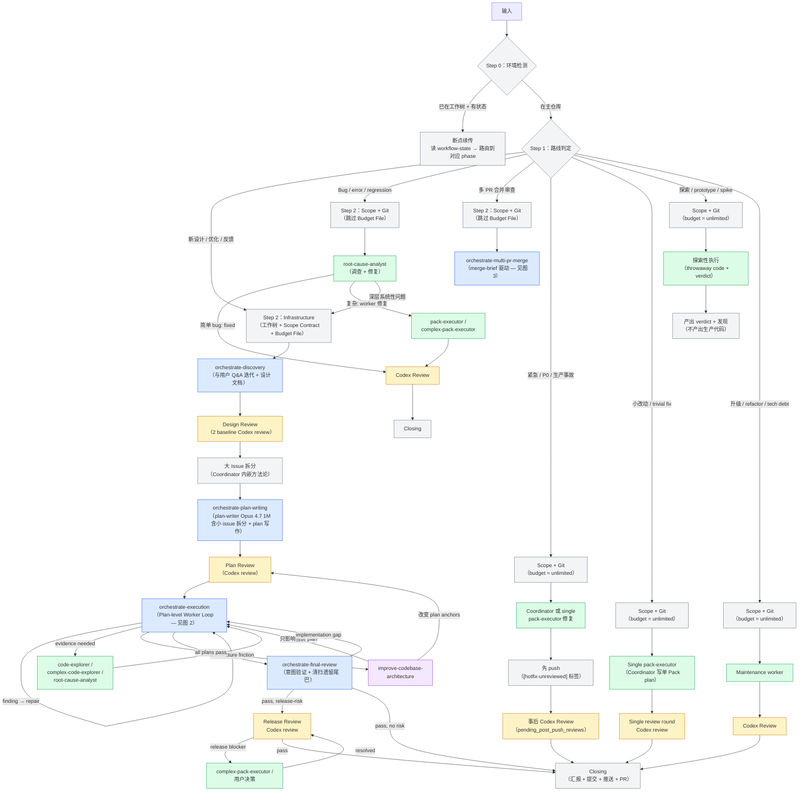
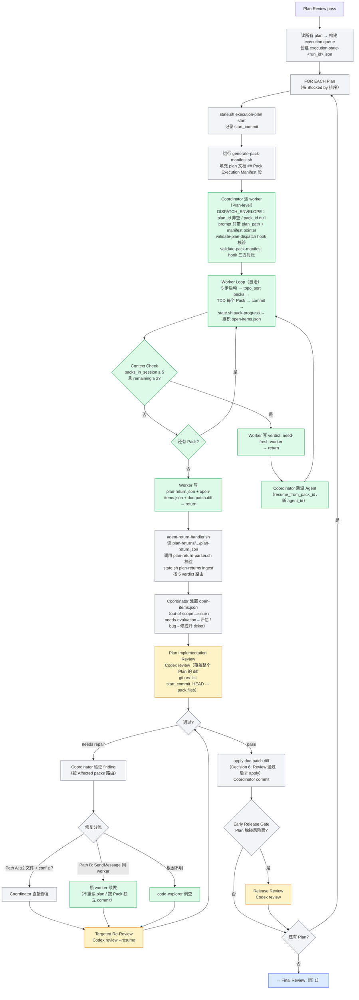
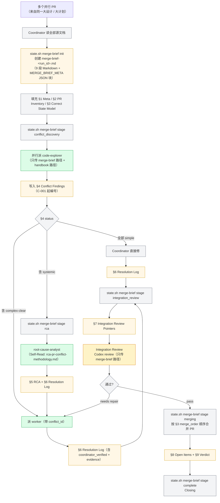

# Plugin 架构文档

> **审计基准**：`plugin/` 目录下的实际代码（skills/ agents/ hooks/ scripts/ build/ state-schema/）。
> **审计日期**：2026-05-28（Plan-level Worker Autonomy + Document-as-Context 重构完成后）。
> **Plugin 版本**：3.8.0。
> **本文目标**：作为理解 plugin 整体 workflow 和所有影响行为的设计细节的**唯一**入口文档。

---

## 图例

```
🟦 蓝色 = 内部 Skill（按需加载到主线程）
🟩 绿色 = Sub-Agent（独立子进程，不消耗主线程上下文）
🟧 橙色 = 外部 Review（跨模型独立审查 / Codex）
🟪 紫色 = 外部 Skill（orchestrate 之外的独立技能）
⬜ 灰色 = Coordinator 自身逻辑
🟥 红色 = 断点 / 矛盾
⬜ 虚线 = 路径存在但机制缺失
```

---

## 0. 核心架构原则

整个 plugin 围绕两条核心原则组织。后续所有节、所有组件设计都从这两条原则推导。

### 0.1 Document-as-Context（文档即上下文）

文档（design / issue / plan / merge-brief）是 phase 之间、Coordinator 与 sub-agent 之间**唯一**的上下文传递媒介。

**强约束**：
- Coordinator dispatch sub-agent 时**不再粘贴完整 Pack Brief 或 PR 内容**——只传文件路径 + DISPATCH_ENVELOPE，sub-agent 自读文档（"Self-Read Protocol"）
- 所有 dispatch reference 文件以"自读协议"组织：reference 顶部有 `## Self-Read Protocol` 段，明确告诉被派 agent 启动时立刻 Read 哪些文件
- Dispatch prompt 文件**不再预写到磁盘**——唯一例外是 Codex CLI 的 `--prompt-file` 要求（写到 `review-prompts/<gate>.md`），所有 Worker Agent / SendMessage 修复全部 inline 传递
- Compaction 恢复依赖文档磁盘状态：plan / design / merge-brief / workflow-state 全部是断点续传时唯一可信源

**3 层复用架构**支撑 Document-as-Context：

| 层 | 位置 | 职责 |
|----|------|------|
| L1：行为权威 | `agents/*.md` | TDD、scope 边界、Worker Loop、persona 等通用合同写在 agent 定义内（构建系统注入），所有 dispatch 不再重复 |
| L2：模板 | `build/templates/*.tmpl` | 共享内容片段（preamble / voice / review-dispatch / worker-loop 等 13 个模板），由 resolver 注入到 agent.md / SKILL.md / reference.md 的 `<!-- BEGIN: xxx -->` 锚点 |
| L3：场景指针 | `skills/*/references/*.md` | 每个 reference 的 Self-Read Protocol 告诉 sub-agent "下一步该读哪些文件 + 用哪份方法论"。Coordinator dispatch 时引用这个 reference 路径即可 |

### 0.2 Plan-level Worker Autonomy（计划级 Worker 自治）

**改造前**：Coordinator 按 Pack 派 Worker。一个 7-Plan / 35-Pack 任务需要 35-55 次 Pack-level dispatch（含 repair），Coordinator 在每个 Pack 边界都要插手。

**改造后**：Coordinator 按 Plan 派 Worker。Worker 在一次 dispatch 中独立完成整个 Plan 内的所有 Pack（串行 TDD + commit），最后产出一个 Plan-level 返回信封。Coordinator 只在 Plan 边界（Plan Implementation Review）介入。一个 7-Plan 任务降到 ~7-11 次 dispatch。

**Worker 自治 6 大段行为合同**（写在 `build/templates/worker-loop.md.tmpl`，注入到 pack-executor / complex-pack-executor）：
1. **5 步严格启动序列**：读 plan 全文（验证 5 必备字段）→ 读 execution-worker-handbook → 读 execution-state（区分首派/续派）→ 继承前任 worker 的 open-items.json → 读 CLAUDE.md
2. **Pack 循环主体**：topo_sort by Dependencies → 跳过已 committed → TDD red/green/refactor → 验证 → scope-drift 自检 → 写 pack-return → git commit → 累积 open-items
3. **Verdict 6 枚举**：`pass / partial-pass / blocked / need-fresh-worker / needs-context / needs-plan-revision`
4. **Repair Mode**：`repair_round ≥ 1 + disposition_refs 非空` 时 SendMessage 同 worker 续修（不重读 plan，按 Pack 独立 commit）
5. **Context 自监控**：完成 ≥ 5 Pack 且剩余 ≥ 2 → 立即 break + verdict=`need-fresh-worker`（Coordinator 新派 Agent 续做，不 SendMessage）
6. **Artifact Schema**：3 个产物全部写到 `.claude/multi-model-workflow/plan-returns/<run_id>/<plan_id>/`——`plan-return.json` / `open-items.json` / `doc-patch.diff`

详见 §5（Agents）§7（Document protocol）。

---

## 1. 全局流程（七条路线）



### Route 对比表

| Route | 名称 | Discovery | Plan Writing | Plan Review | Execution | Final Review | Budget | 特殊行为 |
|-------|------|-----------|-------------|-------------|-----------|-------------|--------|---------|
| 1 | Formal | ✅ | ✅ | ✅ | ✅ | ✅ | `3P+12` | 完整流程；hotfix/quickfix/spike/maintenance 通过 `phase_skip` + `commit_format_override` flags 路由到 Route 1 变体（见 orchestrate-workflow/SKILL.md Route 1 Variant Table） |
| 2 | Bug Investigation | ❌ | ❌ | ❌ | ❌ | ❌ | unlimited | RCA → worker → review → Closing |
| 3 | Multi-PR Merge | ❌ | ❌ | ❌ | ❌ | ❌ | unlimited | merge-brief 驱动；冲突发现 → 修复 → 集成审查 → 合并 |

Route enum 4 值（`formal` / `direct-repair` / `bug-investigation` / `multi-pr-merge`）。原 Routes 4-7（hotfix/quickfix/spike/maintenance）已折叠为 Route 1 + `phase_skip` / `commit_format_override` flags（D10）。

---

## 2. Execution 循环（Plan-level Worker 自治）



### Execution 节点分析

| 节点 | 机制 | 关键合同 |
|------|------|---------|
| 读 plan → 构建 execution-state | Coordinator | 提取 pack 编号、Dependencies、风险；写 `execution-state-<run_id>.json` |
| generate-pack-manifest.sh | 构建脚本 | 扫描 plan 中 `### Task Pack N.M` 标题 + 正文，写入或校验 `## Pack Execution Manifest` 表（6 列：pack_id / title / anchor / risk / dependencies / owned_files） |
| validate-plan-dispatch.sh | PreToolUse Agent hook | 必填字段 + 幂等 + budget + Plan 状态未占用 + repair disposition_refs evidence 检查 |
| validate-pack-manifest.sh | PreToolUse Agent hook | Manifest 表 / Pack 正文 / execution-state.plans[plan_id].packs **三方对账**，缺失方向不同各自 exit 2 |
| Worker Loop | Sub-Agent（pack-executor / complex-pack-executor） | 5 步启动 + Pack 循环 + 6 verdict + Repair Mode + Context 自监控（详见 §0.2 和 §5） |
| state.sh pack-progress | Worker 调用 | 每 Pack commit 后写 `execution-state.plans[plan_id].packs[pack_id]` 的 status / commit_sha |
| state.sh agent-context-check | Worker 自检 | 输出 `need-fresh-worker` 或 `ok`（阈值：完成 ≥ 5 Pack + 剩余 ≥ 2） |
| state.sh execution-plan complete | Worker 调用 | Plan 内全部 Pack 处理完后写 finished_at + worker_verdict |
| agent-return-handler.sh | PostToolUse Agent hook | 读 `plan-returns/<run_id>/<plan_id>/plan-return.json` → 调 `plan-return-parser.sh` 校验 schema → 调 `state.sh plan-returns ingest` → 按 5 verdict 注入 NEXT |
| Open Items 处置 | Coordinator | Plan 边界批量处置；Worker 没有"非阻塞项"概念 |
| Plan Implementation Review | 外部 Codex review | 覆盖整个 Plan 的 diff |
| Path A 修复 | Coordinator 直接修 | ≤ 2 文件 + confidence ≥ 7；修后 targeted re-review；失败自动升级 Path B |
| Path B 修复 | SendMessage 同 worker | 不重读 plan / 按 Pack 独立 commit / 修完重写 plan-return.json |
| doc-patch apply | Coordinator | **Decision 6**：Plan Implementation Review 通过后才 `git apply` doc-patch.diff（plan 文档 checkbox 勾选） |
| Early Release Gate | Coordinator + Codex review | Plan 触碰风险面时触发 |

---

## 3. Multi-PR Merge 流程（merge-brief 驱动）



### Multi-PR Merge 关键约束

| 节点 | 机制 | 关键合同 |
|------|------|---------|
| merge-brief | 单一权威源 | 所有 sub-agent dispatch 只引用 merge-brief 路径，**不粘贴 PR 内容** |
| current_stage | 7 状态枚举 | `init / conflict_discovery / rca / repair / integration_review / merging / complete` |
| conflict_id | per-run | `C-001` 起编，跨 run 不重用（Decision 8） |
| validate-multi-pr-dispatch.sh | PreToolUse Agent hook | 4 项检查：(a) merge-brief 文件存在；(b) META.current_stage 与 repair_round 一致；(c) conflict_id 在 §4 存在且 status ≠ resolved；(d) prompt 必须含 merge-brief 路径字符串 |
| 追加 PR | 视为新 run | 不复用已 run 的 conflict_id；merge-brief 默认不归档，随 worktree 清理一起删（Decision 8） |

详见 §7（Document protocol / merge-brief schema）。

---

## 4. Skill 层（7 个）

Skill 是按需加载到主线程的 Coordinator 逻辑。每个 skill 由 SKILL.md（骨架 + Step 编号 + 决策树）+ references/（按场景分块的详细规程）组成。所有 SKILL.md 在 Plan-level 重构中已瘦身（移除被反转的 dispatch reference 内容）。

| Skill | 行数 | 主要 Steps | 关键 references |
|-------|------|-----------|----------------|
| `orchestrate-workflow` | 219 | 0-2（环境检测 + 入口） / 7-14（Route 1） / 15-18（Route 2 Bug） / 19-20（Route 3 Multi-PR） / 21-24（Closing） | bug-investigation-route / direction-check / workflow-closing / workflow-direct-repair / workflow-infrastructure |
| `orchestrate-discovery` | 155 | 1-2（探索） / 3-6（与用户讨论） / 7-9（设计文档） / 10-11（Design Review） / 12（大 issue 拆分） | design-review-angles / discovery-design-document / discovery-discussion / discovery-formats / issue-splitting |
| `orchestrate-plan-writing` | 271 | 0（Re-entry） / 1-2（前置） / 3-8（写作方法论） / 9-10（派 plan-writer + 收返） / 11-12b（Plan Entry Gate + Inventory Gate + Budget 赋值 + 跨计划合同锚点） / 13-14（Plan Review） / 15-18（disposition + repair + 截断） / 19（Git Checkpoint） | plan-writer-dispatch（Self-Read Protocol） / plan-writing-methodology / plan-gates / plan-preconditions / plan-review-dispatch / plan-review-resolution |
| `orchestrate-execution` | 530 | 1-3（预执行） / 4-9（Plan 执行 + Review 循环 per Plan） / 10-12（修复分流 + 截断） / 13（Early Release Gate） / 14-16（Plan 推进 + 过渡） | execution-worker-dispatch（Self-Read Protocol） / execution-review-dispatch / execution-preparation / execution-completion / execution-release-gate / execution-repair-truncation |
| `orchestrate-final-review` | 236 | 1-3（前置） / 4-5（2 baseline Codex dispatch） / 6-8（接收 + disposition） / 9-12（修复分流 + 截断） / 13-15,19-20（清扫 + 业务汇报 + Verdict） / 16-18（Final Release Gate） | final-review-angles / final-review-preconditions / final-review-disposition / final-review-repair / final-review-release-gate / final-review-completion |
| `orchestrate-multi-pr-merge` | 229 | 1-3（入口 + 文档理解） / 4-8（并行 PR 分析 + 冲突分类） / 9-11（系统性冲突 RCA） / 12-15（Worker 修复 + 验证 + 循环） / 16-18（Codex 集成审查） / 19-22（顺序合并 + 清扫 + 返回） | merge-brief-template / merge-preparation / merge-conflict-discovery / merge-rca-investigation / merge-conflict-repair / merge-integration-review / merge-completion |
| `codex-review` | 154 | 1（确定审查对象） / 2（构建 prompt） / 3（派发 Codex） / 4（等待） / 5（汇报） | 无 references（单文件 ad-hoc skill） |

**Skill 命名空间**：`multi-model-workflow:orchestrate-*`（全限定名，通过 `Skill({ skill: "..." })` 调用）。`codex-review` 是独立的轻量 ad-hoc 路径，与正规 orchestrate workflow 隔离（prompt 写入 `.claude/codex-review/`，不污染 `review-prompts/`）。

### Skill ↔ Reference 的 Self-Read Protocol 反转

Plan-level 重构前：Coordinator 在 dispatch prompt 中**粘贴**完整 reference 内容给 sub-agent。
重构后：Coordinator 在 dispatch prompt 中只写**路径**，每个 reference 顶部的 `## Self-Read Protocol` 段告诉 sub-agent 启动后立即 Read 哪些文件。

9 个反转的 reference：
- `execution-worker-dispatch.md` / `execution-review-dispatch.md`
- `plan-writer-dispatch.md` / `plan-review-dispatch.md`
- `final-review-angles.md`
- `merge-rca-investigation.md` / `merge-conflict-repair.md` / `merge-integration-review.md`

Coordinator 端的"最小职责"被压缩到 4 步（构造 envelope → 写 plan-level 引用 → Agent dispatch → 等 hook 回调）。

---

## 5. Agent 层（8 个 + 1 参考文档）

| Agent | 模型 | effort | maxTurns | Worker Loop 锚点 | `skills:` 自动加载 |
|-------|------|--------|----------|-----------------|-------------------|
| `pack-executor` | sonnet | xhigh | — | ✅ `<!-- BEGIN: worker-loop -->` | tdd |
| `complex-pack-executor` | claude-opus-4-7 | high | — | ✅ `<!-- BEGIN: worker-loop -->` | tdd |
| `plan-writer` | claude-opus-4-7[1m] | xhigh | — | — | —（D11 瘦身） |
| `code-explorer` | sonnet | high | 20 | — | — |
| `complex-code-explorer` | claude-opus-4-7 | high | 30 | — | — |
| `root-cause-analyst` | claude-opus-4-7[1m] | xhigh | 40 | — | diagnose, tdd |
| `docs-worker` | sonnet | high | 20 | — | —（D11 瘦身） |

另有 `persona.md`：非 agent 定义，是 voice/persona 规范参考文档，权威来源 `build/templates/voice-directive.md.tmpl`。

**通用约定**：
- 所有 agent 均设 `memory: project`（跨 session 记忆写入 `.claude/agent-memory/<agent-name>/`）
- 所有 agent 均设 `color` 字段用于 UI 区分
- Plugin **没有 `code-reviewer` 和 `release-reviewer` agent**——所有 review 通过 `codex-companion.mjs` 派发

### 5.1 Worker Loop（pack-executor / complex-pack-executor）

`build/templates/worker-loop.md.tmpl`（126 行）通过 `<!-- BEGIN: worker-loop -->` 锚点注入到 pack-executor 和 complex-pack-executor 的 agent 定义体内。完整 6 大段：

**段 1：合同声明**
- 执行边界 = 整个 Plan
- `${STATE_DIR}` 是固定字面量，由 Coordinator 在 envelope 中提供
- 3 个 artifact 全部写到 `plan-returns/<run_id>/<plan_id>/`

**段 2：5 步严格启动序列**
1. Read plan 文档全文，验证 5 必备字段（Pack Manifest / Dependencies / Acceptance / Verification / owned files）；缺则 verdict=`needs-plan-revision`
2. Read `execution-worker-handbook.md`（TDD 纪律 / commit 规范 / failure modes）
3. Read `execution-state-<run_id>.json` 的 `.plans[plan_id].packs`，区分首派 vs 续派
4. Read `plan-returns/<run_id>/<plan_id>/open-items.json`（若存在）继承前任 worker 累积
5. Read 项目 CLAUDE.md + 链入规则

**段 3：Pack 循环主体（伪代码）**
```
topo_sort(plan.packs, by="Dependencies")
FOR each pack:
    if pack.status == "committed": skip   # partial-fail recovery
    TDD: red → green → refactor (trivial 例外)
    run verification_commands → 失败触发三次失败协议
    scope_drift_check(changed_files ⊆ pack.owned_files)
    write pack-returns/<pack_id>.json
    git commit "Pack N.M: <title> — <summary>"   # enforce-plan-commit hook 校验
    append open_items to plan-returns/open-items.json
    state.sh pack-progress --plan-id ... --pack-id ... --status committed --commit-sha ...
    state.sh agent-context-check → 若 need-fresh-worker → break
END
write doc-patch.diff (只含 checkbox 勾选行) to plan-returns/<plan_id>/doc-patch.diff
write plan-return.json (verdict + per_pack)
state.sh execution-plan complete --plan-id ... --verdict ...
```

**段 4：Verdict 6 枚举**
- `pass` — 全部 Pack committed，Coordinator → Plan Implementation Review
- `partial-pass` — 部分 Pack committed，部分 blocked / open-items 阻塞
- `blocked` — 整个 Plan 无法推进
- `need-fresh-worker` — Context 自监控触发，Coordinator 新派 Agent 续做
- `needs-context` — 缺少 Contract anchors 或下游模块，Coordinator 补 reference 重派
- `needs-plan-revision` — Plan 文档本身缺字段或描述错误，回流 plan-writing

**段 5：Repair Mode**
- 触发条件：`repair_round ≥ 1` + `disposition_refs` 非空（即 SendMessage 进入续修）
- 不重读 plan（节省 context）
- 按 finding 的 `[Pack N.M]` 归属，每个 Pack 独立 commit `Pack N.M: <title> — repair: <summary>`
- 修完重写 plan-return.json（verdict = pass 或 blocked）

**段 6：Context 自监控 + Artifact Schema**
- 阈值：`packs_in_session ≥ 5` AND `remaining ≥ 2` → 立即 break + verdict=`need-fresh-worker`
- Coordinator 通过新 Agent dispatch 续做（**不是** SendMessage），新 envelope 含 `resume_from_pack_id`
- 3 个 artifact schema 引用：`plan-return-v1.json` / `open-items-v1.json` / `doc-patch.diff`（纯 checkbox 行，guard-plan-doc-patch.sh 校验）

### 5.2 其他 Agent

- **plan-writer**：启动后 Read dispatch prompt 中 `## Methodology` 指定的 methodology 文件（Self-Read Protocol），不加载 SKILL.md；并行 dispatch（每 issue 一个 agent，`run_in_background: true`）
- **code-explorer** / **complex-code-explorer**：只读 agent，80% turn budget 时强制返回部分结果
- **root-cause-analyst**：3 种模式（Bug Investigation / Repair Truncation / Multi-PR Conflict）通过 dispatch prompt 信号自检测；模式 3 通过 `## Methodology` 字段读取 `rca-pr-conflict-methodology.md`
- **docs-worker**：只做机械性清理，不改业务决策；Return Contract 区分 semantic vs mechanical changes

---

## 6. Hook 层（13 脚本 / 17 hooks.json 条目）

所有 hook 入口集中在 `plugin/hooks/hooks.json`。

### 6.1 Hook 总览

| Event | Matcher | 脚本 | if 条件 |
|-------|---------|------|---------|
| SessionStart | startup\|clear\|compact | session-start.sh | — |
| PreToolUse | Bash | enforce-plan-commit.sh | git commit |
| PreToolUse | Bash | gate-codex-review.sh | — |
| PreToolUse | Agent | validate-plan-dispatch.sh | Agent(pack-executor*) |
| PreToolUse | Agent | validate-plan-dispatch.sh | Agent(complex-pack-executor*) |
| PreToolUse | Agent | validate-pack-manifest.sh | Agent(pack-executor*) |
| PreToolUse | Agent | validate-pack-manifest.sh | Agent(complex-pack-executor*) |
| PreToolUse | Agent | validate-multi-pr-dispatch.sh | — |
| PreToolUse | Edit | guard-doc-edit.sh | — |
| PreToolUse | Write | guard-doc-edit.sh | — |
| PostToolUse | Bash | track-review-budget.sh | — |
| PostToolUse | Bash | track-execution-state.sh | git commit |
| PostToolUse | Agent | agent-return-handler.sh | — |
| PostToolUse | Agent | track-effort-budget.sh | — |
| PostToolUse | Edit | detect-worker-scope-drift.sh | — |
| PostToolUse | Write | detect-worker-scope-drift.sh | — |

### 6.2 每条 hook 关键行为

**session-start.sh**
检查 `CLAUDE_CODE_EXPERIMENTAL_AGENT_TEAMS` / `jq` / `python3` / `plugin.json` / Claude Code ≥ 2.1.147，任一失败 exit 2。通过后注入 additionalContext：路由规则、硬门、compaction 恢复步骤；活跃 run_id 存在时追加 phase/reference/step/budget 摘要（RESUME 协议）。

**validate-plan-dispatch.sh**（Plan-level 重写，从 validate-pack-dispatch.sh 升级）
PreToolUse Agent hook，guard pack-executor / complex-pack-executor 派发。15 步校验链：
1. 调 `lib/parse-envelope.sh` 解析 DISPATCH_ENVELOPE，必填字段全验
2. 幂等 key 重复 → exit 2
3. budget 已初始化（非 `pending_plan_count`）
4. 无 pending Direction Check（阻断非 codex-reviewer）
5. Plan-level 路径（envelope.plan_id 非空）：plan_path 文件存在 → plan.md 含 `## Pack Execution Manifest` → execution-state 中 plan 条目存在 → plan 未被其他 Worker 占用（status=in_progress + worker_agent_id 已设）
6. 遗留 Pack-level 路径：pack status 必须为 pending + agent_id 未设
7. Path A 耗尽时拦截非 Worker agent_role
8. `repair_round ≥ 1` → `disposition_refs` 中每个 finding_id 在 review_dispositions 中已 accepted 且有 evidence
9. 通过后写 idempotency_key

**validate-pack-manifest.sh**（新增）
PreToolUse Agent hook，phase=execution 才触发。**三方对账**：
- A = `## Pack Execution Manifest` 表格行 pack_id
- B = `### Task Pack N.M` 标题行 pack_id
- C = execution-state.plans[plan_id].packs 键
- A ≠ B → exit 2 + 精确诊断（缺失方向不同）
- C 不是 A 的子集 → exit 2
- 可选调用 `generate-pack-manifest.sh --check`：内容漂移只发 advisory 不 exit 2

**validate-multi-pr-dispatch.sh**（新增）
PreToolUse Agent hook，自行检测 phase=multi-pr-merge。**直接内联解析 envelope**（不通过 parse-envelope.sh，避免 disposition_refs 校验误触发；multi-pr-merge repair 用 conflict_id 而非 disposition_refs）。4 项检查：
- (a) merge-brief-{run_id}.md 存在
- (b) META.current_stage 与 repair_round 一致（round=0 → stage 非 complete；round≥1 → stage 非 init）
- (c) envelope 含 conflict_id → §4 中存在且 status ≠ resolved
- (d) prompt 必须含 `merge-brief-{run_id}.md` 字符串（防 paste 反模式）

**enforce-plan-commit.sh**（从 enforce-pack-commit.sh 改名）
PreToolUse Bash hook，git commit 触发。commit 消息以 `Pack ` 开头但不符合 `Pack N.M: <text>` 格式 → exit 2。非 Pack commit 静默放行。

**gate-codex-review.sh**
PreToolUse Bash hook，检测 codex-companion + `task` 关键字。按 envelope.review_intent 三路：
- `baseline` → 校验 prompt-file 名称中 plan 编号对应 execution-state 中所有 pack 已 committed（Plan Implementation Review 前置门）
- `path-a-re-review` → 检查 workflow-state.path_a_escalation 有条目
- `targeted-re-review` → 必须含 `--resume`；exception_code=user_requested 直接放行，否则检查 qualified exception

**guard-doc-edit.sh**
PreToolUse Edit/Write hook。worker-active marker 存在 + 路径在 `docs/` 下 → exit 2。Coordinator 上下文（无 marker）放行。`plan-returns/` 在 `.claude/multi-model-workflow/` 下不受影响。

**guard-plan-doc-patch.sh**（新增）
PreToolUse Write hook，只拦截 `doc-patch.diff` 结尾路径。用 Python 解析 diff：目标必须在 `docs/orchestrate/plans/<slug>/<file>.md`；每条 +/- 行必须是 Markdown checkbox（`- [ ] / - [x]`）；配对 -/+ 文字必须一致（纯 toggle，不得改 checkbox 后文本）。

**agent-return-handler.sh**（5-路 verdict 重写）
PostToolUse Agent hook。Plan-level 路径（envelope.plan_id 非空）：
1. 读 `plan-returns/{run_id}/{plan_id}/plan-return.json`
2. 调 `lib/plan-return-parser.sh` 校验 schema
3. 调 `state.sh plan-returns ingest` 展开 per_pack 到 execution-state
4. 按 verdict 注入 NEXT additionalContext：
   - `pass` → 派 Plan Implementation Review；doc-patch 暂存不 apply（Decision 6）
   - `partial-pass` → 派 Review，open-items 带阻塞原因
   - `blocked` → BLOCKED，Coordinator triage
   - `need-fresh-worker` → 派新 Agent 含 resume_from_pack_id（或无剩余 pack 时等效 pass）
   - `needs-context` → 返回补充 Contract anchors 再重派
   - `needs-plan-revision` → 路由回 plan-writing

plan-return.json 缺失或无效 JSON → BLOCKED。
遗留 Pack-level fallback（envelope 无 plan_id）：从 pack-returns/.json 或 response 文本提取 verdict。

**detect-worker-scope-drift.sh**（新增）
PostToolUse Edit/Write hook，只在 worker-active marker 存在时触发。
- 解析 plan.md `### Owned files` 节得到全 plan owned_files 集合
- 编辑路径在集合内 → 放行
- 不在集合内 → 追加到 `execution-state.plans[plan_id].drift_warnings[]`，发 WARN additionalContext
- **永不 exit 2**，不阻断 Worker（设计：警告优于阻断，避免 false positive 卡死）

**track-execution-state.sh**
PostToolUse Bash hook，git commit + exit_code=0 触发。从 commit 消息提取 `Pack N.M`，写 execution-state pack status=committed + commit_sha。plan 内所有 pack 均 committed 时：写 end_commit；若 worker_agent_id 已设（Worker 仍在运行）→ 发 STATE 消息要求等待 agent-return-handler；否则发 NEXT: 派 Plan Implementation Review。同时聚合 pack-returns/*.json 到 execution-state.plans[N].pack_summary。

**track-review-budget.sh**
PostToolUse Bash hook，检测 codex-companion `result` 命令且 exit_code=0。递增 `workflow-state.budget.review_used`；100% → BUDGET EXHAUSTED；80% 且无 pending DC → 触发 direction-check + DIRECTION CHECK 警告。

**track-effort-budget.sh**（Decision 5 改造）
PostToolUse Agent hook，按 agent_role 加权：
- `pack-executor` / `complex-pack-executor` — 从 plan-return.json 读 committed pack 数作为权重（默认 1 fallback）
- `need-fresh-worker` 续发 — +0.5
- `code-explorer` — +1
- `root-cause-analyst` — +2

100% → EXHAUSTED；80% 且无 DC → 记录 pending_direction_check + 发 DIRECTION CHECK。

### 6.3 共享原语

`hooks/lib/parse-envelope.sh` — DISPATCH_ENVELOPE 解析（支持单行/多行格式）。验证 6 必填字段：`protocol_version / run_id / phase / agent_role / repair_round / idempotency_key`。`repair_round ≥ 1` 强制 `disposition_refs` 非空；`agent_role = codex-reviewer` 强制 `review_intent`；`targeted-re-review` 强制 `exception_code`。解析失败 exit 2。

被以下 hook 共用：`gate-codex-review.sh` / `validate-plan-dispatch.sh` / `agent-return-handler.sh` / `track-effort-budget.sh`。
**不被** `validate-multi-pr-dispatch.sh` 使用——后者直接内联解析以避免 disposition_refs 误触发。

### 6.4 Plan-level 改造分类

**新增或重命名**：
- `validate-plan-dispatch.sh`（重命名 + 重写）
- `validate-pack-manifest.sh`（新增）
- `validate-multi-pr-dispatch.sh`（新增）
- `enforce-plan-commit.sh`（改名）
- `agent-return-handler.sh`（5-路 verdict 完全重写）
- `detect-worker-scope-drift.sh`（新增）
- `guard-plan-doc-patch.sh`（新增）
- `track-effort-budget.sh`（权重计算改造）

**基本沿用**：`session-start.sh` / `gate-codex-review.sh` / `guard-doc-edit.sh` / `track-execution-state.sh`（含新增 worker_agent_id 检测以抑制提前 NEXT） / `track-review-budget.sh` / `lib/parse-envelope.sh`

---

## 7. Document Protocol（文档流转协议）

### 7.1 DISPATCH_ENVELOPE（`state-schema/dispatch-envelope-v1.json`）

所有 Agent dispatch prompt 必须包含 `<!-- DISPATCH_ENVELOPE {...} -->` JSON 块。

| 字段 | 类型 | 必填 | 含义 |
|------|------|-----|------|
| `protocol_version` | const "1" | ✅ | 信封协议版本 |
| `run_id` | string | ✅ | 当前 workflow run |
| `phase` | enum | ✅ | plan-writing / execution / final-review / discovery / multi-pr-merge |
| `agent_role` | string | ✅ | pack-executor / complex-pack-executor / plan-writer / code-explorer / root-cause-analyst / docs-worker / codex-reviewer |
| `repair_round` | integer ≥ 0 | ✅ | 0 = baseline；≥ 1 = 修复轮（强制 disposition_refs 非空） |
| `idempotency_key` | string | ✅ | 幂等键（hook 用以阻止重复 dispatch） |
| `agent_id` | string\|null | — | Plan-level：用于 SendMessage 续派 |
| `pack_id` | string\|null | — | 遗留 Pack-level 路径用，Plan-level 应为 null |
| `plan_id` | string\|null | — | **Plan-level 新增**：plan_id 非空 + pack_id null = Plan-level Worker 首派 |
| `disposition_refs` | array\|null | repair 时必填 | 引用的 finding_id 列表，每个必须 accepted + 有 evidence |
| `review_intent` | enum\|null | reviewer 必填 | baseline / targeted-re-review / path-a-re-review |
| `exception_code` | enum\|null | targeted re-review 必填 | 3plus_files_control_flow / user_requested / rca_root_cause |
| `correlation_id` | string\|null | — | 格式 `{run_id}/{pack_id}` |

**注意**：`plan_path` / `pack_count` / `manifest_path` **不在 envelope JSON 字段内**，这些信息通过 dispatch prompt 正文以文档路径 + 运行时变量形式传递。

### 7.2 plan-return（`state-schema/plan-return-v1.json`，新增）

Worker 完成 Plan 后写入 `.claude/multi-model-workflow/plan-returns/<run_id>/<plan_id>/plan-return.json`。

**必填字段**：
- `schema_version` (const "1")
- `run_id` / `plan_id`
- `verdict` — 6 枚举：`pass / partial-pass / blocked / need-fresh-worker / needs-context / needs-plan-revision`
- `per_pack` — object，key = pack_id，value 含 `status / commit_sha / verdict / reason / attempts`

**选填字段**：`started_at` / `finished_at` / `open_items_path` / `doc_patch_path` / `context_pressure`（含 `completed_packs` + `triggered`） / `repair_round` / `concerns`

### 7.3 pack-returns（`state-schema/pack-returns-v1.json`）

Worker 每个 Pack 完成后写入 `.claude/multi-model-workflow/pack-returns/<run_id>/<pack-id>.json`。

**必填字段**：`pack_id` / `verdict`（pass / needs repair / blocked / needs context）
**选填字段**：`changed_files` / `open_items`（array，每项必填 `tag/summary`，tag 枚举：out-of-scope/needs-evaluation/bug） / `concerns`

### 7.4 open-items（`state-schema/open-items-v1.json`，新增）

Worker 跨 Pack 累积写入 `.claude/multi-model-workflow/plan-returns/<run_id>/<plan_id>/open-items.json`。

**必填字段**：`schema_version` (const "1") / `plan_id` / `items`（array，每项含 `tag` / `pack_id` / `finding`，选填 `suggested_action`；`additionalProperties: false`）

**流转**：Worker 每完 Pack 后 append → Coordinator 在 Plan 边界批量处置：
- `out-of-scope` → 开 GitHub Issue 或推迟到下个 Plan
- `needs-evaluation` → Coordinator 独立判断
- `bug` → 立即修或开 ticket

### 7.5 doc-patch（plan checkbox 勾选）

Worker 完成所有 Pack 后写 `.claude/multi-model-workflow/plan-returns/<run_id>/<plan_id>/doc-patch.diff`。

**内容约束**：标准 git diff 格式，**只能改 plan 文档的 checkbox 行**（`- [ ]` → `- [x]`），配对的 +/- 行文字必须一致（不得改 checkbox 后文本）。`guard-plan-doc-patch.sh` hook 校验。

**应用时机（Decision 6）**：Worker 不立即 apply。Coordinator 在 **Plan Implementation Review 通过后**调用 `scripts/lib/doc-patch-apply.sh apply_doc_patch <path>`：
1. `git apply --check`（校验）
2. `git apply`（应用）
3. `git add` 已变更文件（不 commit，commit 边界由 Coordinator 控制）

### 7.6 merge-brief（`state-schema/merge-brief-v1.json`，新增）

Multi-PR Merge route 唯一权威源。9 个 section + MERGE_BRIEF_META JSON 块。

| § | key | 核心内容 |
|---|-----|---------|
| §1 | meta | schema_version / run_id / slug / created_at / last_updated_at / **current_stage**（7 枚举：init / conflict_discovery / rca / repair / integration_review / merging / complete） / integration_review_gate |
| §2 | pr_inventory | PR / branch / big_design_path / big_plan_path / single_pr_design_path / single_pr_plan_path / final_review_verdict / core_behavior |
| §3 | correct_state_model | behaviors / contract_surfaces / file_cross_matrix / merge_order / risk_hotspots |
| §4 | conflict_findings | conflict_id (C-001) / type / involved_prs / files / severity / classification（simple / complex-clear / systemic） / route / status / discovered_by / discovered_at |
| §5 | root_cause_analysis | 仅 systemic 冲突；conflict_id / analyst_agent_id / resolution / root_cause_type / fix_direction / target_pr / related_conflicts / design_impact / regression_risk |
| §6 | resolution_log | conflict_id / owner / repair_round / changed_files / summary / verification（含 coordinator_verified + evidence） / status_after / new_conflict_id |
| §7 | integration_review_pointers | base_diff_range / contract_surfaces_to_audit / resolved_conflicts_summary / per_pr_final_review_verdict_refs / regression_focus_files / integration_review_gate_name |
| §8 | open_items | type（worker-open-item / out-of-scope / user-decision-needed） / description / ref |
| §9 | verdict | value（MERGE_COMPLETE / NEEDS_DISCOVERY / NEEDS_USER_DECISION / BLOCKED） / evidence_pointers / decided_at |

**Decision 8 编码**：conflict_id per-run（C-001+，跨 run 不重用） / 追加 PR 视为新 run / 默认不归档。

### 7.7 Pack Execution Manifest（plan 文档内嵌段）

由 `build/generate-pack-manifest.sh` 生成或校验。位于 plan 文档的 `## Pack Execution Manifest` 段，6 列：

| 列 | 来源 |
|----|------|
| `pack_id` | 正则捕获 `\d+\.\d+` |
| `title` | `### Task Pack N.M: <title>` 冒号后文本 |
| `anchor` | GitHub-style slug |
| `risk` | `Risk flags:` 行，缺省 "normal" |
| `dependencies` | `Dependencies:` 行，缺省 "—" |
| `owned_files` | `Owned files / responsibilities:` 后 bullet（backtick 内路径） |

**用途**：Worker 的"自助导航表"——通过 anchor 直接跳转到 Pack 章节，无需线性扫描全文。`validate-pack-manifest.sh` 在派 Worker 前对 Manifest / Pack 正文 / execution-state 做三方对账。

### 7.8 文档间引用关系

```
设计文档 ←──────────────────── plan header: Source design
    │
    ├─(Design Review)
    │
    ▼
大 Issue 文件 ←──────────────── plan header: Source issue
    │                            plan header: Blocked by（从 issue 继承）
    │
    ├─(1 大 issue = 1 plan 文件，编号对应)
    │
    │   小 issue ←────────────── Task Pack: Issue 字段
    │   acceptance ←──────────── Task Pack: Acceptance criteria
    │   blocked-by ←──────────── Task Pack: Dependencies
    │
    ▼
Plan 文件
    │ + Pack Execution Manifest（generate-pack-manifest.sh 生成）
    │
    ├─(Plan Entry Gate + Task Pack Inventory Gate + Manifest 三方对账)
    │
    ▼
DISPATCH_ENVELOPE（plan_id 非空，pack_id null）
+ prompt body 中 plan 文档绝对路径
    │
    ▼
Worker Loop（自读 plan + handbook + execution-state + open-items + CLAUDE.md）
    │
    ▼
plan-returns/<run_id>/<plan_id>/{plan-return.json, open-items.json, doc-patch.diff}
    │
    ▼
agent-return-handler → state.sh plan-returns ingest → Plan Implementation Review
```

**单向引用**：上游不引用下游。Worker dispatch 只引用路径，不嵌内容。

---

## 8. 状态管理

### 8.1 状态文件链

```
orchestrate-workflow Step 2b
  └─ .claude/multi-model-workflow/scope-<run_id>.md                     ← Scope Contract
orchestrate-workflow Step 2c
  ├─ .claude/multi-model-workflow/workflow-state-<run_id>.json          ← Workflow State
  └─ .claude/multi-model-workflow/active-run-id                          ← Active Run ID
orchestrate-plan-writing Step 12a
  └─ workflow-state-<run_id>.json: budget.review_total = 3P + 12,
     effort_total = 2 × review_total                                     ← Budget 赋值（不可变）
orchestrate-execution Step 2a
  └─ .claude/multi-model-workflow/execution-state-<run_id>.json         ← Execution State
orchestrate-multi-pr-merge Step 2（Route 3 only）
  └─ .claude/multi-model-workflow/merge-brief-<run_id>.md               ← Merge Brief
Worker 每 Pack 完成时
  └─ .claude/multi-model-workflow/pack-returns/<run_id>/<pack-id>.json  ← Pack Return
Worker Plan 完成时（Plan-level 新增）
  └─ .claude/multi-model-workflow/plan-returns/<run_id>/<plan_id>/
     ├─ plan-return.json                                                 ← Plan Return
     ├─ open-items.json                                                  ← 累积 Open Items
     └─ doc-patch.diff                                                   ← Plan checkbox patch
每次 review 完成
  └─ workflow-state-<run_id>.json: budget.review_used += 1              ← Budget 消耗
每个 phase verdict 后
  └─ workflow-state-<run_id>.json: cursor.phase + timestamp             ← Phase 标记
Review 派发时
  ├─ .claude/multi-model-workflow/review-prompts/<gate>.md              ← Review prompt
  └─ .claude/multi-model-workflow/review-results/<gate>.md              ← Review result
Closing 前（cleanup-before-push.sh）
  └─ 清除 active-run-id + scope + workflow-state + execution-state +
     pack-returns + plan-returns + merge-brief + review temp files
```

### 8.1 Ruling 1 — track-execution-state Pack ID 提取保留 sed 模式

track-execution-state.sh 的 Pack ID 提取保留 sed 模式（`sed -n 's/.*Pack \([0-9][0-9]*\.[0-9][0-9]*\).*/\1/p'`），因为此 hook 的输入源是 commit message（受 enforce-pack-commit.sh 格式保证），不是 prompt/控制平面。

### 8.2 双文件模型（Ruling 2）

设计原文将 budget 和 execution-state 合并为单一 workflow-state。实现采用双文件：
- **workflow-state-<run_id>.json**：run_id / slug / route（4 值 enum）/ cursor / budget / plans 元信息 / plan_count / plan_writer_agent_id / idempotency_keys / review_dispositions / review_effectiveness / path_a_escalation / self_verifications / pending_direction_check / pending_post_push_reviews / execution_reflux_count / last_gate_phase/timestamp / phase_skip / commit_format_override / mutations（append-only 审计日志）
- **execution-state-<run_id>.json**：pack-level data（plans[plan_id].packs[pack_id] 含 status / agent_id / commit_sha / worker_verdict / repair_round / drift_warnings[] / pack_summary）

分离原因：pack-level 被 3 个 hook 并发写入（agent-return-handler / track-execution-state / track-effort-budget），合并到单文件会加剧竞态。两文件通过 `plan_id` + `pack_id` 关联。

### 8.3 Ruling 3 — PostToolUse 信封解析失败行为

PostToolUse hook（agent-return-handler）在信封解析失败时 **exit 0 跳过**，而非 exit 2 硬停。PostToolUse 在 Agent 已完成后触发，无法撤回，硬停只会中断正常流程。

### 8.4 state.sh 子命令（20 个顶层）

**原有子命令**：

| 子命令 | 用途 |
|--------|------|
| `init` / `read` / `update` | workflow-state 初始化 / 读 / 写 |
| `transition` | 校验 + 执行状态机转换（依 state-transition-matrix.md） |
| `validate` | 校验 state 合规性 |
| `disposition append` | 追加 review_finding 处置；`--plan-id` 选填，`--coordinator-verified-evidence` Plan 002 新增 |
| `self-verify append` | Coordinator 自验项 |
| `path-a-escalation start/update/clear` | Path A 再审升级管理 |
| `budget initialize/unlimited/check/increment-review` | review budget 计数和阈值 |
| `direction-check trigger/ack` | budget 方向检查（trigger 写 pending_direction_check；ack 接受 continue/stop/adjust） |
| `idempotency check/append` | 幂等 key 管理 |
| `review-history append` | 向 design/plan markdown 文件的 Review History 表追加一行 |
| `business-summary append` | 业务汇报段落 |
| `plans add` | 向 state .plans[] 追加计划条目 |

**Plan-level 新增子命令**：

| 子命令 | 用途 |
|--------|------|
| `pack-progress` | Worker 每完 Pack 后写 `execution-state.plans[plan_id].packs[pack_id]` 的 status / commit_sha |
| `execution-plan start/complete` | start：初始化 execution-state plan 条目；complete：写 finished_at + worker_verdict |
| `plan-returns ingest` | agent-return-handler 调用；读取 plan-return.json → 校验 schema → 展开 per_pack 到 execution-state |
| `agent-id set/get --plan-id` | plan-level worker_agent_id 写读（与 --pack-id 互斥） |
| `agent-context-check` | Worker 自检：完成 ≥ 5 Pack + 剩余 ≥ 2 → 返回 need-fresh-worker |
| `merge-brief init/stage/verify` | Pack 6.8 新增；init 创建含 MERGE_BRIEF_META 元数据块的 markdown；stage 推进 current_stage；verify 校验 meta 合法性 |

### 8.5 状态转换矩阵（`state-schema/state-transition-matrix.md`）

24 条 transition 规则，3 类 actor：
- **Coordinator** — 承担绝大多数 transition（phase 推进、dispatch、review、repair 路由）
- **agent-return-handler** — PostToolUse hook 自动 `dispatched → returned`（Plan-level 含 in_progress → returned）
- **track-execution-state** — PostToolUse hook 自动 `returned → committed`

所有 `state.sh transition` 调用必须匹配矩阵中的一行，否则 exit 2。state.sh 内联强制执行。

### 8.6 共享 lib

| 库 | 用途 |
|-----|------|
| `scripts/lib/state-lock.sh` | 共享 flock 原语；TTL 60s，50 次重试，自动清 stale lock |
| `scripts/lib/review-effectiveness.sh` | 从 review_dispositions 聚合诊断指标（reject/suppress/path-a 占比） |
| `scripts/lib/learnings-poison-detector.sh` | 7 类 learnings 污染检测（指令注入 / 跨 run 污染 / 高量 flooding / scope 逃逸 / 来源可信度 / 过期引用 / contested learning） |
| `scripts/lib/plan-return-parser.sh` | **新增**；source 后调用 `parse_plan_return <path>`；校验 schema_version=1、必填字段；导出 PLAN_RETURN_* bash 变量 |
| `scripts/lib/doc-patch-apply.sh` | **新增**；source 后调用 `apply_doc_patch <patch>`；先 git apply --check 再 git apply + git add；空 patch no-op；不 commit |
| `hooks/lib/parse-envelope.sh` | DISPATCH_ENVELOPE 解析原语（被多个 hook 共用） |

### 8.7 其他 scripts/

| 脚本 | 用途 |
|------|------|
| `cleanup-before-push.sh` | PostToolUse hook + 手动；push 成功后清编排临时文件（hotfix route 延迟清以保留事后 review state） |
| `complete-review-dispatch.sh` | review registry 写 durability marker（不计 budget） |
| `guard-premature-push.sh` | PreToolUse hook；双重防护：①plan 有未勾选任务时阻 push/PR；②永久禁 `git merge --squash` |
| `learnings-jsonl.sh` | learnings.jsonl 管理（append/read，append 前调 poison-detector） |
| `dispatch-review.sh` | 合并脚本（D8）；子命令 `validate` / `record`——Codex reviewer 派发前校验 + 成功记录 |
| `dispatch-route-worker.sh` | 合并脚本（D8）；子命令 `validate` / `record`——非执行类 Worker 派发前校验 + 成功记录 |
| `record-review-dispatch.sh` | **shim**（D8）→ 转发到 `dispatch-review.sh record` |
| `record-review-disposition.sh` | 记录 Coordinator 消费 reviewer 结果 |
| `record-route-worker-dispatch.sh` | **shim**（D8）→ 转发到 `dispatch-route-worker.sh record` |
| `validate-review-dispatch.sh` | **shim**（D8）→ 转发到 `dispatch-review.sh validate` |
| `validate-route-worker-dispatch.sh` | **shim**（D8）→ 转发到 `dispatch-route-worker.sh validate` |
| `run-summary.sh` | 读 workflow-state 生成 run 汇总指标 |
| `run-all-tests.sh` | 遍历 tests/ 下 21 个 test_*.sh 套件 |
| `verify-maturity.sh` | 端到端成熟度 harness（12 大类 section） |

---

## 9. Build 系统（3 层复用的 L2 层）

`build/` 目录实现 template + resolver + anchor 模式，将共享内容注入 SKILL.md / agent .md / reference .md。

### 9.1 锚点系统工作原理

`build.sh --apply` 扫描 plugin 目录下所有含 `<!-- BEGIN: <anchor-name> [variant=X] -->` / `<!-- END: <anchor-name> -->` 注释对的文件。对每个锚点：
1. 查找 `resolvers/<anchor-name>.sh` 并执行
2. 将返回内容替换锚点之间的现有内容（用 python3 做字符串替换，避免 BSD/GNU sed 差异）
3. 替换采用 tmp 文件原子写入（tmp → rename）

`build.sh --check` 模式仅比较生成结果与当前文件，差异则 exit 1（CI）。不含锚点的文件静默跳过，支持渐进式接入。variant 标签嵌在 BEGIN 注释内，resolver 按 variant 提取 .tmpl 中对应 `[variant=X]...[/variant]` 段落。

### 9.2 模板（13 个）

| 模板 | 注入目标 | 注入内容 |
|------|---------|---------|
| `worker-loop.md.tmpl` | agents/pack-executor.md / agents/complex-pack-executor.md | **Plan 级 Worker 自治循环** —— 6 大段合同（启动 / 循环 / verdict / repair / context / artifact） |
| `review-dispatch.md.tmpl` | **inactive (canonical 化)** — 内容迁移到 `skills/_shared/review-dispatch.md`；`[variant=content-only]` 仍由 resolver 注入 codex-review/SKILL.md | 完整 Codex review 派发 + confidence rubric |
| `repair-routing.md.tmpl` | **inactive (canonical 化)** — 内容迁移到 `skills/_shared/repair-routing.md` | 按 finding 风险面 / 根因清晰度决定修复 owner |
| `disposition-table.md.tmpl` | **inactive (canonical 化)** — 内容迁移到 `skills/_shared/disposition-table.md` | Coordinator 亲验 → disposition 四选一流程 |
| `sendmessage-resume.md.tmpl` | execution-repair-truncation / final-review-repair / plan-review-resolution | Worker / plan-writer SendMessage 续修操作模板（variant: worker / plan-writer） |
| `control-envelope.md.tmpl` | orchestrate-execution/SKILL.md / orchestrate-plan-writing/SKILL.md / execution-worker-dispatch.md | 每次 Agent dispatch 的 DISPATCH_ENVELOPE 前缀格式 |
| `preamble.md.tmpl` | 各 SKILL.md 顶部（variant T1/T2/T3） | Hard Gate / Compaction Recovery 指引 |
| `signpost.md.tmpl` | 各 SKILL.md | Phase 过渡时更新 cursor / status 的 bash 命令模板 |
| `voice-directive.md.tmpl` | 所有 agents/*.md 和各 SKILL.md（10+ variant） | 各 agent / Coordinator persona 与沟通基调 |
| ~~`state-write.md.tmpl`~~ | **deleted (D2)** — 内联到 orchestrate-execution/SKILL.md | state.sh 操作参考 |
| ~~`trust-boundary.md.tmpl`~~ | **deleted (D2)** — 内联到 orchestrate-execution/SKILL.md | 用户仓库内容不可信声明 + 唯一权威来源声明 |

### 9.3 generate-pack-manifest.sh

不是 resolver，是独立的构建脚本。详见 §7.7。

### 9.4 构建命令

```bash
bash plugin/build/build.sh --check --plugin-dir plugin   # CI 检查（diff 验证）
bash plugin/build/build.sh --apply --plugin-dir plugin   # 应用（原子写入 tmp → rename）
```

**改了什么 → 跑什么**：
- 改 `build/templates/*.tmpl` → 必须 `build.sh --apply` → `build.sh --check`
- 改锚点之外的 SKILL.md → 不需跑构建
- 直接改锚点内内容 → 立即生效但下次 `--apply` 会被覆盖；事后必须同步到 `.tmpl` 源

---

## 10. State Schema（`state-schema/`）

| 文件 | 描述 | 产生 | 消费 | 新增? |
|------|------|------|------|------|
| `workflow-state-v1.json` | Workflow 主状态 schema（route 4 值 enum / budget / cursor / plans / dispositions / effectiveness / path_a_escalation / self_verifications / phase_skip / commit_format_override / mutations） | Coordinator (state.sh) | Coordinator, hooks, all skills | 否（扩展） |
| `execution-state-v1.json` | Pack-level 执行状态（plans[plan_id].packs[pack_id]：status 5 enum / agent_id / commit_sha / worker_verdict / repair_round） | Coordinator / hooks | Coordinator, Worker | 否（plans 二级结构 Plan-level 扩展） |
| `dispatch-envelope-v1.json` | Dispatch envelope schema（13 字段，详见 §7.1） | Coordinator | Worker / hooks | 扩展（plan_id 新增） |
| `pack-returns-v1.json` | Pack 级返回 schema | pack-executor / complex-pack-executor | agent-return-handler / Coordinator | 否 |
| `plan-return-v1.json` | **Plan 级返回 schema**（详见 §7.2） | pack-executor / complex-pack-executor | agent-return-handler / state.sh plan-returns ingest | ✅ 新增 |
| `open-items-v1.json` | 跨 Pack 累积 Open Items（详见 §7.4） | Worker | Coordinator | ✅ 新增 |
| `merge-brief-v1.json` | Multi-PR Merge 唯一权威源 schema（9 段，详见 §7.6） | Coordinator (multi-pr-merge route) | integration review, conflict repair, all multi-pr handbooks | ✅ 新增 |
| `state-transition-matrix.md` | 24 条 transition 规则（详见 §8.5） | — | state.sh transition 校验 | 否 |

---

## 11. Review 派发机制

所有 review 通过 codex 插件的 `codex-companion.mjs` 派发（**没有独立 reviewer agent**）。每次 dispatch 固定五步：

```
1. 写 prompt 文件    review-prompts/<gate>.md（含 DISPATCH_ENVELOPE 前缀 + 审查指令）
                     代码 diff 包裹在 --- BEGIN UNTRUSTED CODE DIFF --- / --- END UNTRUSTED CODE DIFF ---
2. 选模型           Discovery/Plan Writing → gpt-5.5 --effort xhigh
                     Execution/Final Review → gpt-5.4 --effort xhigh
3. 提交 + 持久化    node "$CODEX_SCRIPT" task --background --prompt-file <path>（baseline）
                     或 --resume（targeted re-review，gate 名含 -repair-）
                     → JOB_ID，写入 review-prompts/<gate>.job-id
4. 等待完成          node "$CODEX_SCRIPT" status <JOB_ID> --wait --timeout-ms 600000（run_in_background）
5. 取回结果          node "$CODEX_SCRIPT" result <JOB_ID> → 写入 review-results/<gate>.md
```

- `CODEX_SCRIPT` 运行时解析：`find ~/.claude/plugins -path '*/codex/scripts/codex-companion.mjs' -type f | head -1`
- JOB_ID 通过 `.job-id` 文件持久化，compaction 后可从 Step 4 恢复
- Review budget 计数器在 Step 5 触发（`track-review-budget.sh` 检测 `result` 命令成功执行）
- Targeted re-review 文件名加 `-repair-<round>` 后缀，不覆盖 baseline 结果
- 600 秒超时是单次 review 的硬上限
- `gate-codex-review.sh` hook 在 Step 3 拦截，按 envelope.review_intent 校验权限

**Decision 1 例外**：所有其他 dispatch（Worker / SendMessage 修复）**不再**预写 prompt 文件，inline 传递。

### 11.1 Disposition 表（全 phase 通用）

Coordinator **不是传话筒**——必须亲验每条 finding（读代码、跑测试、对照 source artifacts）后才给 disposition。Disposition 通过 `state.sh disposition append` 写入 workflow-state，每条记录含 `review_round / finding_id / disposition / confidence / severity / evidence`。

| Disposition | 行为 |
|------------|------|
| `accepted` | 进入修复流程；**必须附 evidence** |
| `rejected` | 附技术理由，finding 不进入修复 |
| `suppress` | 低 confidence（1-4）默认处置 |
| `path-a` | Coordinator 直接修复（≤ 2 文件，confidence ≥ 7），修后强制 targeted re-review |
| `path-b` | 派 Worker 修复（SendMessage resume 原 worker 或新 dispatch） |
| `needs-evidence` | 派 code-explorer 子调查 → 再定 disposition |
| `duplicate` | 标记为重复 |
| `out-of-scope` | 开 GitHub Issue（Durable Handoff Brief 格式） |
| `needs-evaluation` | Coordinator 评估后归入其他 disposition |
| `user-decision` | 暂停，询问用户 |

**Confidence 分层处理**（内联到 orchestrate-execution/SKILL.md Learnings 信任门章节）：

| Confidence | 默认动作 | 覆写条件 |
|-----------|---------|---------|
| 1-3 (Low) | `suppress` | Coordinator 独立验证了 finding 的事实主张 |
| 4-6 (Medium) | 亲验 + 派 explorer 补证 | explorer 返回 confirmed → accept；refuted → reject |
| 7-10 (High) | 亲验后 accept 或 reject | 验证通过 → accept；反向证据 → reject |

**Plan Review `accepted` 的五种子路由**：plan repair / design gap / issue-plan mismatch（大 issue → Coordinator；小 issue → plan-writer Step 3c） / issue quality / architecture friction。

### 11.2 Path A / Path B 修复路径

**Path A**（Coordinator 直接修复）：confidence ≥ 7、≤ 2 文件。流程：
1. `state.sh path-a-escalation start` 记录进入 Path A
2. Coordinator 直接修复 + 跑测试
3. Dispatch targeted re-review（`review_intent: path-a-re-review`）
4. Codex 返回 `approved` → `state.sh path-a-escalation clear` → 继续
5. Codex 返回 `needs_repair` → 自动设 `blocked_for_self_fix = true` → **必须升级 Path B**

`gate-codex-review.sh` 阻止无 `path_a_escalation` entry 时发起 `path-a-re-review`。`validate-plan-dispatch.sh` 检查 `blocked_for_self_fix` 阻止后续 Path A 尝试。

**Path B**（Worker 修复）：SendMessage resume 原 worker 或新 dispatch。Plan-level 改造后 SendMessage 是 Worker 续修主路径。

### 11.3 修复截断规则

所有修复循环（Plan Implementation Review / Final Review / Multi-PR）共享同一截断模式：

```
Round 1-2：三路分流
  Path A — Coordinator 直接修复（≤ 2 文件，confidence ≥ 7）
            修复后强制 targeted re-review（review_intent: path-a-re-review）
            Codex 返回 needs_repair → blocked_for_self_fix = true → 升级 Path B
  Path B — Worker 修复（SendMessage resume 原 worker；若无 agent_id 则 BLOCKED）
  Path C — code-explorer 只读调查（根因不明时）
  → Targeted Re-Review

Round 3（截断轮）：
  停止 worker 循环 → 派 root-cause-analyst（带前 2 轮完整上下文）
  RCA 五种结论：
    fixed                     → Targeted Re-Review
    root cause found not fixed → worker 按 RCA 结论修复
    root cause in design/plan → 回流 Discovery（创建 bug seed file）
    unable to reproduce       → 降级为 non-blocking + 开 GitHub Issue
    unable to determine       → BLOCKED

Round 3 Re-Review 仍 needs repair → BLOCKED
```

**Final Review → Execution 回流**：`execution_reflux_count` 字段，初始 0。允许回流 1 次；第 2 次 → BLOCKED。

### 11.4 Review Effectiveness 可选诊断

`scripts/lib/review-effectiveness.sh` 从 disposition 聚合统计，写入 workflow-state。**保留为可选诊断和观测兼容字段**；只提示分布异常，**不证明 review 正确性，不是 release readiness gate**。

| 指标 | 健康告警阈值 |
|------|------------|
| `reject_count` / 总 findings | > 60% → systematic dismissal |
| `reject_count` / 总 findings | < 10% → rubber-stamping |
| `suppress_count` / 总 findings | > 30% → low-confidence abuse |
| `path_a_count` / 总 findings | > 50% → excessive self-repair |

健康告警可在 Direction Check 和 Final Review 时呈现，供 Coordinator 判断是否需人工复核。

### 11.5 Learnings 系统

Worker 返回的 learnings 经过信任门（`learnings-trust-gate.md`）后写入 `learnings.jsonl`：
1. **投毒检测**（`lib/learnings-poison-detector.sh`）：指令注入 / 跨 run 污染 / 范围逃逸
2. **高频检测**：单 run > 10 条 → 只取前 10 条
3. **时间衰减**：> 30 天的 learning 标记 `decayed: true`

Calibration learning 触发：reviewer under/over-confidence → 写入 `review-calibration` learning；同 category 近 5 次 run 中 3 条 reject → `reviewer-drift` learning。

---

## 12. Budget 预算系统

### 12.1 双预算系统

| 预算 | 公式 | 追踪 hook | 计量单位 |
|------|------|----------|---------|
| **Review Budget** | `review_total = 3P + 12` | `track-review-budget.sh` | Codex review dispatch 次数 |
| **Effort Budget** | `effort_total = review_total × 2` | `track-effort-budget.sh` | 加权 agent dispatch 次数 |

P = plan 文件总数。两者在 plan-writing Step 12a 由 `state.sh budget initialize --plan-count N` **首次且唯一赋值**，执行阶段不可变。

Routes 4-7（hotfix / quickfix / spike / maintenance）在 workflow 初始化时设 `budget_status = "unlimited"`，两种预算均不限。

### 12.2 Effort Budget 加权（Decision 5）

| Agent 角色 | 权重 |
|-----------|------|
| `pack-executor` / `complex-pack-executor` | **实际 Pack 数**（从 plan-return.json `per_pack` committed 数读取，默认 1） |
| `need-fresh-worker` 续派 | +0.5（防止 Worker 续做时重复计费） |
| `code-explorer` / `complex-code-explorer` | +1 |
| `root-cause-analyst` | +2 |

Plan-level Worker 自治后，一个 dispatch 可能完成多个 Pack，按实际 Pack 数计费避免 effort_total 失真。

### 12.3 Review Budget `3P` 分配

每个 Plan：1 次 baseline Plan Implementation Review + 最多 2 次 repair re-review = 3 dispatch per Plan。

### 12.4 Review Budget `+12` 分配

| 预留 | 数量 | 用途 |
|------|------|------|
| Design Review | 2-4 | 2 baseline + 最多 2 repair |
| Plan Review | 1 | 1 baseline |
| Final Review | 2 | 2 baseline（Regression+Intent+Cross-Plan Integration / Code-level） |
| Release Gate | 2 | Early Release Gate + Final Release Gate（共享，合计 ≤ 2） |
| 修复余量 | 3-5 | final repair re-review + 余量 |

Discovery 阶段 `review_total` 尚未赋值（plan_count 未知），Coordinator 用 `review_used` 做 per-phase 上限检查（≤ 4 dispatch）。Step 12a 赋值时，`review_used` 已包含 Discovery 消耗。

### 12.5 三级耗尽行为

| 阈值 | 行为 |
|------|------|
| `used ≥ 80%` | Direction Check：`state.sh direction-check trigger`，Coordinator 汇报进度 + 剩余 pack + 累计 findings |
| 下一动作将超 `total` | 停止 dispatch，请求用户授权追加预算或简化 |
| `used ≥ total` | 硬停。Hook 输出 BUDGET EXHAUSTED |

Budget **不因 phase 回流而重置**。Plan revision 改变 pack_count 时必须回 plan-writing Step 12a 重算。

---

## 13. 文档产物链（`docs/orchestrate/`）

运行态状态文件跟踪 Coordinator 内部状态。**文档产物**跟踪功能本身的设计-拆分-计划-执行链路——它们是 phase 之间传递信息的载体，也是 review 的审查对象。

### 13.1 目录结构

```
docs/orchestrate/
├── design/<slug>.md                       # 设计文档（Discovery 产出）
├── issues/<slug>/00N-*.md                 # 大 issue（Coordinator 骨架 + plan-writer 补小 issue）
├── plans/<slug>/00N-*.md                  # 实施计划（plan-writer 产出，含 Pack Execution Manifest）
└── mockups/<slug>/                        # 原型产出
```

**关键约束**：
- feature slug 在 Infrastructure Setup 确定后全流程不变
- `issues/` 和 `plans/` 文件**编号必须一一对应**（001 ↔ 001）——Plan Entry Gate 强制检查
- Plan 文件数量必须与 issue 文件数量一致——缺对应 plan 的 issue 返回 plan-writing 补写

### 13.2 设计文档结构

```
# <功能> 设计文档
├── 背景和问题
├── 目标结果
├── 用户场景（actor/action/benefit + happy/失败/空态/权限/并发/回滚）
├── 方案设计
│   ├── 业务对象、角色和状态（对象 / owner / writer / reader / verifier / 状态 / 生命周期）
│   └── 实现决策
├── 合同边界（API / Pydantic / DB / JSON / sync / billing / permission / runtime）
├── Cross-Plan Contract Anchors    ← 跨 plan 共享合同（由 plan-writing Step 12b 写入）
├── 发布风险和人工门禁
├── 测试和验收
├── UI/UX 状态（mockup 目录 / viewport / states / interaction）
├── 失败场景和异常处理
├── 不在本次范围
├── Open Decisions
├── Business Summary Inputs       ← Final Review 业务汇报输入
└── Review History                 ← 由 state.sh review-history append 写入
```

**硬规则**：使用 CONTEXT.md 正式术语 · 无 TODO/TBD · 不混入 Task Pack 或 worker 指令。

### 13.3 Plan 文档结构

```
# <Issue Title> Implementation Plan
├── Header
│   ├── Goal / Source design / Source issue / Execution owner / Blocked by
│   ├── Architecture / Tech stack / Quality gate
│   ├── File / Responsibility Map（Create / Modify / Test / Docs）
│   └── 发布风险和人工门禁表
├── Pack Execution Manifest      ← generate-pack-manifest.sh 生成的 6 列表
├── Review History               ← state.sh review-history append 写入
└── Task Pack 列表
    └── ### Task Pack N.M: <small issue title>
        ├── Issue / Goal behavior
        ├── Owned files / responsibilities
        ├── Read first（source docs / ADRs / mockups）
        ├── Contract anchors / Mockup anchors
        ├── Acceptance criteria（从 issue 映射，- [ ] checkbox）
        ├── Verification commands（pack-local）
        ├── Implementation tasks（TDD: Red → Green → Refactor）
        ├── Commit boundary
        ├── Risk flags / 发布风险
        ├── AFK / HITL
        ├── Dependencies
        └── Out of scope
```

**Task Pack 编号**：`N.M`，N = plan/issue 文件编号，M = pack 在该 plan 内的序号。

**关键设计**：
- 每个 plan-writer agent **只负责一个大 issue**——Coordinator 逐 issue 派发（并行 background）
- Worker **不需读 plan header 之外的任何文件**——所有依赖通过 Self-Read Protocol 自取
- Task Pack 是最小执行单元
- 无 Placeholder 规则：TBD/TODO/later 出现 = plan failure
- `Dependencies` 字段决定 pack 执行顺序（严格串行）

### 13.4 Issue 文档结构

```
# <大 Issue 标题>
├── What to build       — 端到端行为描述（vertical slice）
├── Small issues        — 编号子节，每个小 issue 包含：
│   ├── Type: AFK / HITL
│   ├── What to build
│   ├── Acceptance criteria（checkbox 列表）
│   └── Blocked by（其他小 issue 编号或 None）
└── Blocked by          — 其他大 issue 编号或 None（跨 plan 依赖）
```

**两阶段产出**：大 issue 骨架由 Coordinator Discovery 阶段产出；`Small issues` 章节由 plan-writer Plan Writing Step 3c 补全。

---

## 14. 返回值路由表

### orchestrate-discovery → orchestrate-workflow

| 返回值 | Coordinator 动作 |
|--------|-----------------|
| `DISCOVERY_READY` | 检查 issue hierarchy → 有则进 plan-writing；无则重新进入 discovery Step 12 |
| `DISCOVERY_NOT_NEEDED` | 同上 |
| `READY_FOR_REPAIR` | 进入 Direct Repair mini-route → Closing |
| `NEEDS_USER_DECISION` | 询问用户 → 重新进入 discovery |
| `BLOCKED` | 报告用户 |

### orchestrate-plan-writing → orchestrate-workflow

| 返回值 | Coordinator 动作 |
|--------|-----------------|
| `PLAN_CREATED` | 确认 workflow-state budget → 进入 execution |
| `NEEDS_DISCOVERY` | 回到 discovery |
| `NEEDS_DESIGN_REVIEW` | 回到 design review |
| `NEEDS_ISSUES` / `NEEDS_TRIAGE` | 大 issue 缺失 → 重新拆分；小 issue 缺失 → plan-writer 内部处理 |
| `NEEDS_DIAGNOSIS` / `NEEDS_ARCHITECTURE` / `NEEDS_CONTEXT` | 调用对应外部 skill |
| `NEEDS_DECISION` | 询问用户 |
| `BLOCKED` | 报告用户 |

### orchestrate-execution → orchestrate-workflow

| 返回值 | Coordinator 动作 |
|--------|-----------------|
| `EXECUTION_PASSED` | 进入 final-review |
| `NEEDS_DISCOVERY` | 回到 discovery |
| `NEEDS_PLAN_REVISION` | 回到 plan-writing |
| `NEEDS_ARCHITECTURE` | 调用 improve-codebase-architecture → 回 execution 或 plan-writing |
| `BLOCKED` | 报告用户 |

### orchestrate-final-review → orchestrate-workflow

| 返回值 | Coordinator 动作 |
|--------|-----------------|
| `FINAL_REVIEW_PASSED` | Closing |
| `FINAL_REVIEW_PASSED_WITH_RELEASE_RISK` | Closing（release review 已在内部处理） |
| `NEEDS_EXECUTION` | 回到 execution（**最多 1 次**；第 2 次 → BLOCKED） |
| `NEEDS_DISCOVERY` | 回到 discovery |
| `NEEDS_PLAN_REVISION` | 回到 plan-writing |
| `BLOCKED` | 报告用户 |

### orchestrate-multi-pr-merge → orchestrate-workflow

| 返回值 | Coordinator 动作 |
|--------|-----------------|
| `MERGE_COMPLETE` | Closing |
| `NEEDS_DISCOVERY` | analyst 发现设计/意图冲突 → 回到 discovery |
| `NEEDS_USER_DECISION` | 询问用户 |
| `BLOCKED` | 报告用户 |

---

## 15. Scope Contract 完整字段

```markdown
# Scope Contract: <run_id>

## Feature slug
YYYY-MM-DD-<feature>

## Source artifacts
<用户提供的文档 / tracker / diff — 只读参考>

## Editable artifacts
- Design: docs/orchestrate/design/<slug>.md
- Plans: docs/orchestrate/plans/<slug>/
- Issues: docs/orchestrate/issues/<slug>/
- Mockups: docs/orchestrate/mockups/<slug>/        （UI 项目）

## Read-only context
<相关 issue / ADR / 代码 / runbook — sub-agent 可读不可改>

## Out of scope
<明确排除的相关内容 — reviewer 提及也不授权修改>
```

**Editable vs Read-only 区别 = sub-agent 写权限边界**：worker 修改的文件必须在 Editable artifacts 中，否则 execution preparation 返回 `NEEDS_PLAN_REVISION`。Out of scope 用于阻止 reviewer scope creep。Feature slug 确定后不可变。

---

## 16. 跨会话恢复

恢复会话时不是"从上次停的地方继续"，而是检查 source artifact 是否在上次 gate 之后被修改过：

```bash
git log --oneline --since="<last_gate_timestamp>" -- \
  "docs/orchestrate/design/${SLUG}.md" \
  "docs/orchestrate/plans/${SLUG}/" \
  "docs/orchestrate/issues/${SLUG}/"
```

- Source artifact 在 gate 后有改动 → **重进对应 gate review**（不跳过）
- `active-run-id` 对应的 workflow-state 超过 1 小时未更新 → Step 0 断点续传时视为 stale，提示用户确认
- SessionStart hook 注入的 compaction recovery 规则：进入任何 phase 前必须 re-read `scope-<run_id>.md`

---

## 17. Bug Seed File 与设计级别升级

`root-cause-analyst` 返回 `root cause in design/plan` 时不直接回 Discovery，而是：
1. 创建 `.claude/multi-model-workflow/bug-seed-<run_id>.md`（结构化摘要：原始 bug · analyst findings · root cause · 受影响模块 · 排除假设 · 建议设计变更）
2. 更新 Scope Contract：bug seed 加入 Source artifacts，design/plan 加入 Editable artifacts
3. 创建 Budget File
4. 以 seed file 作为 Discovery 上下文进入 Route 1（Formal Orchestrate）

---

## 18. 跨计划合同锚点

Plan Writing 在所有 plan 文件完成并通过 Plan Entry Gate 后，把跨 plan 合同写入：

`docs/orchestrate/design/<slug>.md` 的 `## Cross-Plan Contract Anchors` section

该 section 由 Coordinator 写入，记录跨 plan 连接面的 owner / provider / consumer / 关键字段。Plan Review 必须审查这段是否覆盖共享合同、migration、state、hook、template、schema、UI 行为或共享模块。Final Review 再用 `git diff <starting_commit>..HEAD` 对照该 section，确认集成后的 owner / provider / consumer 没有漂移。没有跨 plan 连接面时，section 也必须写明 "无跨计划共享合同"。

> 已统一在 design.md 内维护，单一源。老 run 若仍存在 `docs/orchestrate/plans/<slug>/cross-plan-contract-map.md` 独立文件，人工迁移内容到 design.md 同名 section 后删除原文件。

---

## 19. 9 项最终决策（Plan-level Worker Autonomy 重构）

| # | 决策 | 落地位置 |
|---|------|---------|
| 1 | 取消 "dispatch prompt 写文件"（Codex `--prompt-file` 例外） | 所有 SKILL.md 与 dispatch reference 更新；Worker / SendMessage inline 传递 |
| 2 | 保留 `pack-executor` 命名（不改名） | agent 定义保持原名，Worker Loop 锚点追加 |
| 3 | `plan-returns/` 路径 = `.claude/multi-model-workflow/plan-returns/<run_id>/<plan_id>/` | state-schema 注释 + worker-loop.md.tmpl + agent-return-handler.sh |
| 4 | Context 阈值 = 5 Pack；触发后 verdict=`need-fresh-worker` | `state.sh agent-context-check` + worker-loop.md.tmpl 段 6 |
| 5 | `pack-executor` / `complex-pack-executor` effort 权重 = 实际 Pack 数；need-fresh-worker 续派 +0.5 | track-effort-budget.sh |
| 6 | doc-patch apply 时机 = Plan Implementation Review 通过后 | agent-return-handler.sh 明确不 apply；Coordinator 在 review pass 后调 doc-patch-apply.sh |
| 7 | 失败封顶 = per-pack TDD 内三次失败（沿用）；per-plan 不额外封顶，Worker 走 partial-pass | worker-loop.md.tmpl 段 2/3；SendMessage 续修不另设上限 |
| 8 | merge-brief 追加 PR = 新 run；conflict_id per-run（C-001 起编）；默认不归档 | merge-brief-v1.json schema 注释 + state.sh merge-brief init |
| 9 | 不新增 stop-conditions / blocked-report build template | 各 SKILL.md 各自手写 stop conditions |

---

## 20. 9 条 Enforcement 机制

| # | 类型 | 名称 | 强制内容 |
|---|------|------|---------|
| 1 | state.sh 子命令 | `review-history append` | 强制写 design/plan Review History 字段 |
| 2 | state.sh 子命令 | `business-summary append` | 强制写 design Business Summary Inputs |
| 3 | state.sh 扩展 | `disposition record --plan-id --coordinator-verified-evidence` | accepted disposition 必须附 evidence |
| 4 | state.sh 扩展 | `agent-id set/get --plan-id`（与 `--pack-id` 互斥） | plan-level worker_agent_id 写读 |
| 5 | state.sh 新增 | `execution-plan complete` + `plan-returns ingest` | Plan-level Worker 完成后状态摄取 |
| 6 | state.sh 新增 | `merge-brief init / stage / verify` | merge-brief 文档生命周期管理 |
| 7 | hook 新增 | `validate-pack-manifest.sh` | Manifest / Pack 正文 / execution-state 三方对账 |
| 8 | hook 扩展 | `complete-review-dispatch.sh` 附加 Review History append | review 历史强制持久化 |
| 9 | hook 扩展 | `track-execution-state.sh` 聚合 pack-returns 写入 `pack_summary` | Plan 边界写入聚合摘要 |
| — | 构建脚本 | `generate-pack-manifest.sh` | 从 plan 主体生成 Manifest 段 |
| — | schema 校验 | `pack-returns/*.json` schema | JSON 合法性校验 |
| — | state.sh `validate` 扩展 | accepted disposition 必须有 coordinator_verified_evidence | 防止 disposition 无证据 |

---

## 21. 架构约束（硬规则汇总）

- **渐进式加载**：SKILL.md 是骨架；reference 到达步骤时才读取
- **Sub-agent 隔离**：dispatch prompt 自足；sub-agent 不读 SKILL.md / references（通过 Self-Read Protocol 自读必要文件）
- **Agent 定义 = 行为权威**：TDD、自检、scope 边界、Worker Loop 等通用规则写 agent 定义（构建系统注入），dispatch template 只写场景信息
- **Reviewer 独立验证**：所有 Calibration 包含"不信任上游报告"；Coordinator 亲验后才给 disposition
- **合并策略铁律**：只用 `git merge --no-ff`，禁止 squash merge（`guard-premature-push.sh` 进程级强制）
- **Review 双预算**：Review Budget `3P + 12` + Effort Budget `2 × (3P+12)`。三级耗尽（80% Direction Check → 溢出停派 → 100% 硬停）。Routes 4-7 预算 unlimited
- **修复截断**：所有修复循环 3 轮封顶（2 轮 A/B/C + 1 轮 RCA），超出 → BLOCKED
- **Path A 升级强制**：Coordinator 直接修复后 Codex 仍报 needs_repair → 自动 `blocked_for_self_fix`，必须升级 Path B
- **回流守卫**：Final Review → Execution 回流最多 1 次（`execution_reflux_count`）
- **跨会话稳定性**：恢复时检查 source artifact 是否在 gate 后被修改——有改动则重进 gate review
- **`AGENT_TEAMS` 硬依赖**：`session-start.sh` 阻断未设置 `CLAUDE_CODE_EXPERIMENTAL_AGENT_TEAMS` 的会话
- **Worker docs/ 写保护**：`guard-doc-edit.sh` hook 阻止 Worker agent 修改 `docs/` 下任何文件，只有 Coordinator 可写
- **Worker scope 漂移检测**：worker 修改 Owned files 之外的文件 → WARN 写入 drift_warnings[]（不阻断）
- **Dispatch 幂等性**：每次 dispatch 附 `idempotency_key`，`validate-plan-dispatch.sh` 阻止重复 dispatch
- **状态文件锁**：所有状态写入使用 `lib/state-lock.sh` 目录级自旋锁（50 次 × 100ms，TTL 60s），原子写入通过 tmp → rename
- **Disposition 证据强制**：`accepted` disposition 必须附 `evidence` 和 `coordinator_verified_evidence`，state.sh validate 校验
- **Review Effectiveness 可选诊断**：reject > 60% / suppress > 30% / path-a > 50% 触发健康告警；该指标**不**作为 review correctness gate
- **Learnings 信任门**：Worker 返回的 learnings 必须通过 7 类投毒检测 + 高频检测 + 时间衰减
- **doc-patch apply 时机**：Plan Implementation Review 通过后才 apply，且只能 toggle plan 文档 checkbox（guard-plan-doc-patch.sh 校验）
- **Plan-level Worker 唯一性**：同一 plan 同一时刻只能有一个 Worker 持有 worker_agent_id（validate-plan-dispatch 检查）

---

## 22. 其他设计决策（保留自前次审计）

- Bug 路线不走 Final Review——`bug-investigation-route.md` Step 17/18 → Closing
- Bug RCA 发现设计问题 → 不直接回 Discovery，先创建 bug seed file 再以 seed 进入 Route 1
- 文档阶段线性不回流——Discovery → Design Review → 大 issue 拆分 → Plan Writing → Plan Review，各一轮 review + 修复
- Release Review 最多两次——Execution Early Release Gate + Final Release Gate，共享 ≤ 2 dispatch 配额
- Coding Worker 无"非阻塞项"——要么当场修，要么累积到 open-items.json
- Worker Open Items 在 Plan 边界批量处置——`[out-of-scope]` 开 issue，`[needs-evaluation]` Coordinator 评估归类
- Closing 积极主动——提交 + 推送 + PR 自动执行，`guard-premature-push.sh` 确保完成后才放行
- Review 无独立 agent——全部通过 `codex-companion.mjs` 五步协议
- Review 模型分层——Discovery/Plan Writing 用 GPT-5.5 xhigh，Execution/Final Review 用 GPT-5.4 xhigh
- Budget 由 PostToolUse hook 自动追踪——prompt 写入 `review-prompts/<gate>.md`，结果存 `review-results/<gate>.md`
- Direct Repair mini-route 不创建 Budget File——已有 approved design 的实现偏差走单 worker + 1 review + ≤ 2 repair

---

## 23. 与 Codex Runtime 的关系

`plugin/` 和 `.agents/skills/`（Codex runtime）是**两套并行代码**，30+ 文件已不同步。同步方向单向：`.agents/skills/` → 外部 repo。

| 维度 | Plugin | Codex Runtime |
|------|--------|---------------|
| Skill 调用语法 | `Skill({ skill: "multi-model-workflow:..." })` | 裸名 `orchestrate-*` |
| 状态文件路径 | `.claude/multi-model-workflow/` | `.codex/multi-model-workflow/` |
| Review 派发 | `codex-companion.mjs` Bash 调用 | `codex-companion.mjs`（统一通过 `review-dispatch` resolver 派发） |
| Agent 命名 | `plan-writer`（连字符） | `plan_writer`（下划线） |
| Worker 隔离 | 串行执行，同分支 | disjoint write sets |

---

## 24. 测试套件

| 目录 | 测试数 | 覆盖范围 |
|------|-------|---------|
| `build/tests/` | 15 | preamble resolver、review model tier、confidence injection、sendmessage resume、resolver 逻辑、voice injection、review segmentation、disposition audit、trust boundary、build check、cross-plan contract map、repair regression evidence、repair routing、review evidence table、review effectiveness optional |
| `hooks/tests/` | 21 | 幂等性重放、disposition refs 校验、gate-codex-review、effort budget 加权（含计划级）、agent-id hook guard、envelope 解析、sendmessage resume、validate-plan-dispatch、validate-pack-manifest、validate-multi-pr-dispatch（14 项）、multi-pr-merge end-to-end（25 项）、worker scope drift、guard-plan-doc-patch、track-execution-state（pack summary / next suppression）、enforce-plan-commit、need-fresh-worker |
| `scripts/tests/` | 21 | state.sh（全子命令）、state_merge_brief（39 项）、state_cursor_reference（7 项）、state_agent_context_check、state_agent_id_plan_level、state_disposition_plan_level、state_pack_progress、learnings append、learnings 投毒检测、pack count validator、run summary、review effectiveness、hotfix post-push review、budget direction check、route keyword routing、trust gate、path-a re-review、doc-patch apply、generate pack manifest、complete review dispatch history、plan return parser |

运行方式：`bash plugin/scripts/run-all-tests.sh`（全量）或 `bash plugin/scripts/verify-maturity.sh`（含测试 + 构建 + schema + 结构 12 大类检查）。

---

## 25. 编辑同步清单

- 改 disposition 表 → 同步 4 个 phase 文件（orchestrate-execution/SKILL.md Steps 4-9 / final-review-disposition / plan-review-resolution / merge-integration-review）
- 改 disposition `needs context` 前置检查 → 同步全部 5 个 disposition 文件（含 design-review-angles）
- 改 Forbidden Shortcuts → 同步 execution-review-dispatch.md（Plan Implementation Review prompt）+ final-review-angles.md
- 改 verdict 值 → `rg` 验证所有 producer 和 consumer
- 改 dispatch template → 检查 agent 定义的模式检测表是否对齐
- 改 agent 通用规则 → 检查所有相关 agent 定义
- 改 NEEDS_EXECUTION 上限 → 同步 final-review-repair.md + final-review-completion.md + orchestrate-workflow/SKILL.md Step 14
- dispatch template 不放 agent 定义已有的规则（TDD、自检、Git 纪律、Worker Loop 等）
- 改 build template → 跑 `build.sh --apply` 然后 `build.sh --check`
- 改 route enum → 同步 `state-schema/workflow-state-v1.json` + `state.sh init` + `session-start.sh` route 判定
- 改 disposition enum → 同步 `state.sh disposition append` 校验 + `validate-plan-dispatch.sh` disposition_refs 检查 + disposition 表模板
- 改 review_intent enum → 同步 `dispatch-envelope-v1.json` + `gate-codex-review.sh` + `review-dispatch.md.tmpl`
- 改 Worker Loop 行为 → 改 `build/templates/worker-loop.md.tmpl` → 跑 `build.sh --apply` → 检查 pack-executor.md / complex-pack-executor.md 注入正确
- 改 plan-return / open-items / merge-brief schema → 同步 plan-return-parser.sh / agent-return-handler.sh / state.sh plan-returns ingest
- 改 doc-patch apply 时机 → 同步 agent-return-handler.sh + guard-plan-doc-patch.sh + execution-review-dispatch.md
- 改 Pack Execution Manifest 列定义 → 同步 generate-pack-manifest.sh + validate-pack-manifest.sh + plan-writing-methodology.md

---

## 附录 A：版本号管理

改版本号必须同时更新两处保持一致：
- `plugin/.claude-plugin/plugin.json` → `version`
- `.claude-plugin/marketplace.json`（仓库根目录）→ `plugins[0].version`

CI 验证：`diff <(jq -r .version plugin/.claude-plugin/plugin.json) <(jq -r '.plugins[0].version' .claude-plugin/marketplace.json)` 必须无输出。

---

## 附录 B：硬性禁区

- `docs/orchestrate/plans/` 下有未勾选任务（`- [ ]`）时，`git push` 和 `gh pr create` 被 `guard-premature-push.sh` hook 阻断
- `git merge --squash` 被 `guard-premature-push.sh` 永久禁止
- Worker agent（含 `worker-active` marker 的上下文）不能修改 `docs/` 下文件（`guard-doc-edit.sh` 进程级强制）
- Worker 写 `doc-patch.diff` 只能 toggle plan 文档 checkbox 行（`guard-plan-doc-patch.sh` 进程级强制）
- 未设置 `CLAUDE_CODE_EXPERIMENTAL_AGENT_TEAMS` 时 session 启动被阻断（`session-start.sh`）
- 未通过 build `--check` 时 CI 失败（`build.sh --check` 返回 exit 1）
