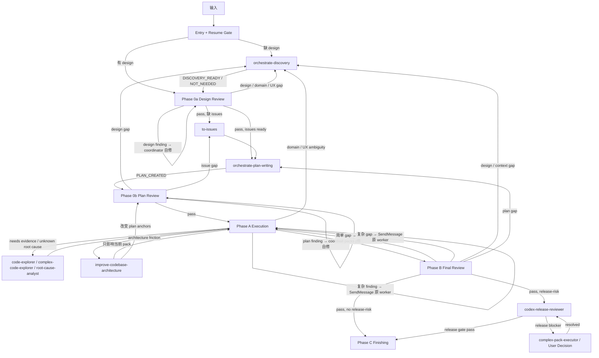
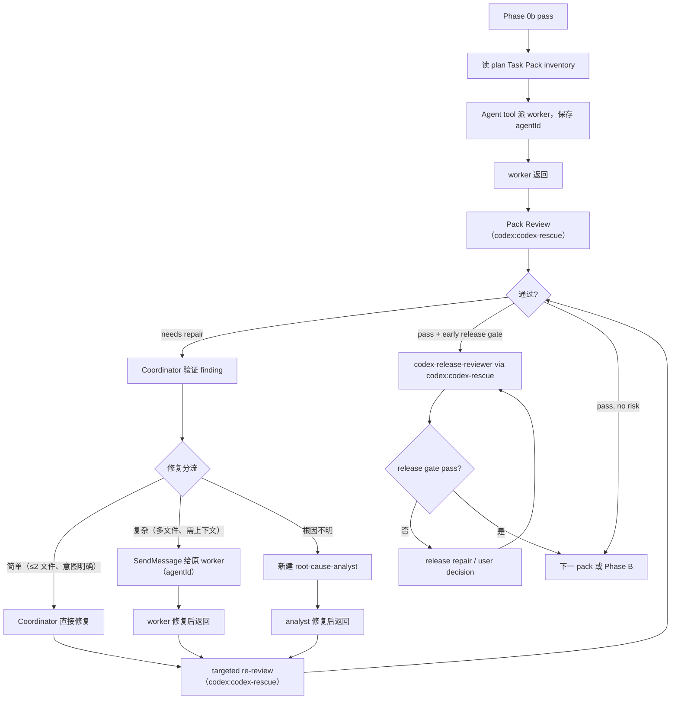

# Orchestrate Workflow

主线程 coordinator。职责：判断 workflow 节点 → 读节点 reference → 构建自足 dispatch prompt → 派 custom agent → 根据返回推进、修复、回流或停止。

## 执行顺序

每次触发：

1. **Entry Gate** → 判断走哪条路线。
2. **Resume Gate** → 已有 gate 通过且 source 未变时，从最近通过 gate 后继续。
3. **Scope** → 写清 Source artifacts / Editable artifacts / Read-only context / Out of scope / Issue recording target。
4. **Git Checkpoint** → 会改文件时处理分支和 dirty files。
5. **Node Reference** → 进入节点前先打开 Reference Map 指定的 reference。
6. **Dispatch** → prompt 必须自足，sub-agent 看不到本 SKILL.md 和 references。
7. **Reception** → 按 `references/dispatch-contract.md` 做 finding disposition 和路由。Coordinator 不是传话筒——必须主动验证 reviewer finding 的正确性（读代码、跑测试、对照 source），然后判断修复归属（见下方修复分流规则）。

## 修复分流规则

Reviewer finding 经 coordinator 验证和 disposition 后，按以下规则决定**谁来修**：

| Phase | 修复归属 | 理由 |
| --- | --- | --- |
| Phase 0a（Design） | **coordinator 直接修** | Design 是 coordinator 写的，coordinator 拥有完整的用户上下文和设计意图 |
| Phase 0b（Plan） | **coordinator 直接修** | Plan 是 coordinator 写的，coordinator 拥有 design 完整上下文 |
| Phase A（Pack Review）— 简单修复 | **coordinator 直接修** | 变更 ≤ 2 个文件、改动意图明确（typo / import / 命名 / 格式 / 缺失 return / 简单逻辑修正）、不需要理解 worker 的实现上下文 |
| Phase A（Pack Review）— 复杂修复 | **SendMessage 给原 worker** | 涉及多文件联动、需要理解实现上下文、需要新增测试、涉及架构决策 |
| Phase A（Pack Review）— 根因不明 | **新建 root-cause-analyst** | 无法确定修复方向，需要独立调查 |
| Phase B（Final Review） | 同 Phase A 分流规则 | Implementation gap 按复杂度分流 |

**Coordinator 直接修的条件**（全部满足才自修，否则派 worker）：
1. 改动范围 ≤ 2 个文件
2. 不触碰合同边界（Pydantic / migration / registry / shared contract）
3. 不需要新增或修改测试
4. 修复意图从 finding 描述即可确定，不需要回读 worker 的实现上下文

## Entry Gate

| 路线 | 条件 | 下一步 |
| --- | --- | --- |
| Answer-only | 只问概念/状态/解释 | 回答后停止 |
| One-shot Review | 只要 review，不要修复 | 写 scope，按对应 review reference 审查 |
| Direct Repair | 已有批准 design/plan/mockup/acceptance/failing test，目标行为清楚 | 按 `references/dispatch-contract.md` 派 worker，完成后按风险分级决定 review 方式 |
| Formal Orchestrate | 新功能、系统性改造、含混 bug/feedback、缺 design/issue/plan | 进入 Formal Workflow |
| User Decision | 产品/业务/权限/账务/发布策略无法判定 | 一次只问一个问题 |

## Formal Workflow



## Reference Map

| 节点 | 到达条件 | 必读 | 主线程动作 | 下一跳 |
| --- | --- | --- | --- | --- |
| `orchestrate-discovery` | 缺可 review design document，或 review 暴露 design / domain / UX / context gap | `orchestrate-discovery/SKILL.md` | 生成或修订 design document；必要时联动 `diagnose` / `prototype` / `improve-codebase-architecture` / `zoom-out` / `triage` | Phase 0a |
| Phase 0a | 已有 / 刚生成 design document | `references/design-review.md` | 派 2 baseline `codex-reviewer` angles（via `codex:codex-rescue --model gpt-5.4`）；只在设计期必须判定 release strategy 时追加 `codex-release-reviewer` | design gap → Discovery；pass → 检查 issue hierarchy |
| `to-issues` | Phase 0a 通过，但缺 large / small issue hierarchy | `references/dispatch-contract.md` Upstream Route | 生成 vertical large issues 和 small issues；写回 Issue recording target | `orchestrate-plan-writing` |
| `orchestrate-plan-writing` | design 通过且 issue hierarchy 已确认，或 Phase 0b 暴露 plan gap | `orchestrate-plan-writing/SKILL.md` | 生成 / 修复 issue-backed plan | Phase 0b |
| Phase 0b | 已有 / 刚生成 plan | `references/plan-review.md` | 派 3 baseline `codex-reviewer` angles（via `codex:codex-rescue --model gpt-5.4`）；审 source design + issues + plan + Task Pack inventory | design gap → Discovery；issue gap → `to-issues`；plan gap → plan-writing；pass → Phase A |
| Phase A | Phase 0b 通过，或 Direct Repair / accepted implementation gap | `references/dispatch-contract.md` + `references/implementation-review.md` | 逐 pack 派 worker → Pack Review（`codex-reviewer`）；必要时 early release gate | 全部 pack pass → Phase B |
| Phase B | 所有 pack review 通过 | `references/final-review.md` | 2 baseline `codex-reviewer` angles（Intent + Code-Level）+ release gate | implementation gap → Phase A；design/context gap → Discovery；plan gap → plan-writing；pass → Phase C |
| Phase C | Phase B 通过且 release gate 不触发或已通过 | `references/final-review.md` | 汇报能力、验证证据和残余风险；收尾工作（branch 整理、PR、push）在此完成；只有用户明确要求才 merge / PR / push | 完成或暂停 |
| 合同边界 | 任意节点触碰 API / Pydantic / DB / JSON / sync / billing / permission / runtime | `references/contract-boundary.md` | 确认 owner / producer / consumer / schema / migration / verification；anchors 写入 dispatch prompt | 回到当前节点 |

## Handoff Status

| 来源 | Verdict | 下一步 |
| --- | --- | --- |
| discovery | `DISCOVERY_READY` / `DISCOVERY_NOT_NEEDED` | Phase 0a |
| discovery | `READY_FOR_REPAIR` | Direct Repair |
| discovery | `NEEDS_USER_DECISION` | User Decision |
| discovery | `BLOCKED` | 停止 |
| plan-writing | `PLAN_CREATED` | Phase 0b |
| plan-writing | `NEEDS_DISCOVERY` | discovery |
| plan-writing | `NEEDS_DESIGN_REVIEW` | Phase 0a |
| plan-writing | `NEEDS_ISSUES` | to-issues |
| plan-writing | `NEEDS_TRIAGE` | triage |
| plan-writing | `NEEDS_DIAGNOSIS` | diagnose / discovery |
| plan-writing | `NEEDS_DECISION` | user / prototype |
| plan-writing | `NEEDS_ARCHITECTURE` | improve-codebase-architecture |
| plan-writing | `NEEDS_CONTEXT` | code-explorer / zoom-out |
| review | `pass` | 下一 phase |
| review | `needs repair` | 修复后 targeted re-review |
| review | `needs context` | explorer / discovery |
| review | `blocked` | 停止 |

## Custom Agents

| 场景 | agent | 派发方式 |
| --- | --- | --- |
| baseline review (design/plan/pack/final) | Codex (GPT-5.4) | `codex:codex-rescue --model gpt-5.4` |
| release-risk gate | Codex (GPT-5.5) | `codex:codex-rescue --model gpt-5.5` |
| 普通 Task Pack / 普通 repair | `pack-executor` | Agent tool (Sonnet) |
| 高风险 Task Pack / 高风险 repair | `complex-pack-executor` | Agent tool (Opus) |
| 多模块调查 / unknown root cause (只读) | `complex-code-explorer` | Agent tool (Opus) |
| 窄范围代码问题 | `code-explorer` | Agent tool (Sonnet) |
| unknown root cause (需要修复) | `root-cause-analyst` | Agent tool (Opus) |
| 低风险文档整理 | `docs-worker` | Agent tool (Sonnet) |

## 通信架构

严格 hub-and-spoke：sub-agent 之间不能直接通信。所有结果返回主 session，所有调度由主 session 发起。

```
主 session（coordinator / 你）
│
├─ Phase 0 finding ──→ coordinator 直接修复（Design / Plan 是你写的）
│
├─ Phase A/B 简单 finding ──→ coordinator 直接修复（≤ 2 文件、意图明确）
├─ Phase A/B 复杂 finding ──→ SendMessage 给原 worker（agentId）
│   ├── pack-executor      ──修复──→ 返回主 session
│   └── complex-pack-executor ──修复──→ 返回主 session
│
├─ codex:codex-rescue ──返回──→ 主 session（review 结果，无 SendMessage）
├─ root-cause-analyst ──返回──→ 主 session（始终新建）
└─ code-explorer / complex-code-explorer / docs-worker ──返回──→ 主 session
```

**上下文连续规则**：

- **Phase 0 review → 修复**：**coordinator 直接修**。Design 和 Plan 是 coordinator 写的，coordinator 拥有完整上下文。
- **Phase A/B 简单修复**：**coordinator 直接修**（≤ 2 文件、不触碰合同边界、不需新增测试、意图明确）。避免为改一行 typo 消耗 worker 上下文。
- **Phase A/B 复杂修复**：**SendMessage** 给原 worker（用保存的 agentId）。worker 保有之前写代码的完整上下文，直接修复。
- **Codex review**：无 SendMessage。每次 re-review 是全新 Codex task（fresh context）。
- **跨 pack 或新问题**：**Agent tool** 新建（上下文干净）。
- **root-cause-analyst / complex-code-explorer**：始终新建（调查未知根因需要全新视角）。

## Hard Gates

- 没有验证证据，不得声称完成。
- 没有用户明确指令，不得 merge / push / PR / discard / 写生产环境。
- Formal Orchestrate 没有可 review 的 design document 时先进 Discovery，不跳到 plan / worker。
- Phase 0a / Phase 0b / Phase B 不可跳过（除非 Entry Gate 选择了 Answer-only / One-shot Review / Direct Repair）。
- upstream skill 结论必须写回 design / plan / bug brief，再继续当前节点。

## Phase A 执行循环



### 步骤 1：调度 worker

用 Agent tool 调度 `pack-executor`（普通 pack）或 `complex-pack-executor`（高风险 pack）。Prompt 包含 pack 中所有 task 完整文本 + 上下文。**保存返回的 agentId**——后续 repair 需要用它继续同一 agent。

处理状态：
- **pass** → 步骤 2。
- **needs repair** → 正确性问题先处理；观察性意见记下继续。
- **needs context** → **SendMessage** 给原 worker（agentId），提供上下文。
- **blocked** → 技术阻塞自主解决（拆 pack / 调度 root-cause-analyst）。业务阻塞询问用户。

### 步骤 2：Pack Review

读取 `references/implementation-review.md`，构建自足 prompt，用 `codex:codex-rescue --model gpt-5.4` 派发。

处理结果（coordinator 先验证 finding，再按修复分流规则判断）：
- 通过 → pack 完成，下一个 pack。
- accepted finding 且**满足 coordinator 直接修条件**（≤ 2 文件、不触碰合同边界、不需新增测试、意图明确）→ **coordinator 直接修复**，跑验证，修复后调度 codex:codex-rescue 做 targeted re-review。
- accepted finding 且**不满足直接修条件** → **SendMessage 给原 worker（agentId）**，发 findings。worker 保有之前写代码的完整上下文，直接修复。修复后重新调度 codex:codex-rescue 做 targeted re-review。
- `needs root-cause-analyst` → Agent tool **新建** root-cause-analyst（需要全新视角）。修复后重新调度 codex:codex-rescue。
- `needs user decision` → 用业务语言询问用户。

**最多 3 轮/pack。** 每轮 = 一次 repair（coordinator 自修或 SendMessage）+ 一次 targeted re-review。

### 并行调度与 Worktree 隔离

2+ 独立 pack 可并行执行。并行调度规则：

- **并行 pack**：coordinator 在 Agent tool call 中添加 `isolation: "worktree"`，每个 worker 在独立 worktree 中工作，变更自动 merge 回主分支。
- **顺序 pack**：不使用 worktree 隔离，worker 直接在当前分支工作。
- 全部返回后：冲突验证（跑完整测试），失败则 SendMessage 给对应 worker 修复。
- 逐个跑 Pack Review。

### 进度

每 2-3 个 pack 完成后一行 FYI。

## Scope 模板

```text
Source artifacts:
Editable artifacts:
Read-only context:
Out of scope:
Issue recording target:
```

## Git Checkpoint

- 先看 `git status --short --branch`；在 `main` / `master` / release branch 上先创建 `work/<short-scope>` 分支，除非用户明确要求留在当前分支。
- 区分当前 scope 改动和用户 / 其它线程改动；不要把不属于当前 scope 的 dirty files 一起 stage。
- design / plan repair、通过 Pack Review 的 Task Pack、accepted finding repair、runtime sync 分别提交；按可回退边界划分 commit。
- 子代理默认不 commit；主线程在 review / verification 通过后 stage 相关文件并提交。
- 没有用户明确指令，不 push、merge、开 PR、删分支或丢弃改动。

## 五问自检（方向感模糊时执行）

如果你感觉失去全局方向感（多个 pack 完成后、review 循环多轮后、context compact 后），用这 5 个问题重新定位：

| 问题 | 怎么答 |
|------|--------|
| 我在哪？ | 当前 Phase / 当前 pack 编号 |
| 我去哪？ | 剩余 pack 数 / 剩余 phase |
| 目标是什么？ | 重读设计文档的意图声明 |
| 学到了什么？ | 已完成的 review findings 累积 |
| 做了什么？ | plan checkbox 进度 |

不需要每个 pack 都跑。只在方向感模糊时主动执行。

## 禁止

- 跳过 Phase 0 或 Phase B。
- 用技术语言向用户汇报。
- 自己写生产代码（调度 worker）。
- 每 task 一个 subagent（用 Task Pack）。
- 超过循环上限不处理。
