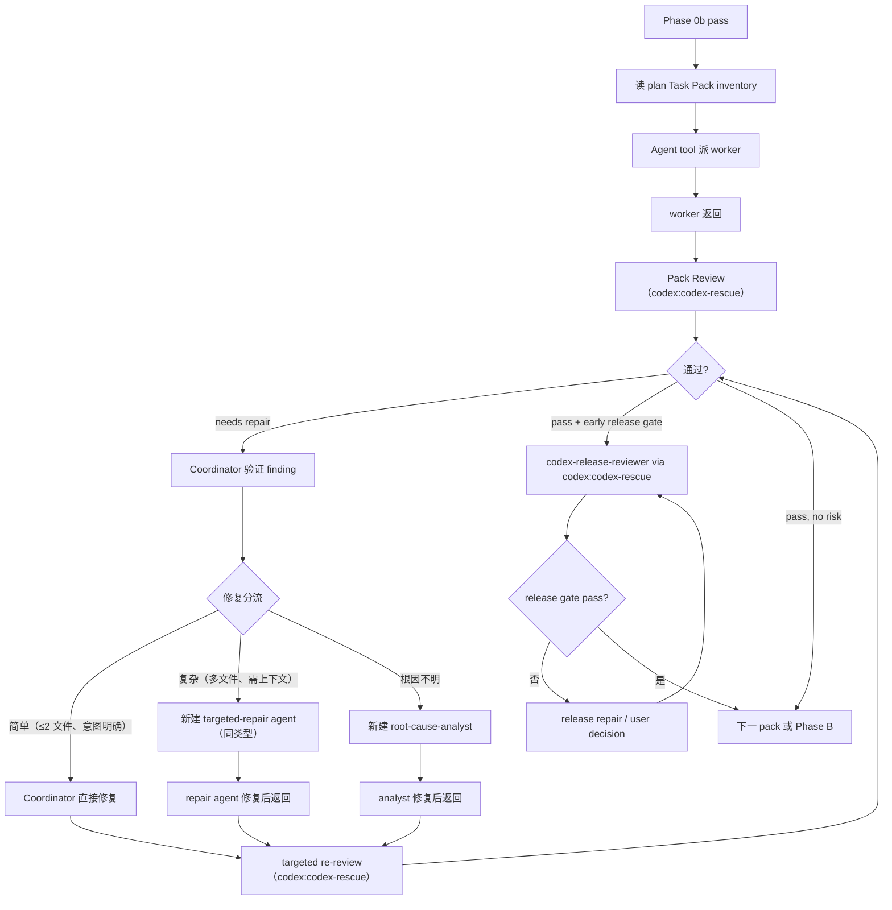

# Phase A Execution + Pack Review

Phase 0b 通过后进入。逐 pack 派 worker → Pack Review → 必要时 repair → 必要时 early release gate。



## Step 1: Dispatch Worker

用 Agent tool 调度 `pack-executor`（普通 pack）或 `complex-pack-executor`（高风险 pack）。Prompt 包含 Pack Brief 完整字段（见 `dispatch-primitives.md`）+ pack 中所有 task 完整文本 + 上下文。

处理状态：
- **pass** → Step 2。
- **needs repair** → 正确性问题先处理；观察性意见记下继续。
- **needs context** → 新建同类 worker，prompt 包含原 pack brief + 补充上下文。
- **blocked** → 技术阻塞自主解决（拆 pack / 调度 root-cause-analyst）。业务阻塞询问用户。

## Parallel Dispatch

2+ 独立 pack 可并行执行：

- **并行 pack**：Agent tool call 中添加 `isolation: "worktree"`，每个 worker 在独立 worktree 中工作。返回含 worktree path 和 branch name。
- **顺序 pack**：不使用 worktree 隔离，worker 直接在当前分支工作。
- 全部返回后：逐个 `git merge <worktree-branch> --no-ff` → 解决冲突 → 跑完整测试验证。冲突则新建 targeted-repair agent 修复。
- 逐个跑 Pack Review。

## Step 2: Pack Review

### 输入

Scope + source design + plan + pack brief + worker report + diff / changed files + verification + mockup + project docs + risk flags + Contract anchors。

### Pass 条件

Spec Compliance 通过 + Code Quality 无当前验收 blocker。每个 pack 最多 3 个 repair rounds。

### Dispatch: 1 baseline `codex-reviewer`

通过 `codex:codex-rescue --model gpt-5.4` 派发。每次 review 是全新 Codex task。同一 reviewer 先做 Spec Compliance，通过后才做 Code Quality。

Prompt 包含：Read first / Project baseline / Contract anchors / Mockup anchors / plan path / pack brief / worker report / diff scope / verification commands / risk flags / 发布风险 / Return Contract 和 Finding Shape（见 `dispatch-primitives.md`）。

### Reviewer 独立验证（不信 worker self-report）

1. 读 diff 和变更文件。
2. 跑 focused verification 或说明为什么不能跑。
3. UI pack 对照 mockup anchors 检查实现。
4. 合同边界对照 parent 给出的 Contract anchors 检查正式 contract、registry、migration、repository、read model、catalog 和 producer / consumer。
5. 对照 pack brief 逐 task 审查。

### Phase 1: Spec Compliance

有 Critical 时停止，不进 Code Quality。

检查：功能完成 / UI 按 mockup 实现 / 错误路径覆盖 / 合同按 anchors 实现 / 无 scope creep / 多 task 兼容 / 安全问题。

Critical：功能缺失或做错 / mockup 关键状态未落地 / UI 目标含混被 worker 自行落成不可追溯行为 / 安全漏洞 / 绕过 Pydantic-registry-migration / 违反不变量。

### Phase 2: Code Quality（仅 Spec Compliance 通过后）

检查：逻辑错误 / 项目规则 / 合同质量（schema_version / extra=forbid / typed return / consumer 同步 / DB 闭合）/ helper placement / 测试质量（public behavior / 真实边界 / no internal mocks）/ UI 证据 / mock 边界 / architecture routing / 文件健康。

Refactor 只在 GREEN 后允许；普通整洁偏好不阻塞 pack。

### Result Payload

`### Result` 下使用：

```text
Spec Compliance:
Phase summary: 通过 / 阻塞
Critical:
Important:

Code Quality:
Phase summary: 通过 / 阻塞 / 未执行
Critical:
Important:

Verification summary:
命令:
结果:
```

每条 finding 必须使用统一 Finding Shape（见 `dispatch-primitives.md`）。

## Release Gate

Pack Review 通过后，只在 early release gate 触发时追加 `codex-release-reviewer`（via `codex:codex-rescue --model gpt-5.5`）。多个相邻 high-risk packs 同一风险面合并一次。Early release gate 触发条件见 `review-budget.md`。

## Reception

- 能说清改哪里 → original worker / pack-executor / complex-pack-executor。
- 根因不明（只需调查）→ complex-code-explorer。
- 根因不明（需要调查 + 修复）→ root-cause-analyst。
- desired behavior 不清 → orchestrate-discovery。
- bad seam → improve-codebase-architecture。
- 满足 release gate → codex-release-reviewer。
- 改变产品范围 → user decision。

Repair 后 targeted Pack Review，只重审 accepted findings + repair diff + affected anchors。完整路由选项见 `coordinator-tools.md` Routing Vocabulary。

## 进度

每 2-3 个 pack 完成后一行 FYI。
