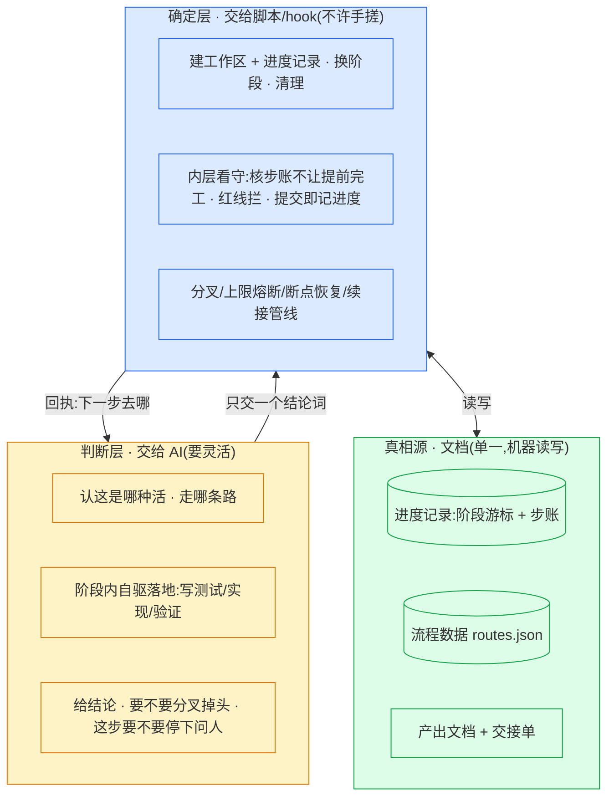
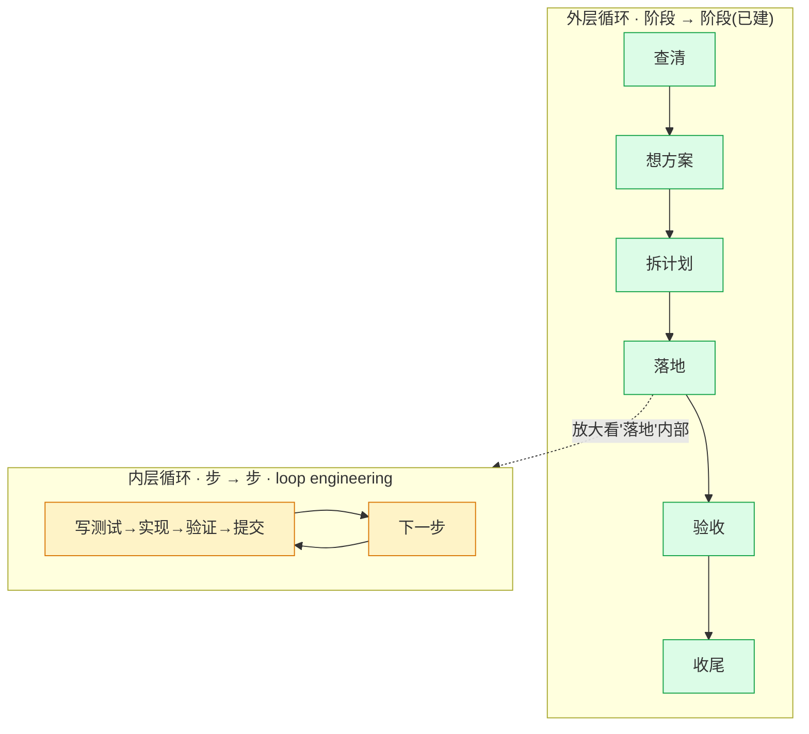
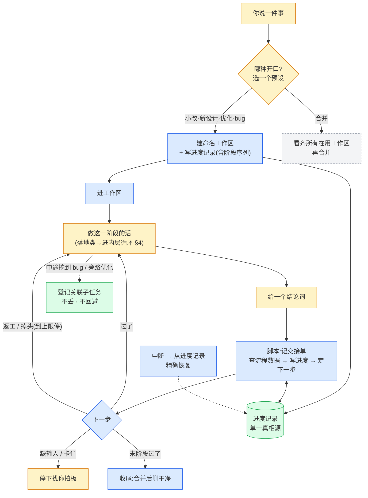
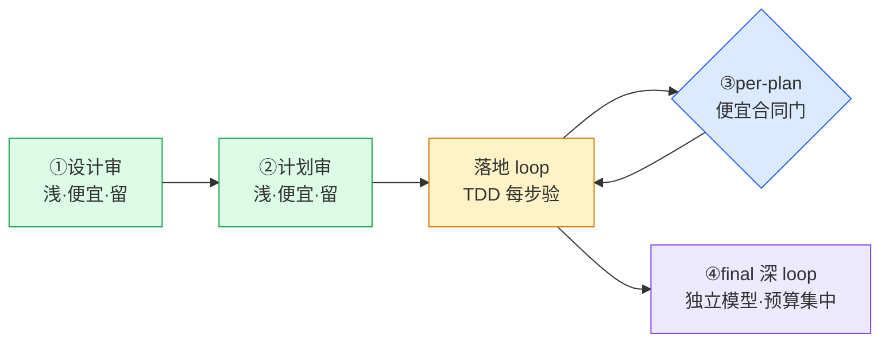
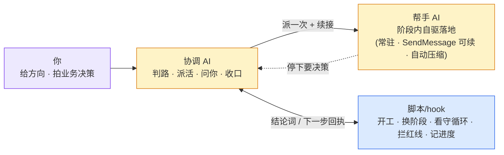
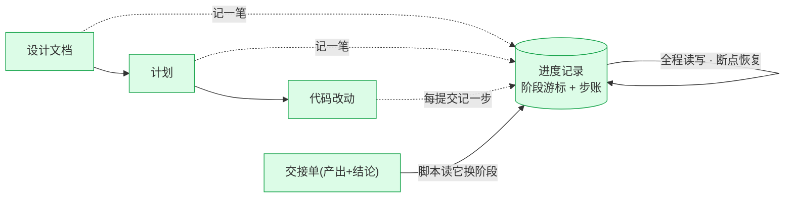
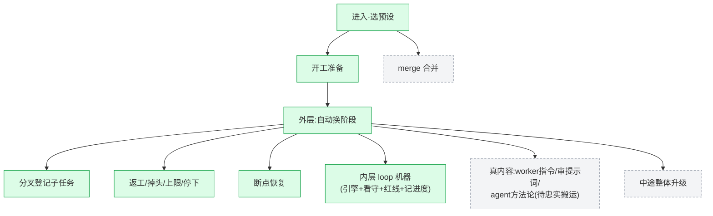
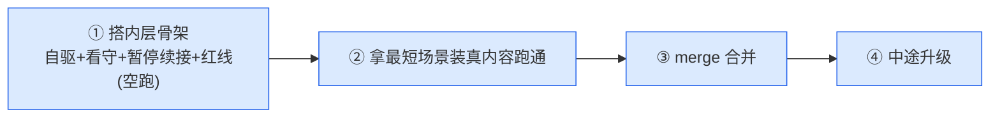

# plugin2 · 架构总览

> 给项目负责人看的全局图。讲清楚:谁干什么、整套怎么运转(阶段之间 + 阶段内部)、信息怎么流转、现在到哪、往哪走。
>
> **真相源**:进度记录(`task.json`)记任务全部状态;流程数据(`routes.json`)记主干阶段与结论走向。本文与它们冲突时,以这两份文件为准。本文的设计取舍已对照旧 plugin 实测、业界成熟做法、Claude Code 已核实的运行时能力(见 §10),不是凭猜。

---

## 1. 三层结构 —— 整套架构的根

只有三层。**而且这三层既管"阶段之间怎么换",也管"阶段内部怎么落地"——同一条线,用在两个尺度。**



确定的事(开工、换阶段、记进度、看守循环、拦红线)全压进脚本/hook,AI 不碰;要判断的事(走哪条路、代码怎么写、这步该不该停下问你)全留 AI。两层只用"结论词进、下一步回执出"对接。

---

## 2. 两层循环 —— 整套怎么运转



- **外层**:协调者把任务一阶段接一阶段往下推。每阶段干完交一张单子,脚本据结论换阶段。(§3)
- **内层**:进了"落地"这种阶段,一个帮手**自己连跑很多步**(写测试、改代码、验证、提交),不每步回协调者。这层才是 loop engineering——在该停处把你拉进来、断了能从断点续且不重做。(§4)

内层全部的多步、暂停、修复,对外**只露一次阶段交接**;内外不互相污染。

---

## 3. 外层:阶段怎么换

颜色:🟡AI 判断 · 🔵脚本确定 · 🟢文档 · ⬜待建。



每阶段干完按五个结论分流:过了 / 要返工 / 方向错 / 缺输入 / 卡住。

---

## 4. 内层:阶段里怎么自驱落地(loop engineering)

进了"落地"这种阶段,协调者派**一个 Claude subagent 帮手**(后台跑),帮手自己跑这个循环,不每步回来(**small-change 小活例外:协调者就地做,不派帮手、不 SendMessage**):

```
读步账 → 找下一个没做的步
循环:
  判这步要不要停下问人(三类停,见下)
  写失败测试 → 确认它真失败 → 最小实现 → 确认它真通过   ← 验收吃测试,不吃"我觉得对了"
  提交                                              ← 提交即记一步完成(脚本记,不手写)
  下一步…
全做完 → 交一次阶段交接单 → 回外层
```

**为什么帮手不会"扫一眼就宣布完工"**(业界实测的真失败模式):帮手想停时,一个看守脚本拿步账一核——还有步没做完、又没到该停的地方,就**当场把它顶回去继续**。完工信号是**步账全绿**,不是帮手自我感觉。

### 自动化和 HITL 怎么融合

**唯一的硬红线 = 上线发布**(合并回主分支 / 部署云端)——不可逆的对外动作,**机器硬闸(PreToolUse 直接拦),要你亲自批,不分在场还是无人值守**。它在**收尾/merge 边界**,不在执行循环里。计费/权限/数据/用户可见合同这些,**在设计审+计划审就约定死**,执行中不再为它们停——那才是规划它们的地方。

执行循环内部只有这几种打断,一个在场开关调"软停":

| 执行中 | 什么情况 | 你在场 | 无人值守 |
|---|---|---|---|
| **软停** | 有合理默认的判断、风险中等 | 停下问你 | 自己拍板 **+ 留痕**,继续 |
| **冒泡** | 真缺输入 / 怀疑方向错 | 停下问你 | 同(needs-context / needs-redirection 太重,AFK 也停) |
| **不停** | 纯机械(写测试、让它过、提交) | 不停 | 不停 |

"在场 / 无人值守"开关**只动软停那一档**:冒泡永远停、不停永远不停、红线(merge/deploy)永远要人批。

### 停了怎么续:不白死、不重做已做的

续接路,代价不同(机制序列见落地文档 `design/loop-engineering.md` §1):

| 出口 | 何时 | 怎么续 | 代价 |
|---|---|---|---|
| 暂停问人 | 软停 / 冒泡 | 答完**续同一帮手,context 原封** | 零重读 |
| 修复 | 审查给了要改的点 | 续同一帮手改 | 零重读 |

**续接不重做**靠每步一次提交(已提交的步永不重跑)+ 续同一帮手保上下文(SendMessage)。帮手当**普通 sub-agent** 用,context 长了它自己自动压缩,不用我们管换帮手——省 token 的核心是续同帮手、零重读。

---

## 4b. 同一台 loop 的另一组实例:四个审

loop engineering **不是落地专用**,是通用内层机器。审核也是它的实例,只是"一步"从"写一个 pack"换成"查一个维度/坐实一条 finding",verify 从"跑测试"换成"grep/读/跑去坐实 finding 真假"。**审者载体 = Codex**(`codex exec` 喂我们自己的 review 提示词 quartet+阶段 angle、`--sandbox read-only`;**不用 `codex review`**——那走 Codex 内置提示词、绕过我们的方法论;续接走 `codex exec resume`,不走 SendMessage——见 §5b),否则自审自盲。

整套有**四个审**(`skills/second-model-review`),同一台机器(防幻觉四件套 + 每阶段两个独立视角 + 亲验处置 + Gap 路由),深浅与预算不同:

| 审 | 时机 | verify 吃什么 | loop 深度 | 预算 |
|---|---|---|---|---|
| ①设计审 | 写计划前 | grep/读仓库(有没有现成库、合同对不对) | 浅 | **留**·便宜最高杠杆(代码前抓方向/设计错) |
| ②计划审 | 写代码前 | 同上 + 覆盖/合规 | 浅 | **留**·便宜高杠杆 |
| ③落地审 | 每个 plan 提交后 | —— | **降成便宜合同门**(只查跨 plan 合同兑现) | 低·跟 TDD 重叠、孤立看不到跨 plan |
| ④final | 全合并后 | 跑测试、读大 diff、对抗输入 | **深** | **集中**·跨 plan 缝隙+兑没兑现意图+独立代码审 |



预算原则:**①②便宜高杠杆要留;③降成便宜合同门(对不对已由 TDD 每步验过);重判预算集中砸④final 深 loop。**

### 退出标准 —— 一个 loop 合不合格的命门

一个 loop 最关键的是"什么时候算审完、可以退出"。**"reviewer 自己说审完了"不可信**——业界把它命名为过早完成(premature termination),还实测出 reward hacking:迭代自审里 judge 给自己打分越打越高,真实质量反而下降。所以退出靠**外部证据**,不靠自报,且必须三件套齐:

| 三件套 | 是什么 | 防什么 |
|---|---|---|
| **完成判据** | 覆盖清单全绿(查质量/正确,不是"提到了")+ 无开口 Critical/Important + **收敛**(无新高置信 finding) | 防过早宣布审完 |
| **熔断** | 修复轮上限,到顶转第三态 | 防无限打转 + 防 reward hacking(自审超 ~3 轮基本只换语法、还把分刷上去) |
| **第三态** | 不是 pass/fail 二选一,加 needs redirection(方向疑)/ needs context(缺输入)/ blocked(卡死或超限)→ 交人 | 防它在没权/没把握处硬判过 |

四个审用同一套三件套,覆盖清单和验证方式各不同:

| 审 | 完成判据(覆盖 + 怎么验) | 熔断 | 第三态 |
|---|---|---|---|
| ①设计 | 两轴过 + 方向级五问都明答(不许跳)+ 无 Critical;验=grep 仓库(现成库?调用方?合同?) | **2 轮**(旧 plugin 这里忘了设,要补) | 方向疑→交人 / 缺输入 |
| ②计划 | 两轴过 + 每个 issue 有对应 plan、每个 pack 有验收命令、引用的符号 grep 得到 + 无 Critical | 2 轮 → blocked | 方向疑 / blocked |
| ③落地 | 全 Pack 提交 + 声明的跨 plan 合同兑现(都可机器核);不开判断 loop | 合同不达→回落地(落地自己的 2 轮) | 合同根上错→升级 |
| ④final | 意图清单逐条坐实(不是"提到")+ 每条跨 plan 合同真接上 + 两基线过 + 无 Critical;验=真跑测试/读大 diff/对抗输入 | 1–2 轮 + 超限转根因调查/人 | 回流落地(上限1)/ 发布风险→人 |

**防过早完工靠机器抓手,不靠自觉**:覆盖清单由**主线程从设计/计划/issue 文档抽出**(落进进度记录);里头**客观项机器核**(③全 Pack 提交、②issue 数=plan 数、④意图清单每条有勾),没全绿就由看守 hook 顶回去续审——和落地 loop 防"扫一眼宣布完工"是同一个机器;**语义项要证据**(每条 finding 引 `file:line` 原文,引不出=降置信)。

---

## 5. 谁干什么



| 角色 | 干什么 | 不干什么 |
|---|---|---|
| 你 | 给方向、给真实体感、拍业务决策 | 不管机械细节 |
| 协调 AI | 判活、派帮手、问你、验收、收尾 | 不亲自写生产代码 |
| 帮手 AI | 阶段内自驱落地;停下时把问题抛回协调者 | 不直接问用户(只有主线程能问)、不改文档、不越界 |
| 脚本/hook | 开工、换阶段、看守循环、拦红线、记进度、续接管线 | 不做判断 |

**写审异家 = 不同模型**:设计讨论用 **Claude**;审核派 **Codex**(审者与作者不同模型,独立性最强);落地帮手**倾向 Claude**(顺手,未最终定)。审者必须 ≠ 作者,这是审查可信的前提。

---

## 5b. 三个载体 —— 各能干什么,别混

这 plugin 是给 **Claude Code** 写的:**主线程就是 Claude Code**。帮手分两种载体,机制不同,功能不同,角色不许混。

| 载体 | 是什么 | 能 | 不能 / 注意 | 怎么续 |
|---|---|---|---|---|
| **主线程 = Claude Code** | 协调者(这个对话) | **唯一能问用户**(AskUserQuestion);派 subagent;Bash 调 Codex;跑 hook;**就地做 small-change** | —— | —— |
| **Claude subagent** | Agent 派,独立 context,回摘要 | 自驱干活;后台跑;SubagentStop 看守;自动压缩 | 不能问用户(抛回主线程);Explore/Plan 一次性不可续 | **SendMessage** |
| **Codex 无头 CLI** | codex exec,外部进程、**不同模型** | 审 = `codex exec` **喂我们自己的 review 提示词**(quartet+阶段 angle,`--sandbox read-only`);落地 = `codex exec --sandbox workspace-write`;`--output-schema`=结构化回执;`-m`/effort 分层 | **不是 Claude subagent**:经 Bash 调,不吃 SendMessage/SubagentStop/Claude hook;不能问用户。**`codex review` 用 Codex 内置提示词,绕过我们的方法论 → 不用** | **codex exec resume** |

**五条硬规矩**:① 续接两套别混(Claude=SendMessage,Codex=exec resume);② SubagentStop 只看守 Claude 帮手,Codex 靠 `--output-schema` 回执核;③ 只有主线程能问用户,subagent/Codex 都抛回主线程;④ **审用 `codex exec` 喂我们的 review 提示词,不用 `codex review`**(那是 Codex 内置提示词,绕过 quartet/阶段 angle);⑤ small-change 主线程就地做,不派帮手、不 SendMessage。

---

## 6. 八个核心设计

| 设计 | 是什么 | 给你解决什么 |
|---|---|---|
| 确定与判断分两层 | 机械的进脚本/hook,判断的留 AI;外层内层同一条线 | 又快又稳,AI 不空耗判断 |
| 进度记录唯一真相源 | 阶段游标 + 步账写进一份文件,机器读写 | 中断精确接上,不读错写错 |
| 工作区即工作单元 | 一任务一个命名工作区,可跨天,合并后才删 | 你在 VSCode 认得出、管得住 |
| 交接靠固定单子 | 干完交"产出+结论词",缺了当场拒收 | 根治"上一步没对齐、下一步陷修补" |
| 流程是数据不是散文 | 阶段、结论走向写成数据表 | 改流程=改数据;能分叉掉头 |
| 续接不重做 | 每步一提交(已做的跳过)+ 续同帮手 context 原封(SendMessage) | 暂停/修复都不白干,省 token |
| 验收吃测试不吃自述 | 每步先写测试再实现;看守核步账防过早完工 | 不让"扫一眼宣布做完了" |
| 该停按风险分级 | 红线机器拦 + 在场开关只动软停 | 自动化和 HITL 融合,该自动自动、该停必停 |

---

## 7. 主干 + 预设开关

只有一条主干。前三个阶段是可开关的前置——你怎么开口只决定默认开哪几个。"新设计"和"优化"是同一主干,优化只是默认多开"查清"。


| 你怎么开口 | 默认开的阶段 |
|---|---|
| 明确的小改 | 落地 → 验收 → 收尾 |
| 新想法(清晰或模糊) | 想方案 → 拆计划 → 落地 → 验收 → 收尾 |
| 优化(反馈/真机) | 查清 → 想方案 → 拆计划 → 落地 → 验收 → 收尾 |
| bug(根因不明) | 查清 → 落地(修) → 验收 → 收尾 |
| 合并 | merge 独立,不走主干 |

前置开关中途能翻:查清中发现要大改→打开"想方案";小改做着发现是设计问题→升级打开前置。

---

## 8. 信息怎么流转

文档是接力棒;指令在文档里,不在对话里。



---

## 9. 现状叠在架构上



🟢 已完成并空跑验证(81 项断言):进入路由 · 开工/恢复/清理 · 外层自动换阶段 · 分叉/返工/掉头/上限/停下 · **内层机器(引擎 loop.sh + 看守/红线/记进度三 hook)** · 一份进度记录管全部。
⬜ 待建:**真内容**(从旧 plugin 忠实搬:worker 指令 / 审提示词 / agent 方法论)· merge · 中途升级。

---

## 10. 设计依据(不闭门造车)

| 源 | 贡献 |
|---|---|
| 旧 plugin 实测 | plan 级帮手自治、从已提交计数恢复、续同帮手修复、上限数据+hook 双持有、转根因调查;也挖出它的坑(手写整块状态、轮次编进文件名、魔数阈值、溢出就换帮手)——全改掉 |
| 业界成熟做法 | 状态外置+游标、"停"做成显式原语、副作用隔离出重放路径(每步一提交→续接不重做)、验收吃 ground truth + 逐项清单防过早完工、风险分级 deny-default + 自决留痕 |
| Claude Code 已核实原语 | 看守 hook 能顶回帮手续跑、续接保留完整 context、敏感操作能机器拦、帮手不能直接问用户(故 HITL 经主线程) |

---

## 11. 接下来顺序



---

## 12. 文件对照

| 能力 | 文件 |
|---|---|
| 进入 + 路由 + 准备 + 推进说明 | `skills/orchestrate/SKILL.md` |
| 开工 / 恢复 / 清理 | `scripts/prepare.sh` |
| 交单 / 换阶段 / 分叉 / 查位置 | `scripts/flow.sh` |
| 进度记录结构 | `state-schema/task-manifest.schema.json` |
| 流程数据(主干+预设+结论+上限) | `state-schema/routes.json` |
| 内层 loop engineering(自驱/看守/暂停续接/红线) | 待建(§4) |
| 空跑验证 | `scripts/tests/` |
