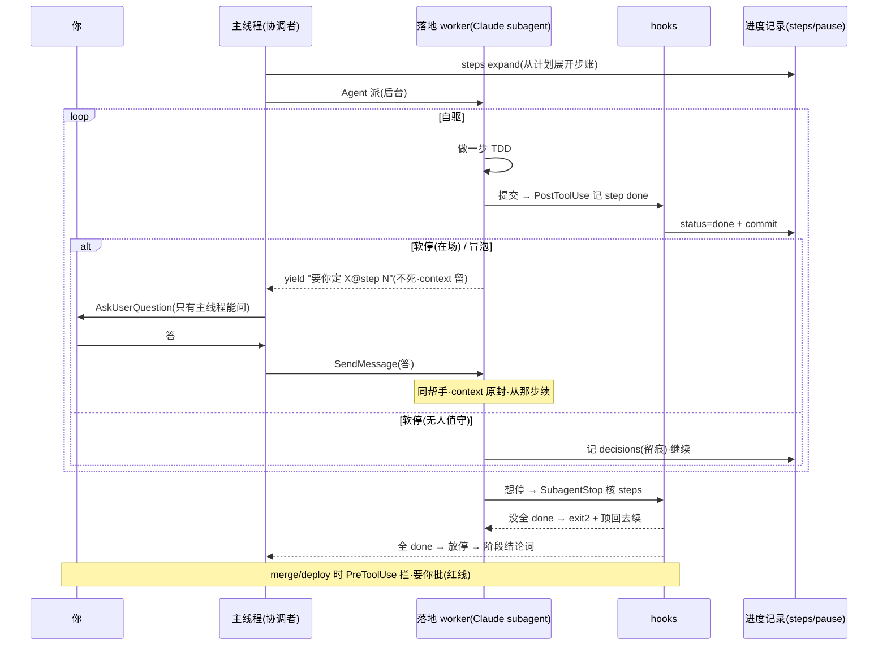

# Loop Engineering · 落地规格

> **OVERVIEW = 设计文档**(为什么、什么形态);**本文 = 落地文档**(具体建什么:载体 / 数据 / 命令 / hook / 退出 / 空跑)。
> 冲突时以 OVERVIEW + `routes.json` + 进度记录 schema + 代码为准。具体字段名以骨架空跑时定死为准,本文是建表蓝本。

---

## 1. 范围:两类内层 loop,一台机器

| loop | 干什么 | "一步" | verify 吃 |
|---|---|---|---|
| **落地 loop**(execution) | 自驱写代码 | 一个 pack:写测试→实现→提交 | 跑测试 |
| **审核 loop ×4**(①设计②计划③落地④final) | 自驱查证 | 一个维度 / 一条 finding | grep/读/跑去坐实 finding 真假 |

同一台机器、同一套退出三件套(§6),载体和数据不同。**small-change 不进 loop**:主线程就地做,不派帮手、不 SendMessage。**③落地审**不开判断 loop,降成机器合同门(§2)。

### 落地 loop 机制(序列)



审核 loop 同构:载体换 Codex(`codex exec` + 我们的提示词),续接换 `codex exec resume`,看守换 `--output-schema` 回执核 checklist。

---

## 2. 载体分配(落地必须照这个调,角色不混)

| loop | 载体 | 派发 | 续接 | 看守 |
|---|---|---|---|---|
| 落地 worker | **Claude subagent** | `Agent(background)` | `SendMessage` | `SubagentStop` hook 核 steps |
| 审 ①②④ | **Codex**(不同模型) | Bash:`codex exec --sandbox read-only -C . --output-schema <f> - < <prompt>`,prompt = 我们的 `quartet.md` + 阶段 angle | `codex exec resume <id>` | `--output-schema` 结构化回执核(Claude hook 管不到 Codex) |
| 审 ③(合同门) | **脚本**(无模型) | 机器核:全 pack committed + 声明的跨 plan 合同存在 | — | — |

**铁律**(§5b):审用 `codex exec` 喂我们的提示词,**不用 `codex review`**(那是 Codex 内置提示词);Claude 续接=SendMessage、Codex 续接=exec resume,别混;只有主线程能问用户,worker/Codex 都把问题抛回主线程。

> 我们的 review 提示词现住 `skills/second-model-review/`(`quartet.md` + 四阶段 angle)。plugin2 审时要能拿到喂给 codex exec——复制进 plugin2 还是引用,搭审核 loop 时定。

---

## 3. 数据结构(进度记录新增字段 · 建表蓝本)

**落地 loop**(写进 task.json 或并列执行档):
```
steps:       [ { id, desc, status: pending|done|blocked, commit } ]   # 主线程从计划展开
attendance:  attended | afk                                           # 在场开关
pause:       { at_step, kind: soft|surface, question } | null         # soft=有默认的判断;surface=缺输入/方向疑
decisions:   [ { at_step, chose, why, at } ]                          # afk 软停留痕,不偷跳
```

**审核 loop**(每轮审):
```
checklist:   [ { item, source, status: open|covered, evidence } ]    # 主线程从设计/issue 文档抽
findings:    [ { severity, confidence, locator, evidence, impact, remediation } ]  # quartet 字段
review_round: int
verdict:     pass | needs-repair | needs-redirection | needs-context | blocked
```

**merge/deploy 红线**:不在进度记录,是 PreToolUse hook 的判定 + 一条 `release_approval`(用户批准令牌)。

> 删净(已否定):续派信封 / resume_from_step / 红线路径表 / context 计数 —— 都不要。

---

## 4. 命令(flow.sh 新增)

| 命令 | 谁调 | 干什么 |
|---|---|---|
| `steps expand` | 主线程 | 从计划展开 `steps[]` |
| `step done` | commit hook | 提交成功→记 `status=done` + commit |
| `pause` | worker | 写 `pause`、yield 返回主线程 |
| `checklist expand` | 主线程 | 从设计/issue 文档抽 `checklist[]`(审核 loop 的覆盖清单) |
| `review dispatch` | 主线程 | 拼 `quartet + angle` prompt、`codex exec --output-schema` 起审 |
| `review ingest` | 主线程 | 收 Codex 结构化回执,落 `findings` |
| `exit check` | 看守 / 主线程 | 核退出三件套(§6):完成判据 + 熔断 + 第三态 |

续接走载体原语(SendMessage / codex exec resume),不另造命令。

---

## 5. Hooks 新增

| hook | 事件 | 逻辑 |
|---|---|---|
| **看守** | `SubagentStop`(仅 Claude worker) | 核 `steps`(落地)或 `checklist`(若 Claude 审):没全绿且没到该停 → `exit 2` + `additionalContext` 顶回去续 |
| **红线** | `PreToolUse` | 命中 merge 回主分支 / push / 部署命令 且无 `release_approval` → deny,要主线程拿用户批准 |
| **记进度** | `PostToolUse`(commit) | 调 `step done` 记 step 完成 |

> Codex 审者是外部进程,不吃 SubagentStop——它的"审完没"靠 `--output-schema` 回执 + 主线程核 checklist。

---

## 6. 退出三件套(每个 loop 落地怎么核)

| 件 | 怎么落 |
|---|---|
| **完成判据** | 覆盖清单全绿(客观项机器核:落地=steps 全 done;审=checklist 全 covered)+ 无开口 Critical/Important + 收敛(无新高置信 finding) |
| **熔断** | 修复轮上限(数据持有,见下),到顶转第三态 |
| **第三态** | `needs-redirection`(方向)/ `needs-context`(缺输入)/ `blocked`(卡死或超限)→ 抛主线程交人 |

**轮上限矩阵**(放 routes.json caps):①设计=2 · ②计划=2 · ③合同门=不开 loop · ④final=1–2 + 超限转根因调查。

**per-review 退出判据**:

| 审 | 完成判据(覆盖 + 怎么验) | 第三态 |
|---|---|---|
| ①设计 | 两轴过 + 方向级五问明答 + 无 Critical;验=grep 仓库 | 方向疑 / 缺输入 |
| ②计划 | 两轴过 + issue↔plan 全覆盖 + 引用符号 grep 得到 + 无 Critical | 方向疑 / blocked |
| ③落地 | 全 pack committed + 跨 plan 合同兑现(机器核) | 合同根上错→升级 |
| ④final | 意图清单逐条坐实 + 跨 plan 合同真接上 + 两基线过 + 无 Critical;验=真跑测试/读大 diff | 回流落地(上限1)/ 发布风险→人 |

**防过早完工**:覆盖清单客观项由看守/脚本机器核,没全绿不让出 pass;语义项每条 finding 引 `file:line` 原文,引不出=降置信。

---

## 7. 骨架空跑断言(先空跑,再装真内容)

**落地 loop**:
- worker stub 跑通整串 steps;`SubagentStop` 逼它做完才放停。
- 软停随 attendance 变(attended 停问 / afk 自决+留 decisions)。
- 冒泡(needs-context / needs-redirection)停下抛主线程。
- 提交→commit hook 记 step done。
- merge/deploy 被 PreToolUse 拦,要 `release_approval` 才放。
- small-change 路径:主线程就地做,不派 subagent、不 SendMessage。

**审核 loop**:
- 主线程 `checklist expand` 抽出覆盖清单;`checklist` 没全 covered 不让出 pass。
- `review dispatch` 用 **fake codex** stub:断言传了 `--sandbox read-only`、prompt 含 quartet+angle、`--output-schema`;`review ingest` 收结构化 findings。
- 轮上限到顶→转第三态。
- ③合同门:全 pack committed + 合同存在 → 过;缺→回落地。

---

## 8. 落地依据(设计取舍出处)

载体能力(Codex `codex exec`/`exec resume`/`--output-schema`/sandbox、Claude subagent SendMessage/SubagentStop/不能问用户)均为实测/官方文档核实;退出三件套、副作用隔离(每步一提交→续接不重做)、风险分级、防过早完工 取自业界成熟做法 + 旧 plugin 实测取舍。详见 OVERVIEW §10。
